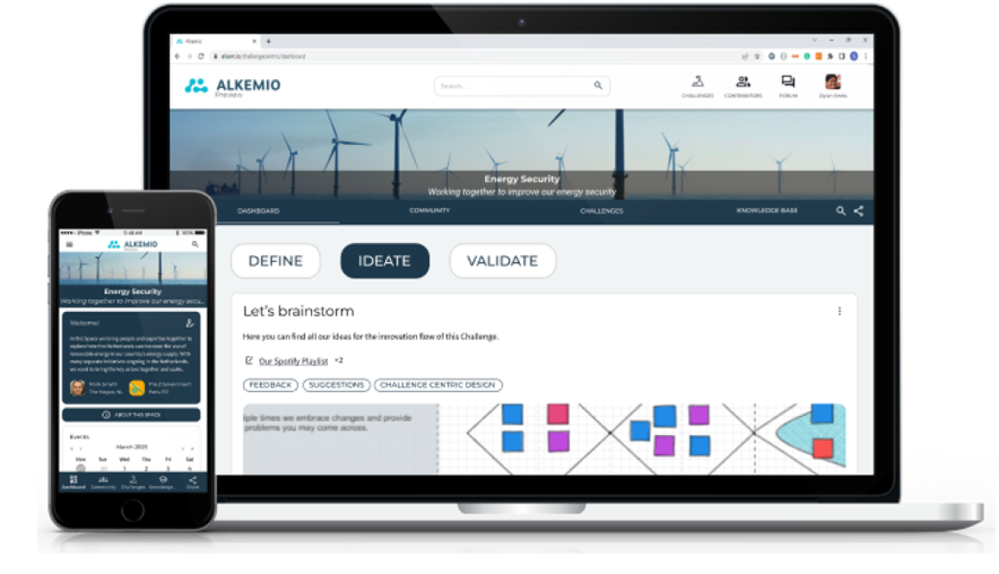
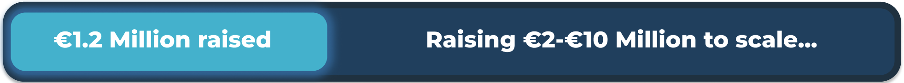
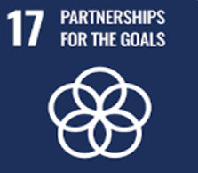
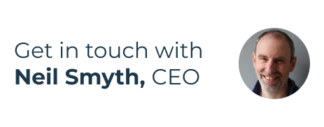

---
title: Investors
type: landing

url: "/investors"

sections:
  - block: markdown
    content:
      title: Taking off with impact investors who...
      text: |-
        
want to create a better and safer future,
        
        while earning 3x-5x returns from a business backed by powerful trends in society.</b>
        

    design:
      columns: '1'
      spacing:
        padding: ['50px', '0', '40px', '0']
      # Choose an optional background color, gradient, image, or video
      background:
        color: white

  - block: markdown
    content:
      title: 
      text: |-
        

          
        

    design:
      background:
        image:
          filename:
          flip: false
        color: white
      columns: '1'
      css_class: d-flex align-items-center
      spacing:
        padding: ['20px', '0', '20px', '0']

  - block: markdown
    content:
      title:
      text: |-
      
        
 Sounds like you? Big Tech isn't waiting, let's make this happen together now!
        

        
    design:
      columns: '1'
      spacing:
        padding: ['20px', '0', '20px', '0']
      # Choose an optional background color, gradient, image, or video
      background:
        color: white

  - block: markdown
    content:
      title:
      text: |-
        

          <a href="https://eu1.hubs.ly/H09PDgC0" class="btn btn-primary" style="font-size: 1.2em; padding: 10px 20px;">
            <i class="fas fa-file-pdf"></i> View One Pager
          </a>
        

    design:
      columns: '1'
      spacing:
        padding: ['10px', '0', '40px', '0']
      background:
        color: white

  - block: markdown
    content:
      title:
      text: |-
      
        
<b>Are we happy with the future of society being driven by profit-maximizing Big Tech?</b>
        
         Especially given the disruptive power of AI, which is increasing every month.

        Are governments agile enough to regulate? Is profit maximization going to stop?
        
        What, then, can we do to help shape the future we want for our kids?   
        
        **We can design technology to benefit society (#EUTech)**
          
        
          Putting <b>society first</b>, not profits. 
          Using <b>open source</b>, not black boxes. 
          Enabling <b>greater collaboration</b>, not polarization. 
          Creating <b>safety and trust</b>! 

        

        
    design:
      columns: '1'
      spacing:
        padding: ['50px', '0', '40px', '0']
      # Choose an optional background color, gradient, image, or video
      background:
        color: rgb(241, 244, 245)

  - block: markdown
    content:
      title: This is Alkemio  
      text: |-
        
<s style="color: red;"><b>Shareholder</b></s> <b>Steward</b>-owned, a company designed for trust. Legally aligned with EU societal goals.  
        
        Providing <b>safe digital spaces</b>, with control and trust. Where people and AI work together, solving societal challenges.
        
        Introducing <b>Virtual Contributors</b>, created based on trusted bodies of knowledge and using AI. Ready at all times to contribute expertise, do work, and supercharge your output.
        
        Alkemio offers a SaaS platform for change makers. Beachhead markets are the public sector and education in the Netherlands. **€170k revenue in 2023**.
        
        Aligned with powerful trends in society. Hugely scalable.
        

    design:
      columns: '1'
      spacing:
        padding: ['50px', '0', '50px', '0']
      # Choose an optional background color, gradient, image, or video
      background:
        color: white

  - block: markdown
    content:
      title: 
      text: |-
        

          
        

    design:
      background:
        image:
          filename:
          flip: false
        color: white
      columns: '1'
      css_class: d-flex align-items-center
      spacing:
        padding: ['0', '0', '50px', '0']

  - block: markdown
    content:
      title: 
      text: |-
        

          
        

    design:
      background:
        image:
          filename:
          flip: false
        color: rgb(241, 244, 245)
      columns: '1'
      css_class: d-flex align-items-center
      spacing:
        padding: ['40px', '0', '20px', '0']

  - block: markdown
    content:
      title: 
      text: |-
        

          

            
            <h2>Supercharge collaboration</h2>
            
 Enabling SDG 17, the <b>key</b> to making progress on all UN SDGs

          

          

            
            <h2>To scale Virtual Contributors</h2>
            
 Expand AI and Sales teams  Grow team from 17 to 30+  Increase revenue to €1 Million+

          

          

            
            <h2>Provide inspiration</h2>
            
 That we <b>can</b> have a safer digital future

          

        

    design:
      background:
        color: rgb(241, 244, 245)
      columns: '1'
      css_class: d-flex align-items-center
      spacing:
        padding: ['80px', '0', '50px', '0']

  - block: markdown
    content:
      title: A new style of investment opportunity
      text: |-
        

          In line with Alkemio’s choice of Steward-Ownership, some investment features differ from a typical venture capital backed startup. Designed for long-term investors who really care about Alkemio’s purpose.
        

    design:
      spacing:
        # Customize the section spacing. Order is top, right, bottom, left.
        padding: ['40px', '0', '20px', '0']
      background:
        color: white

# left-right block below becomes a text-only block + image below in a different block

  - block: left-right
    content:
      title:
      image:
        # Reference an image in your `assets/media/` folder
        filename: hands-together.png
        position: 'left'
        alt: 'nature'
        height: 300
       
      # Add your Hero text here
      text: |-
        - **Guided by stewards**, not shareholders. Stewards hold and control the voting shares to ensure the business is managed to achieve the purpose.
        - Alkemio’s purpose and independence are **legally locked in**. An independent 3rd party holds a special share with a veto right on certain decisions such as a sale or change of the purpose of the company.
        - For **all stakeholders**, not just shareholders. Investor economic returns are capped at levels that provide attractive returns. Excess profits will be used/donated to benefit society. Profit serves purpose.
        - With investor economic returns coming from **dividends** and/or **share repurchase**, instead of a sale of the company. Investors may see to sell their shares privately.
        - **Simple setup, easy to scale.** A single share class for all investors, including founders. The capped returns and steward control mean there are no cap table, valuation, or investor voting rights discussions. So management can focus on scaling a very successful business.
    design:
      spacing:
        padding: ['10px', '0', '10px', '0']
      # Choose an optional background color, gradient, image, or video
      background:
        color: white
      align: center

  - block: markdown
    content:
      title:
      text: |-
        

          Full details of how Alkemio has implemented Steward Ownership legally, please visit our <a href="/structure"><b>Alkemio Group structure overview</b></a>.
        

    design:
      spacing:
        # Customize the section spacing. Order is top, right, bottom, left.
        padding: ['10px', '0', '40px', '0']
      background:
        color: white

  - block: markdown
    content:
      title: The Why and How of the Economic Returns!
      text: |-
        

        The capping of economic returns to all investors and staff helps ensure alignment of all parties with the purpose of benefiting society.

        The cap level for early investors starts at 3x-3.5x, depending on timing of investment. From 4 years after the investment date, the outstanding amount payable to an investor will start to accrue at a certain annual rate, such that the effective cap level can increase to 4x-5x.

        |   Example   | Year 1 | Year 2-4 | Year 5 | Year 6 | Year 7 | Year 8 |
        |------|------|----------|--------|--------|--------|--------|
        | Investment amount | €1,000 |
        | Initial dividend entitlement amount | €3,000 |
        | Dividend amount in each year | €0 | €0 | €0 | -€200 | -€300 | -€500 |
        | Annual increase due to accrual | €0 | €0 | €210 | €211 | €204 | €184 |
        | Outstanding dividend entitlement amount | €3,000 | €3,000 | €3,210 | €3,221 | €3,125 | €2,809 |
        | Effective capped return multiple | 3.0 | 3.0 | 3.2 | 3.4 | 3.6 | 3.8 |

        - A cap of 3x means an investment of €1,000 will create a dividend entitlement for that investor which starts at €3,000.
        - 4 years after the investment date, the outstanding dividend entitlement amount will accrue at an annual rate of 7%.
        - Each year the outstanding dividend entitlement amount will (a) decrease by dividends received and (b) increase at the accrual rate.

        The full mechanism, including issuance of certificates, is described in schedule C of the <b><a href="./documents/alkemio_holding_shareholders_agreement_v1.1.pdf">Alkemio Holding Shareholders Agreement (SHA)</a></b>.
        
        The Purpose Foundation has conducted a great case study on Alkemio, which you can <b><a href="https://purpose-economy.org/content/uploads/purpose-alkemio-casestudyen-31032024.pdf">find here</a></b>.
    design:
      columns: '1'
      spacing:
        padding: ['40px', '0', '40px', '0']
      background:
        color: rgb(241, 244, 245)

  - block: markdown
    content:
      title: Trusted by
    design:
      spacing:
        # Customize the section spacing. Order is top, right, bottom, left.
        padding: ['40px', '0', '0px', '0']
      background:
        color: white
        
  - block: carousel-logos
    content:
      slides:
        slide1:
          - /partners/vrije-universiteit-amsterdam.svg
          - /partners/vng.svg
          - /partners/digicampus.svg
        slide2:
          - /partners/gemeente-den-haag.svg
          - /partners/velokonzept.svg
          - /partners/dsih.svg
    design:
      background:
        color: white
      spacing:
        padding: ['30px', '0', '50px', '0']

  - block: markdown
    content:
      title:
      text: |-
        <b>"Working together requires trust, in each other but also in the digital platform being used" </b> - City of The Hague
    design:
      spacing:
        # Customize the section spacing. Order is top, right, bottom, left.
        padding: ['30px', '0', '40px', '0']
      background:
        color: white

  - block: markdown
    content:
      title: For impact investors
      text: |-
        
Join us in scaling a business backed by powerful trends in society.   
        Big Tech isn't waiting, let's make it happen together, <b>now</b>!
        

    design:
      spacing:
        # Customize the section spacing. Order is top, right, bottom, left.
        padding: ['30px', '0', '1px', '0']
      background:
        color: rgb(241, 244, 245)

  - block: markdown
    content:
      title: 
      text: |-
        

          
        

    design:
      background:
        image:
          filename:
          flip: false
        color: rgb(241, 244, 245)
      columns: '1'
      css_class: d-flex align-items-center
      spacing:
        padding: ['15px', '0', '0', '0']

  - block: markdown
    content:
      title: 
      text: |-
        

          <a href="mailto:neil@alkem.io" class="btn btn-primary" style="font-size: 1.2em; padding: 10px 20px; display: inline-flex; align-items: center; text-decoration: none; color: white; background-color: #1D384A; border-radius: 5px;">
            <i class="fas fa-envelope" style="margin-right: 8px;"></i> Email
          </a>
        

    design:
      spacing:
        padding: ['0', '0', '20px', '0']
      background:
        color: rgb(241, 244, 245)

  - block: markdown
    content:
      title: Disclaimer
      subtitle: 
      text: |-
        

        The above information is shared in the interest of accelerating the wider move to a purpose-based economy. The information provided here is for general informational purposes only and should not be considered as investment or business advice. Any investment or business decisions made based on this information are at your own risk.
        

        

    design:
      # See Page Builder docs for all section customization options.
      # Choose how many columns the section has. Valid values: '1' or '2'.
      columns: '1'
      css_class: d-flex align-items-center
      spacing:
        padding: ['40px', '0', '50px', '0']
      background:
        color: white
---