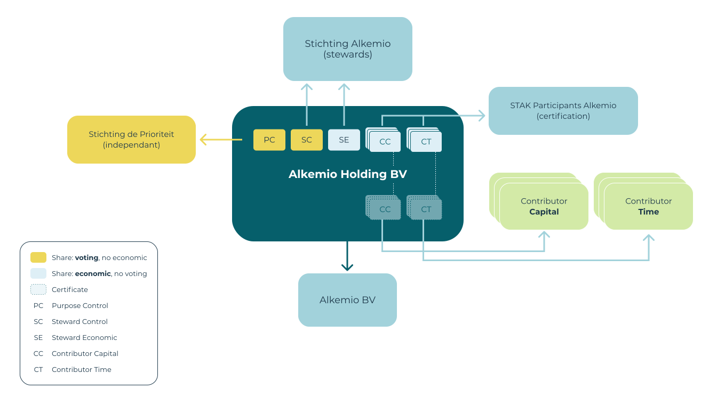

---
# An instance of the Blank widget.
# Documentation: https://wowchemy.com/docs/page-builder/
widget: blank

# This file represents a page section.
headless: true

# Order that this section appears on the page.
weight: 9

# Section title
title: 

# Section subtitle
subtitle: 

# Section design
design:
  columns: '1'
  spacing:
    # Customize the section spacing. Order is top, right, bottom, left.
    padding: ["20px", "0", "30px", "0"]
---

## **How Alkemio is set up (spoiler alert: a lot of details!)**
The new organizational structure implemented by Alkemio is shown below. All named entites are registered in The Netherlands. 

  </a>

It is important to note that **Alkemio Holding** _is_ the Steward Ownership venture. It is a for profit, commercially and professionally run venture. The value generated is distributed in accordance with the principles of Steward Ownership and the purpose. 

<button type="button" class="collapsible" data-toggle="collapse" 
data-target="#alkemio-entities" id="alkemioentities">The key entities in this diagram and their roles are:
</button>
<!-- Content of collapisible -->

  

* **Alkemio Holding BV**: the central entity, bringing together all the stakeholders. It is a holding company, raising capital, receiving and distributing profits, holding assets (IP), etc. 
* **Stichting Alkemio**: the original entity, whose role evolves to being the "steward" for Alkemio Holding. The board of Stichting Alkemio are in effect the stewards. 
* **Stichting de Prioriteit**: an independent foundation whose purpose is to hold "golden shares" in steward ownership ventures. It is obliged to act according to the principle of steward ownership. 
* **Alkemio BV**: the operating entity that actually provides the Alkemio services to the market. It is 100% owned by Alkemio Holding. Over time there could potentially be multiple operating companies depending on the needs of the business, for example in multiple countries or for separate business lines. 
* **STAK Participanten Alkemio**: manages the conversion of certain classes of Alkemio Holding shares to certificates (so economic rights), and facilitates the transfer of certificates without involving a notary. 

## Alkemio Holding BV share structure
As the core entity in the organizational design, it is important to clarify the different share classes in Alkemio Holding and their purpose. 

| <u>Share class </u>     | <u>Abbreviation</u>&nbsp; | <u>Purpose</u>  | <u>Control</u>&nbsp;&nbsp;  | <u>Economic</u>&nbsp;&nbsp; | <u>Held by</u>  |
| ----------- | :-----------: | ----------- | :----------------: | :-----------: | ----------------------- |  
| **Steward Control**   | **SC** | Primary voting control  | Y | N | Stichting Alkemio |
| **Purpose Control**   | **PC**   | Independent guarantee on the purpose   | Y | N | Stichting de Prioriteit | 
| **Contributor Capital** &nbsp;&nbsp;  | **CC**   | Economic participation for contributors of capital. Capped (*). | N | Y | STAK Participanten Alkemio | 
| **Contributor Time**   | **CT**   | Economic participation for contributors of time. Capped (*).    | N | Y | STAK Participanten Alkemio | 
| **Steward Economic**   | **SE**   | Economic value to be allocated in line with the purpose. Not capped.   | N | Y | Stichting Alkemio | 

(*) Economic returns for contributors are capped in that there is a limited economic value that can be received. Shares CC and shares CT are converted to certificates via STAK Participanten Alkemio, to ensure that they can be issued without requiring notarial involvement.  

There are multiple implications from the above structure that are worth detailing out:
* **Separation of control from economic interest**: One interesting aspect of the above design is that it is actually much **simpler** in some ways than more standard share structures. Key is that there is no share class that holds both economic and voting interests. This actually makes the articles and execution of the structure significantly simpler as one can deal with voting control fully separate from economic interest. 
* **One mechanism for allocation of value generated**: All economic value is allocated via the CC / CT / SE shares. There is no partial ownership in the structure i.e. all entities are 100% owned by a parent entity. This is for simplicity, as there is then one mechanism for the allocation of value generated. 
* **Split between SC and SE shares**: Finally, one question that you may ask is why the need for both SC and SE. The rational is that from a steward ownership persepective it is important to decouple the control from the economic interest. However, the above is already a heavy organizational structure for the size of Alkemio. So the decision was made to have SE also held by Stichting Alkemio near term - not least as there is not likely to be substantial value flowing to that share near term. And as the organization grows, it is expected that the SE share would ultimately be held by a separate entity. This entity is mandated to allowed value accruing from the underlying business according to the purpose of Alkemio. 

## PC share = Double Lock on Purpose
The adoption of Steward Ownership can be seen as a **double lock** on the purpose of Alkemio. 

This is important for two key reasons:
* investors in Alkemio do not have voting shares, so they are fully dependent on the governance that is in place. 
* as Alkemio achieves significant scale, the venture will be highly valuable - so the locks need to be put in place now to prevent any temptation in the future.

It is simply a _much stronger_ guarantee than relying on the governance of a Foundation. 

The Purpose Control (PC) share is held by Stichting de Prioriteit. this entity, establised also in The Netherlands, has the purpose to act as an independent party to guarantee principles of steward ownership are followed in such ventures.

It is also important to mention again the fact that investors in the above structure do not have formal control. They need to fully rely on the double lock of the foundation and the independent guarantee on purpose to ensure governance and decisions are made in line with the stated purpose. Hence the importance of the double lock. 

 

