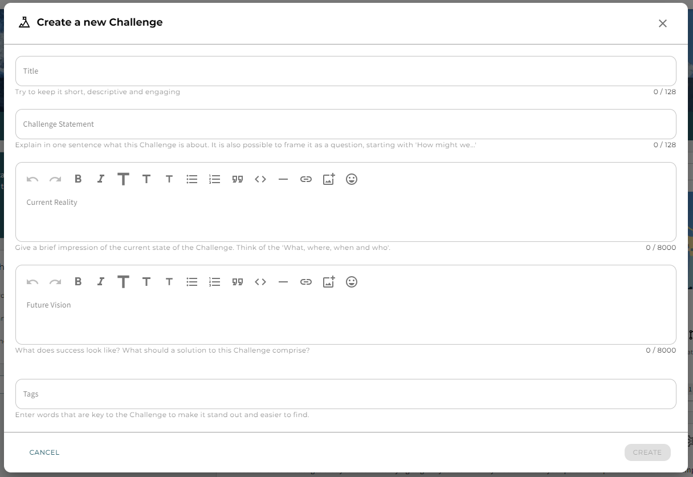

---
# An instance of the Blank widget.
widget: blank

# This file represents a page section.
headless: true

# Order that this section appears on the page.
weight: 10

# Section title
title:

# Section subtitle
subtitle:

# Section design
design:
  # Use a 1-column layout
  columns: "1"
  # Use a dark navy background with light text.
  #background:
  #  color: 'navy'
  #  text_color_light: true
  spacing:
    padding: ['60px', '0px', '60px', '0px']

---

# How to get started with my Challenge

*The platform allows you to bring the community, the challenges and knowledge together in one Space. Sometimes you may want to gather the challenges bottom-up after opening your Space, sometimes you already have a set of challenges that a (sub-)community is working on. Whether you are working on big or small, on environmental or societal, on global, regional or local levels, it is all possible. Key is that together with the community you can create alignment: where are we now and where do we want to go? Even though we don't know the solution yet, we avoid duplication of efforts and inefficient use of resources.*

## Creating a Challenge
Whether or not you are able to create a new Challenge, depends your *role* and the choices made by the *leads of the Space*. They can decide whether or not any member can open a Challenge or if they want to be able to control the set of Challenges being worked on.

If you have the right privileges, you can find the *create button* on the Challenges page. You will be first asked some questions about to describe the Challenge. Even though you may not know how exactly we are going to solve the Challenge, you can identify a direction or a few elements that should be taken into account. That is why we ask you besides the title and challenge statement, to describe the *current reality* and the *future vision*. You can further add tags to make your Challenge easier to find for interested stakeholders. This is just a first pass, and can (and probably should) always be adjusted and extended as you continue to work on it. 

## Settings of a Challenge
Again, the Challenge has a set of standard settings similar to the Space set up explained in [this Support Page](alkemio.org/help/community-management/): *profile*, *context*, *community*, and *updates*. They allow you to fill in the basic information, visuals, manage the community roles and send updates.

Furthermore the **authorization settings** allow you to define who will be the *admins*, but also what the *members* of this Challenge can do. Also, you can choose to make this specific Challenge private (non-members are not allowed to read the contents of the Challenge). There might be situations where you want to restrict the access to the information in the Challenge due to privacy issues, or when you first want to work on the Challenge in a smaller team.

In the **Opportunities** section, you can add and manage the identified ideas or directions towards a solution for (part of) the Challenge. A team of members can then deepen their understanding of the possibility to turn it into action. How can it impact the Challenge? How can we realize it? What resources are needed?

Last but not least, each Challenge has an **Innovation Flow**. This flow can be used, and chosen by the leads, to guide the community through the innovation process. It visualizes the various steps that have to be taken to go from start to end. You can think of Design Thinking Flows or an agreed innovation process defined by your organization. By moving to the next innovation flow state, you can communicate the process with your members.

## Populating a Challenge
To further populate your Challenge and get your community active, make the *Dashboard* engaging with some updates, interesting recommendations, and references. Also, use the visuals and emoticons to give the page more colour. Then start adding collaboration tools on the *Contribute tab*. What are the set of questions that your community can answer, what knowledge and resources do you need, who else should be involved?   

## Coordination Challenge
Very often we see that there are a few leads or core team driving, managing and activating the Space. These members want to coordinate with each other for example what the next steps of the Space are, what collaboration tools they want to add, capturing meetings notes and brainstorm boards. 

That is why we often see communities that open a **private** Coordination Challenge as a sub-community for this process.

## Let's get started
Hopefully this guide has helped you with understanding the possibilities of opening a Challenge in your Space. You can always find further guidance on our [support page](https://alkemio.org/help/) or [contact us directly](https://www.alkemio.org/feedback/).

