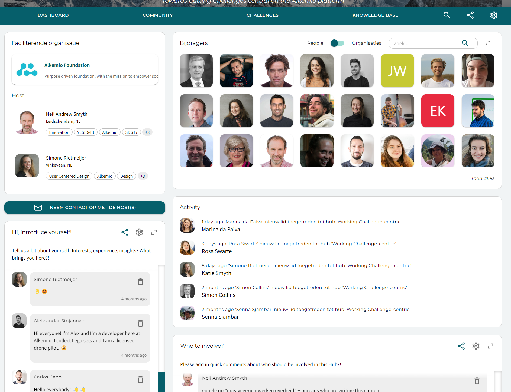

---
# An instance of the Blank widget.
widget: blank

# This file represents a page section.
headless: true

# Order that this section appears on the page.
weight: 10

# Section title
title: 

# Section subtitle
subtitle: 

# Section design
design:
  # Use a 1-column layout
  columns: "1"
  # Use a dark navy background with light text.
  #background:
  #  color: 'navy'
  #  text_color_light: true
  spacing:
    padding: ['60px', '0px', '60px', '0px']

---
# How to use Alkemio's collaboration tools?

## Alkemio's Collaboration Tools

As a Host, I want an easy way to ask my Community questions to make progress on the Challenges. Discussions with the Alkemio Community brought forward that users want to contribute in multiple ways: to growing the community, to framing challenges, to building up shared knowledge. This is now possible! No more "contribute" tab, but instead users directly contribute to the relevant section.

### Collaboration tool types
We want a way to share information with the community, gather knowledge and insights or allow interaction between members. Callouts are a set of collaboration tools to help you.

* **Creating a Post** to send a message with information such as a guidance video, or to ask your community a question. Members are able to respond with a short comment.
* **Creating a Call for posts** to gather information in a more structured way (previous Cards Callout). As a lead you can choose to add some guiding questions or information fields that members have to fill in. Members are able to respond with a more extensive answer, including references, tags, and visuals. Also, other members can comment on the response of another member.
* **Creating a Call for Whiteboards** to gather responses in a more visual way. The lead can choose a template that members must fill in when submitting their answer.

#### Where can I find these tools?
As mentioned before, the Hosts are now able to use these tools on any page! This allows them to ask the question where it makes the most sense. Let's give you some examples:

* A post on the Dashboard to ask for comments, suggestions, feedback
* A whiteboard with a stakeholder map on the Community tab, so that people can put their insights on this whiteboard
* A post on the Community tab to ask members to introduce themselves or suggest other people / organizations to invite (see example below)
* A call for posts on the Challenges tab where members can submit ideas for Challenges to work on by filling in a few context questions.
* A call for posts with relevant articles related to the topic on the Knowledge base tab

