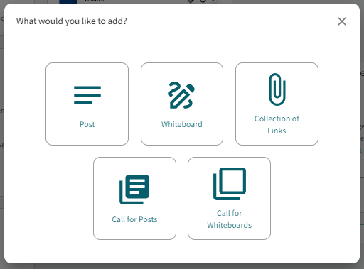
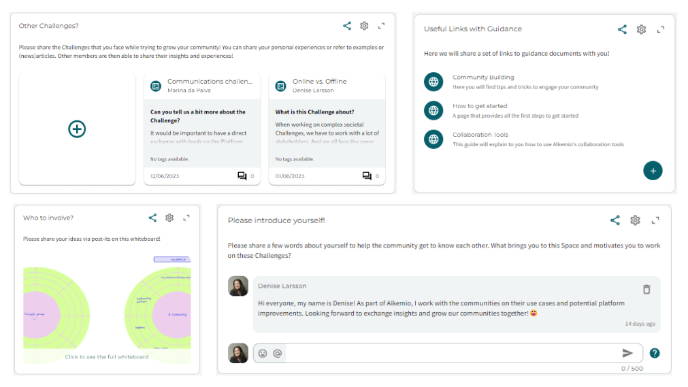

---
# An instance of the Blank widget.
widget: blank
profile: false
show_date: false
share: false

# This file represents a page section.
headless: true

# Order that this section appears on the page.
weight: 10

# Section title
title: 

# Section subtitle
subtitle: 

# Section design
design:
  # Use a 1-column layout
  columns: "1"
  # Use a dark navy background with light text.
  #background:
  #  color: 'navy'
  #  text_color_light: true
  spacing:
    padding: ['60px', '0px', '60px', '0px']

---
# How to use Alkemio's collaboration tools?

Discussions with the Alkemio Community brought forward that users want to contribute in multiple ways: to growing the community, to framing challenges, to building up shared knowledge. This is now possible! Our selection of collaboration tools now offers you the ability to start collaborating directly in the context. Not in a separate document, or miro board, or spreadsheet, but directly in a Space where you have also gathered the community, the Challenges, and the Knowledge base.

In this Support page, we will explain what **types** the platform offers, **where** you can use them, and how the use of our **templates** can help you.

## Collaboration tool types
To make progress on a set of Challenges, you need a way to share information with the community, gather knowledge or allow interaction between members. For each callout to the community, you may want to gather input in a different way. You may want short answers in a discussion, or more visual contributions in the form of a whiteboard. The platform offers you several collaboration tools - and will continue to expand these types - that you can use everywhere. The current set of tools are:

* **A Post** to start a discussion, send a message with information such as a guidance video, or to ask your community a question. Members are able to respond with short comments.
* **A Call for posts** to gather information in a more structured way. As a lead you can choose to add some guiding questions or information fields that members have to fill in. Members are able to respond with a more extensive answer, including references, tags, and visuals. Also, other members can comment on the response of that member.
* **A Whiteboard** to allow members to contribute visually, for example to submit post-its to a stakeholder map or sketching the vision of a Challenge.    
* **A Call for Whiteboards** to gather multiple responses in a more visual way. The lead can choose a template that members must fill in when submitting their answer, for example can everyone draw their vision for this Challenge.
* **A Collection of links** to gather materials in a set of links, for example relevant articles, blogposts, or guidance documents. Members are able to add a link with a title and a short description.

## Where can I use these collaboration tools?
As mentioned before, the Hosts are now able to use these tools on **any page**! This allows them to ask the question where it makes the most sense. Let's give you some examples:

* A Post on the *Dashboard Tab* to ask for comments, suggestions, feedback.
* A Collection of Links on the *Dashboard Tab* to share guiding materials to get started in this Space.
* A Whiteboard with a stakeholder map on the *Community tab*, so that the community can contribute with their insights about the current ecosystem
* A Post on the *Community tab* to ask members to introduce themselves or suggest other people / organizations to invite (see example below)
* A Call for Posts on the *Challenges tab* where members can submit ideas for Challenges to work on by filling in a few context questions.
* A Call for Posts with relevant articles related to the topic on the *Knowledge base tab*

## How can I use templates?
To guide you in creating these collaboration tools to activate your community, the Alkemio Innovation Library offers a set of templates. There is a lot of **knowledge, best practices and templates** out there related to innovation. Organizations as well as knowledge institutions often promote these materials via their websites or internal channels, but it is hard to find for the wider community. More importantly, it is hard to directly use when you want to start collaborating with multiple stakeholders. The platform offers an Innovation Library that gathers all these materials and makes them directly available for you to apply in your Space (more information on [this Support Page](https://www.alkemio.org/help/innovation-library/)). 

These templates can be used both when you want to open a new callout as well as when you are submitting a new answer or contribution. Note that in principle the leads are able to open a new callout, but they can also choose to allow **any member** to open a new callout. 

There are two relevant types of templates:
- Post templates
- Whiteboard templates

### **Post templates**
These templates allow you to choose a set of default text or questions that each contribution must include. Hereby a few examples as inspiration:
- You want each user to start their answer with a user story. Then you would set as a default text for each post:  *As a ... I want ... so that ...*  Each member can then submit their contribution in a more structured way using this template.
- You want users to submit relevant newsarticles related to a specific Challenge. Then you could state that each contribution must provide a *description*, *why is this relevant for the Challenge*, and *source*.
- You ask the community to share what organizations should be involved. Then you could let members answer a few questions. For example, *why do you think this organization is relevant*, *how would you like to approach them*, and *do you need any help*.

When starting a new Call for posts, you can define the default text to structure the answers of your community. When a member submits a new answer, they will be prompted to fill in these questions.

### **Whiteboard templates**
Secondly, you can use our whiteboard templates to gather input from the community. You can think of templates for stakeholder maps, brainstorm sessions, innovation funnels, etc. When you start a new Whiteboard or a Call for Whiteboards, you can directly choose a template from the library of your Space or the platform's Innovation Library. You can edit them to make it suitable for the particular question. Everytime a member wants to submit their contribution, they can use the whiteboard.

## More settings for the Collaboration tools
There are several settings that will help you make the most of these collaboration tools.
For example, you can ...
- **Move** them up and down, or to the bottom or the top of the list as well as between the various pages.
- **Share** them with other people inside and outside of the platform.
- **Expand** the dialog to see a clearer overview of all contributions. 
- **Close** them for answers. In the settings you can decide to turn the switch 'Accept new responses' on or off. Members are still able to see the previous answers and comment on them, but they cannot submit new ones.
- Create them in **draft** state, so that they are only visible for the admin. When the admin is ready to share it with the community, they can **publish** it (with the option to notify the community).

## Let's get started!
The current tools are just a glimpse of what they can offer you in the future, think of Polls, Stack Overflow, or other types of integrations. Have fun using them, share your experiences with other users of the platform, and share your feedback! 
