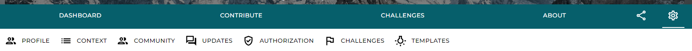
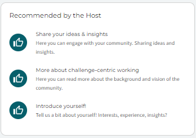
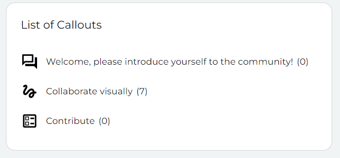
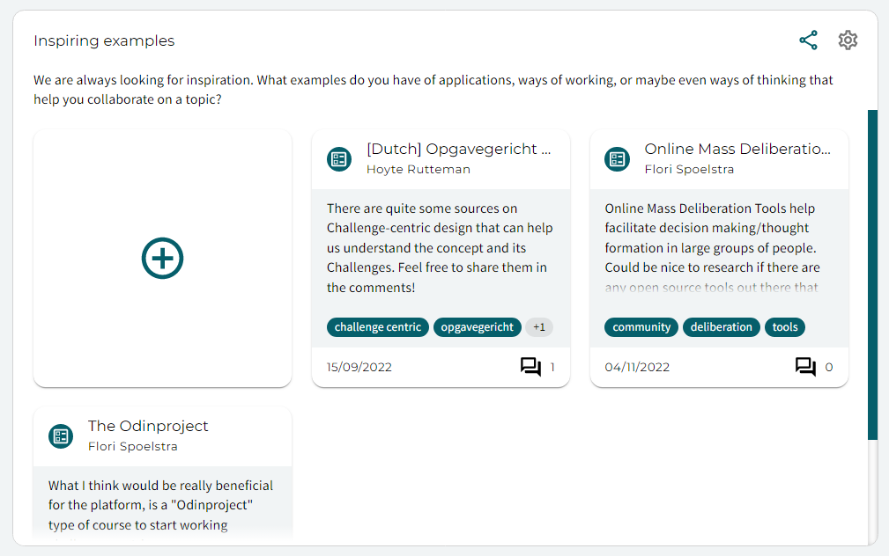
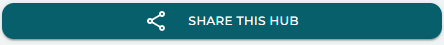
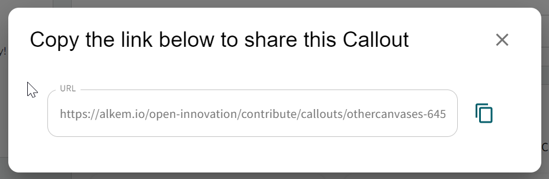

---
# An instance of the Blank widget.
widget: blank

# This file represents a page section.
headless: true

# Order that this section appears on the page.
weight: 10

# Section title
title: 

# Section subtitle
subtitle: 

# Section design
design:
  # Use a 1-column layout
  columns: "1"
  # Use a dark navy background with light text.
  #background:
  #  color: 'navy'
  #  text_color_light: true
  spacing:
    padding: ['60px', '0px', '60px', '0px']

---
# Community management page

### New lead of a Space? Welcome to our platform!
*Congratulations on starting to build your online community! Finding ways to make your community engaged and activate can be difficult. This page includes tips and tricks to get to know the platform, it's **structure and concepts**, how to **populate** your Space, and how the functionalities on Alkemio can keep your **community active**.*

### **Getting to know the Alkemio structure**
While you may be managing your projects using Excel spreadsheets, Trello to manage your tasks, Miro to capture your brainstorm sessions, or LinkedIn to find relevant people to connect with, the Alkemio platform combines it all. All centered around the urgent societal and environmental challenges of today. 

As with any tooling, understanding the platform will help you get the most out of it. A good place to start is reading about the platform structure and its key concepts on [our support page](https://www.alkemio.org/help/key-concepts/).

Are you interested in reading more about the mission and vision of the foundation behind the platform? Have a look at our [Manifesto](https://alkemio.org/manifesto).

### **Populating your Space**
It is now time to populate your Space with an initial set of content before you start onboarding the rest of your community. The first step is to navigate to the **settings** of your Space. This is done by clicking on the cogwheel icon on the right:

Here you will find various subtabs that guide you through the possibilities. We will focus on the first few tabs. 

#### **I. Profile**
To make your Space visually attractive for new members, it is important to choose an engaging **tagline** as well as **visuals**. They will be visible on the home page for all visitors of the platform as well as the dashboard page of your Space.

Also, you can add additional **tags** to summarize the content and make the Space easier to find. Finally, you can add **references** (links as well as documents) for your community, such as your website of the facilitating organization, an article or report related to this Space, an introduction video, etc.

#### **II. Context**
For yourself, and for the members of your community, it is essential to understand the context of the Space. We have divided this into 4 key sections (**vision**, **background**, **impact**, and **who should be involved**). The context section will guide you through filling in all these sections. Note that you can also use text styles such as bold/headings etc. or add images to make it more visually attractive/understandable. You can do a first pass, it is always adjustable later.

#### **III. Community and authorization**
Here you can manage users and organizations that are members of your community, as well as contributors that are playing **leading roles**. This is also where you can approve (or reject) user **applications** to become a member. 

The Community Tab contains settings to control how users become members: allow anyone to join, accept applications for membership or rely on direct addition of members. 

On the Authorization tab you can control the visibility of the Community content (is this a **private** or a **public** community?), as well as what actions within the community Contributors can carry out. For example whether a user can create Challenges. 

#### **IV. Community engagement**
Besides some descriptive information, it is key to engage and guide your community when they land on the platform. Three key functionalities that can help you with this are the following:

##### Recommendations
Each dashboard has three recommendations that you can use to guide your community to the most relevant content of the Space. This can be a link to a 'getting started in this Space' document, the most relevant callout, a sign up link for the next community event, etc. 

These links can and will change over time as the focus of the Space will mature. You can update the recommendations under `settings > profile`.

##### Callouts
On the Contribute tab, you will find the key functionality to engage your community: the **Callouts**. 

Callouts allow you to ask the community for their knowledge, experiences, methods, etc. on various topics that are relevant for the Space. By default there are callouts already added so that new members can immediately start engaging e.g. by introducing themselves or sharing their insights. 

This is key for **engaging your Community**, so it's important to customize the Callouts to your community. For example ask your community about who else should join the Space, relevant articles or other initiatives that should be considered. 

You can find more information on the [inspiration page](https://alkem.io/inspiration/callouts) or this [blogpost](https://www.alkemio.org/post/2022-09-callouts/).

##### Sharing
When you have populated the Space, you can start sharing it in your network. Pretty much all content on Alkemio is shareable via direct links. On the Space tab there is a prominent button for this:

On other places the possibility to share is via this icon:

In both cases a sharing dialog will pop up:

You can then **share the link directly** via email, on LinkedIn, or direct message in platforms such as WhatsApp. 

##### Updates
Updates are a powerful way to keep your Community informed and engaged. They allow you to broadcast messages to the community, and then each member (with notifications enabled!) will receive an email with your update. 

Updates are accessed via ``settings > updates``.

For example with an introduction why the Space started or when you will have a webinar/presentation to explain.

#### **V. Challenges**
If you already have a few Challenges in mind for this community, you can directly add them under the Challenges tab. Our context questions will guide you through the process of framing your Challenge. 

Note that for Challenges, you can follow similar steps as the ones above for the Space to further populate it.

### Check?
Hopefully these few steps will get you up and running on the platform! There is a lot more to discover with regards to functionalities or best practices. Have a look at our [blogposts](https://alkemio.org/post/) to find more content on various topics. 

Also, you can always find further guidance on our [support page](https://alkemio.org/help/) or [contact us directly](https://www.alkemio.org/feedback/). 

------------------

### Next to add
- more about how the manage your challenges/opportunities
- more about how to use templates within your Space
