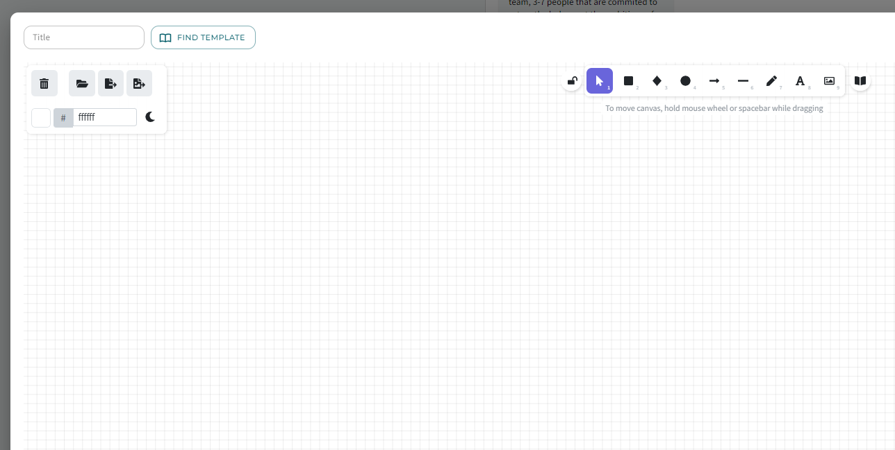
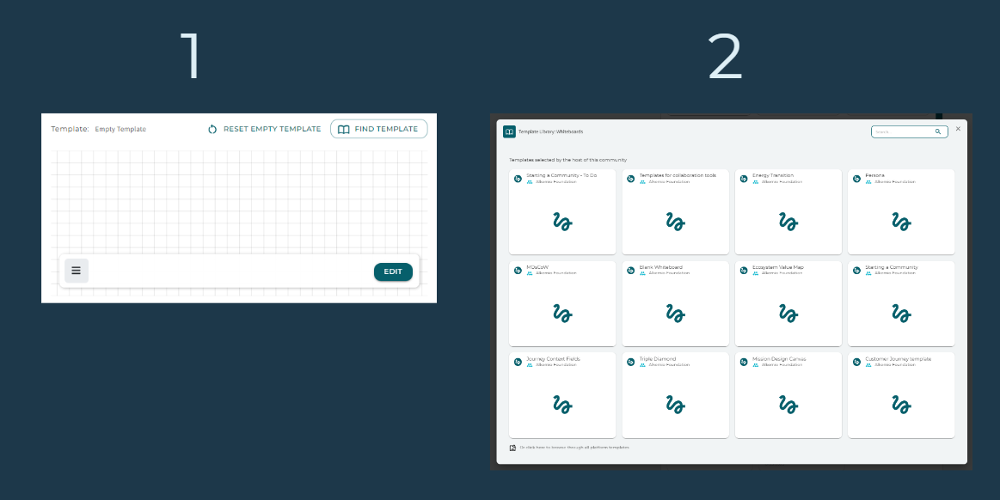
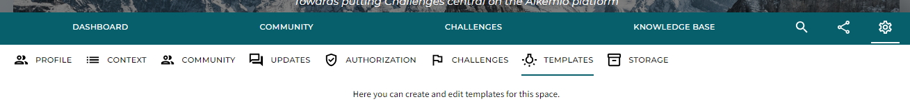

---
# An instance of the Blank widget.
widget: blank

# This file represents a page section.
headless: true

# Order that this section appears on the page.
weight: 10

# Section title
title: 

# Section subtitle
subtitle: 

# Section design
design:
  # Use a 1-column layout
  columns: "1"
  # Use a dark navy background with light text.
  #background:
  #  color: 'navy'
  #  text_color_light: true
  spacing:
    padding: ['60px', '0px', '60px', '0px']

---

# Our way of contributing to innovation: an Innovation Library!

Innovation is not always easy and at Alkemio we want to make it easier for everyone to innovate effectively. There is a world of innovation best practices, templates, and insights available. But how do we find them? And more importantly, how can we directly apply them?

The Innovation Library on Alkemio makes it easier to share best practices for effective innovation. The Innovation Library is a collection of whiteboard templates, guided innovation flows and excersises to do with your community. They offer offer guidance and structure to users of the platform. This results in alignment between all parties and an overview of the steps to be taken or needs to make change. Our innovation library is growing daily, with new templates from multiple parties that can share knowledge and expertise.

## Template types: Whiteboard, Innovation Flow and Posts
There are currently three types of templates available, all visible under the Library icon of the platform navigation. 

As you can see, the library is divided into two sections:
- Templates that are bundled into an **Innovation Packs**. Innovation packs are a coherent set of templates based on for example a specific *theory* or *theme*, best practices shared by an *organization*, or recommended by a *knowledge institutes*. Clicking on the Innovation Pack allows you to see the templates, the facilitating organization, a description and references. Anyone can share their templates in this library to support innovation. If you are interested, please reach out via the [Forum](https://alkem.io/forum) or info@alkem.io!
- It is also browse through **all templates**, some part of an Innovation Pack and some not. You can search for keywords or filter based on the type of template. 

## Using templates in your Space
The Innovation Library shows you all templates that are made available by the Alkemio community. Besides these platform templates, you can also create your own templates for your Space or Challenge. Below we will explain how you can use, create and import templates in the collaboration tools. More information about these tools can be found on [this support page](https://www.alkemio.org/help/collaboration-tools/).

### Whiteboard and Post templates

**Using templates**

As a member, you can use whiteboard templates when you contribute to a *Call for Whiteboards* or *Call for Posts*. 

As a lead, you can choose templates from the library of the Space or the platform when adding a new collaboration tool.

**Creating and importing templates**

As a lead, you can also create new templates for the library of the Space. You can either choose to base your template on one of the templates from the platform library, or start creating your own.

### Innovation Flow templates
Innovation Flow visualizes guides the members throught the various states of the chosen innovation process. You can think of Design Thinking Flows or an agreed innovation process defined by your organization. Each Challenge or Opportunity can have an Innovation Flow. You can find and change them under the settings of the Challenge or Opportunity, in the section Innovation Flow.

