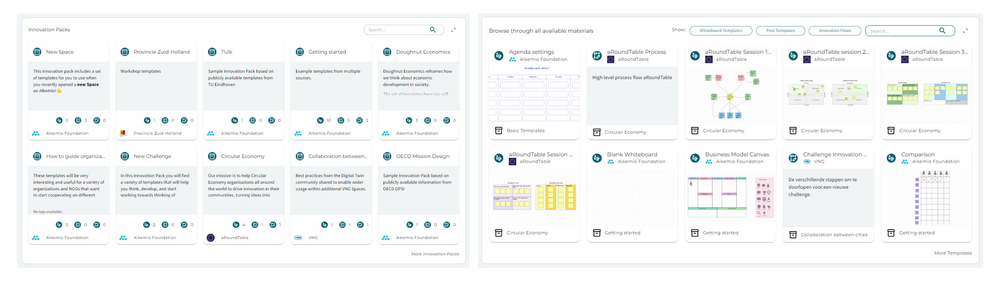

---
# An instance of the Blank widget.
widget: blank

# This file represents a page section.
headless: true

# Order that this section appears on the page.
weight: 10

# Section title
title: 

# Section subtitle
subtitle: 

# Section design
design:
  # Use a 1-column layout
  columns: "1"
  # Use a dark navy background with light text.
  #background:
  #  color: 'navy'
  #  text_color_light: true
  spacing:
    padding: ['60px', '0px', '60px', '0px']

---

# How to use the Innovation Library?
Innovation is not always easy and at Alkemio we want to make it easier for everyone to innovate effectively. There is a world of innovation best practices, templates, and insights available. But how do we find them? And more importantly, how can we directly apply them?

The Innovation Library on Alkemio makes it easier to share best practices for effective innovation. The Innovation Library is a collection of whiteboard templates, guided innovation flows and excercises to do with your community. They offer offer guidance and structure to users of the platform. This results in alignment between all parties and an overview of the steps to be taken or needs to make change. Our innovation library is growing daily, with new templates from multiple parties that can share knowledge and expertise.

## What templates can I find in the library?
You can find an overview of the current set of templates under the [Library](https://alkem.io/innovation-library). The library currently includes three types of templates: **whiteboards**, **innovation flows** and **posts**.

As you can see, the library is divided into two sections:
- Templates that are bundled into an **Innovation Packs**. Innovation packs are a coherent set of templates based on for example a specific *theory* or *theme*, best practices shared by an *organization*, or recommended by a *knowledge institutes*. Clicking on the Innovation Pack allows you to see the templates, the facilitating organization, a description and references. Anyone can share their templates in this library to support innovation. If you are interested, please reach out via the [Forum](https://alkem.io/forum) or info@alkem.io!
- It is also browse through **all templates**, some part of an Innovation Pack and some not. You can *search* for keywords or *filter* based on the type of template.

## How can I add the templates to my Space or Challenge?
The Innovation Library shows you all templates that are made available by the Alkemio community. It is also possible to create your own templates for your Space or Challenge. Below we will explain how you can use, create and import templates in the **Collaboration tools**. More information about these tools can be found on [this support page](https://www.alkemio.org/help/collaboration-tools/).

### Whiteboard and Post templates
When asking the community for their knowledge and insights, you can either ask for textual or visual contributions. *Whiteboard templates* can provide inspiration for your creative and collaborative whiteboards, such as a stakeholder map, mindmap, or SWOT analysis. *Post templates* can help you to structure the input of your members with a default text or set of questions. An example would be that every contribution starts with a user story (*As a ... I want ... so that ...*) or a set of questions (*(1) provide a short description of the article, (2) describe why this is relevant for this Challenge*).

*Using templates*
- As a **member**, you can use whiteboard templates when you contribute to a *Call for Whiteboards* or *Call for Posts*. 
- As a **lead**, you can choose templates from the library of the Space or the platform when adding a new Collaboration tool, such as a *single whiteboard*, *Call for whiteboards*, or *Call for Posts*.

*Creating and importing templates*
- As a **lead**, you can also create new templates for the library of the Space. You can either choose to base your template on one of the templates from the platform library, or start creating your own. To add new templates, go to the *Settings* of the Space and navigate to the section about *Templates*.

### Innovation Flow templates
Innovation Flow visualizes guides the members throught the *various states* of the chosen innovation process. You can think of Design Thinking Flows or an agreed innovation process defined by your organization. Each Challenge or Opportunity has an Innovation Flow. You can find and change them under the *Settings* of the Challenge or Opportunity, in the section *Innovation Flow*.

*Using Innovation Flow templates*
- As a **lead of a Challenge or Opportunity**, you can choose a template for your Challenge or Opportunity from the templates defined in the Space. If you want to use other templates, you can contact the lead of the Space.

*Creating and importing templates*
- As a **lead of a Space**, you can add templates to the Space from the platform library or create a new one yourself. Navigate to the *settings of the Space* and the section for *Templates*. There you will find the current set of Innovation Flow templates defined in the Space. You can click on the *library icon* to search for platform templates or click on *create new* to make your own. The Innovation Flow is based on [Xstate](https://stately.ai/viz). You can try making a definition for a statechart yourself or [contact](https://www.alkemio.org/feedback/) the team. 

Hopefully this guide helps you to make the most of the templates and the innovation library. If you have any templates you would like to share in the Innovation Library or as an Innovation Pack, please reach out!
