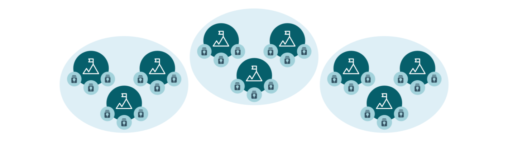

---
# An instance of the Blank widget.
widget: blank

# This file represents a page section.
headless: true

# Order that this section appears on the page.
weight: 10

# Section title
title:

# Section subtitle
subtitle:

# Section design
design:
  # Use a 1-column layout
  columns: "1"
  # Use a dark navy background with light text.
  #background:
  #  color: 'navy'
  #  text_color_light: true
  spacing:
    padding: ['60px', '0px', '60px', '0px']

---

# Platform Key Concepts

#### Hello there! In this section you will find listed the key concepts representing the hierarchy of the Alkemio [platform](https://alkem.io), as well as an explanation of their functions and utility.
As a new user entering the platform for the first time, you may be asking yourself: What is the meaning behind our platform's terminology? What do we mean by words such as "Space", "Challenge", "Opportunity" and "Callout"?

First, follow our new member [onboarding steps](https://www.alkemio.foundation/help/getting-started/) and begin your journey! Ready and looking for the next steps? Let's dive into the understanding of the platform's core concepts:

#### 1. We are a platform that works Challenge-Centric, so let's start with understanding what a Challenge is, why should you create one, and what can you do through it.

_What's a Challenge?_  
A Challenge is a specific issue within the more general topic and frame of reference introduced by the Space. It is a place to explore the issue and of everything that can lead towards finding solutions. Challenges variate from Space to Space and can develop in different ways based on the necessities of the community in that specific Space.

Through the creation of a Challenge, one has the chance to shine light on urgent issues, big or small, on a local, national or international level, that need to be solved. One should create new challenges because, through it, people will get more knowledge on the issue as well as the opportunity to meet people with the same concerns or with potential solutions to help you out. Or simply it can give you the right network which will bring you closer to finding the solution of the issue.

_What value can I get from a Challenge Community?_ 
Finally, creating a challenge means tackling the general issue into specifics and making people cooperate around these specific issues in orther to work out solutions, together. Only together we will be able to successfully solve these problems.

#### 2. What is a Space? What can you do through it, why should you create one and what happens after you created a Space?

Picture a Space as a virtual environment created for you to engage on something you care about and that you would like to find solutions for. It is a community with a specific frame of reference, under the responsibility of the lead user or organization. The key goal is to gather people and identify their Challenges.

_Who can create a Space?_  
A Space can be created by members of the platform, together with us, based on a general topic that the creator has interest in. You can start a Space to gather further ideas or simply see it as a place to raise awareness on an issue that you believe is urgent and can be relatable to others. A demo of an example Space can be found [here](https://alkem.io/reducingpollution/dashboard).

_What value can I get from a Space Community?_  
Through a Space, you can raise attention on a topic of your interest and find more people that share your same interest but have different visions. It is important to create Spaces because through different Spaces the topics of interest that regard different people will lead to inspiration for more. This will allow the creation of different communities around meaningful topics that are relevant to many. Creating a Space means generating knowledge on relevant areas that can then be divided into specific "Challenges", a step that brings us to the next key concept of our platform.

#### 3. What are opportunities, why should you create one, what can you do by creating one and what happens after creating one?

Opportunities represent the actions that people within the community can take to tackle (part of) a certain Challenge. The key goal is to gather necessary resources and showcase possible results. Even though Opportunities may not already be the perfect solution, they give us a direction on where and how to make progress to solve the Challenge. By creating an Opportunity you are providing possible solutions for everyone and sharing your personal experiences, connections and knowledge.

##### 4. What is a Callout, why should Callouts be created, what can you do by creating Callouts?

Callouts are essentially possible questions people may want to raise after starting to work on a Challenge. Callouts should be created to make concepts clearer and answer possible questions the community may have. It is a way to involve the community and get feedback on how the overall Space is progressing. If you are interested in reading more about it fell free to read our [blog post](https://www.alkemio.foundation/post/2022-09-callouts/) about it! Enjoy :)
