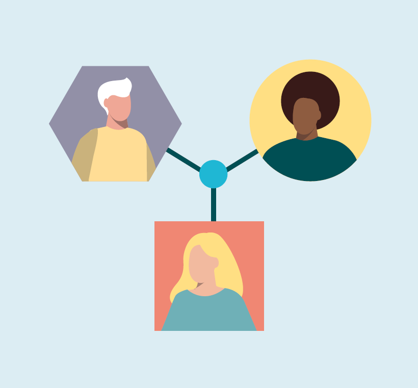

---
# An instance of the Blank widget.
# Documentation: https://wowchemy.com/docs/page-builder/
widget: blank

# This file represents a page section.
headless: true

# Order that this section appears on the page.
weight: 5

# Section title
title:

# Section subtitle
subtitle:

# Section design
design:
  columns: '1'
  background:
    color: '#dcedf3'
  spacing:
    # Customize the section spacing. Order is top, right, bottom, left.
    padding: ['0px', '0px', '0px', '0px']
  advanced:
    css_style: 'text-align: center;' ## todo: align the markdown below centrally
---

   

      

         

            <h2 class="font-weight-bold  pb-3"> Living community</h2>
            

               Building an online <b>community</b> around a challenge. Turning individuals and organizations into co-workers. 
            

            

               Spotting the right organizations, capabilities and resources to <b>make progress</b> on solutions in our fast-moving world.      
            

         

      

      

         
      

   

