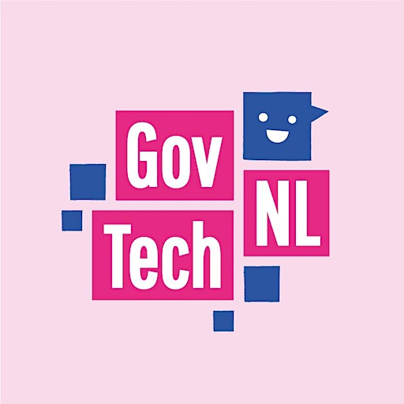
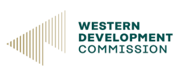

---
# An instance of the Blank widget.
# Documentation: https://wowchemy.com/docs/page-builder/
widget: blank

# This file represents a page section.
headless: true

# Order that this section appears on the page.
weight: 5

# Section title

# Section subtitle
subtitle: Strategic

# Section design
design:
  # Use a 1-column layout
  columns: '1'
  spacing:
    # Customize the section spacing. Order is top, right, bottom, left.
    padding: ['20px', '0', '0px', '0']
---

    <!-- Title -->
    <h2 class="text-center font-weight-bold">Community Partners</h2>
    <!-- Rows -->
    

        

            
        

        

            
Driving innovation to improve the cycling industry sustainabiliy (Germany)

        

    

    

        

            
        

        

            
Center for civic innovation

        

    
   
    

        

            
        

        

            
Promote social and economic development in Western Ireland (Ireland)

        

    

