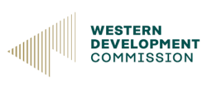
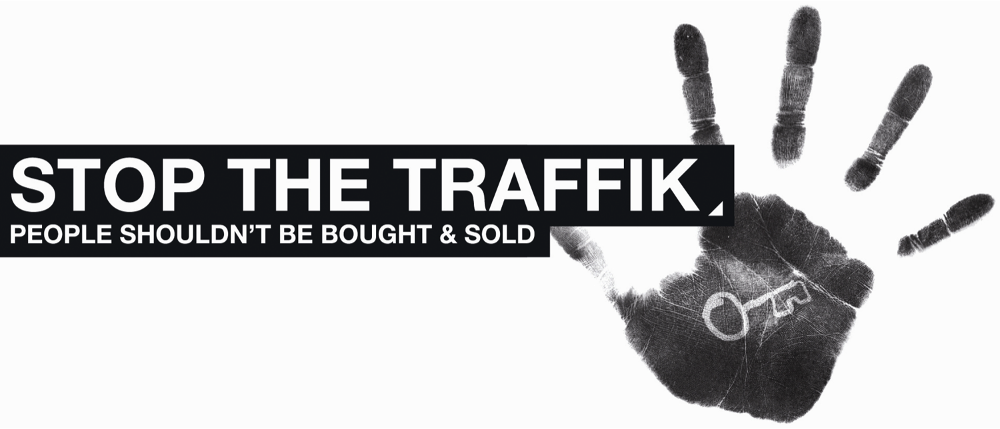

---
# An instance of the Blank widget.
# Documentation: https://wowchemy.com/docs/page-builder/
widget: blank

# This file represents a page section.
headless: true

# Order that this section appears on the page.
weight: 6 

# Section title

# Section subtitle
subtitle: Strategic

# Section design
design:
  # Use a 1-column layout
  columns: '1'
  spacing:
    # Customize the section spacing. Order is top, right, bottom, left.
    padding: ['20px', '0', '0px', '0']
---

<!-- Title -->
<h2 class="text-center font-weight-bold">Community Partner </h2>
<!-- First row -->
  

    
 
      
 Promote social and economic development in Western Ireland

          
 
             
    <!-- Second row -->
   

        

            
        

        

            
People shouldn't be bought and sold

            </a>
    

  
 

