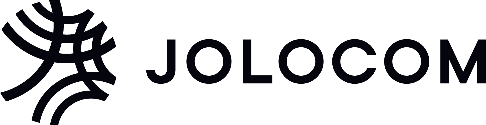

---
# An instance of the Blank widget.
# Documentation: https://wowchemy.com/docs/page-builder/
widget: blank

# This file represents a page section.
headless: true

# Order that this section appears on the page.
weight: 7

# Section title

# Section subtitle
subtitle: Strategic

# Section design
design:
  # Use a 1-column layout
  columns: '1'
  spacing:
    # Customize the section spacing. Order is top, right, bottom, left.
    padding: ['20px', '0', '10px', '0']
---

<!-- Title -->
<h2 class="text-center font-weight-bold"> Ecosystem Supporters </h2>
<!-- First row -->

   
 
       
   

   
 
       
   

   
 
      
   

<!-- Second row -->

  
 
    
  

<!-- First row -->

    
*eSSIF-Lab is funded by the European Commission, as part of the Horizon 2020 Research and Innovation Programme, under Grant Agreement Nº 871932 and it’s framed under Next Generation Internet Initiative.
