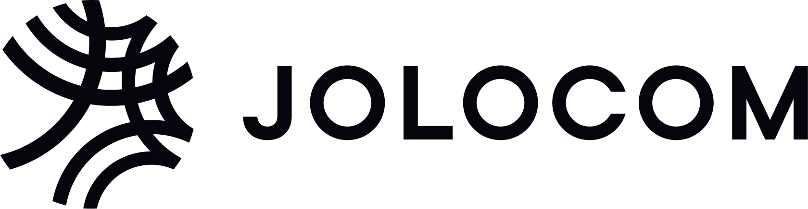

---
# An instance of the Blank widget.
# Documentation: https://wowchemy.com/docs/page-builder/
widget: blank

# This file represents a page section.
headless: true

# Order that this section appears on the page.
weight: 1

# Section title
title: Our partners

# Section subtitle
subtitle:
  Working with the Alkemio Foundation to develop the platform and community
  with sustainablity, neutrality and impact

# Section design
design:
  # Use a 1-column layout
  columns: '1'
  spacing:
    # Customize the section spacing. Order is top, right, bottom, left.
    padding: ['20px', '0', '0px', '0']
---

<!-- First row -->
  

    
 
         
      
 The place where we design future plubic services together  
       Strategic Partner

    

    
 
         
      
 Authority for employment services and provision of labour market and data services in the Netherlands  
       Strategic Partner

    

  
 
  <!-- Second row -->
  

    
 
         
      
 The Assocation of Netherlands Municipalities  
       Innovation Partner

    

    
 
             
      
 Ministry of the Interior and Kingdom Relations in the Netherlands  
       Foundation Partner

    

  
 
  <!-- Third row -->
  

       
 
         
      
 A project funded by the European Commision to advance the broad uptake of self-sovereign identity using digital identity solutions

    

    
 
         
      
 People shouldn't be bought and sold

      

  
 
  <!-- Fourth row -->
  

     
 
        
        
 Jolocom helps companies to implement standard-based decentralized identity technology, understand and grow decentralized ecosystems.   Technical partner

      

      
 
     
      
 The Netherlands Chamber of Commerce

    

  
 
  <!-- last row -->
  

    
 
        
        
 We're building the social network metaverse stack for Web3 Communities. Founding Partner.

    

    
 
            
      
 A foundation, taking internet projects and ideas to the next level, to help increase the social impact of the internet in the Netherlands

    

  

