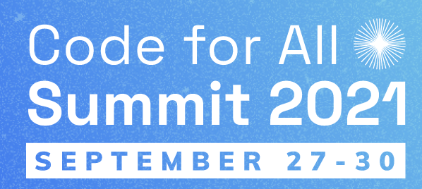

Alkemio will be participating in the upcoming [Code for All Global Summit](https://codeforall.org/summit-2021/). This is an online event, with sessions occuring globally. [Code for All](https://codeforall.org/) is an international network of organizations supporting each other to empower citizens to meaningfully engage in the public sphere and have a positive impact on their communities.

We will be participating in a panel discussion on [Achieving real change through mass collaboration](https://www.eventbrite.com/e/achieving-real-change-through-mass-collaboration-tickets-169959069151). Our co-participants in this session are Mark Frischmuth from [Democracy Lab](https://democracylab.org/) and Jean F. Queralt from the [IO Foundation](https://www.theiofoundation.org/).

Looking forward to a good discussion, and raising awareness on the important topic of achieving real change at scale. 

Please join us for the discussion!

