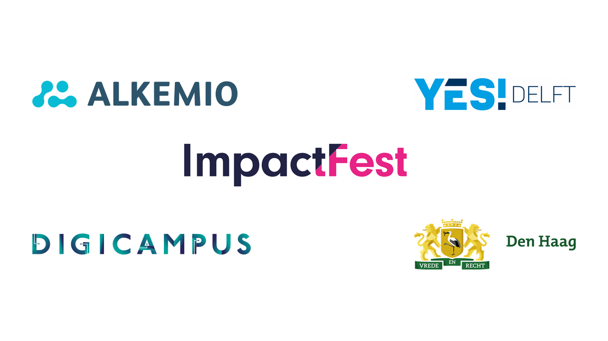

> *'Innovation never stops, and making a positive impact on the world  becomes more important every day. That’s why we are bringing together  impact makers from around the world in The Hague (NL) escalate doing  good and doing business to a new level during the 6th edition of  ImpactFest'*

Alkemio is pleased to announce that we are hosting a session on 'Enabling collaboration across organizational boundaries' at the [ImpactFest](https://www.impactfest.nl/) in The Hague on November 4th!

Multi-stakeholder collaborations are complex, especially when they cross organizational boundaries. Yet all the hard problems facing society  need this this kind of collaboration. 

The session will start with innovators from [Digicampus](https://digicampus.tech), [YES!Delft](https://yesdelft.nl) and [The Hague municipality](https://denhaag.nl) sharing their experiences  in  enabling collaboration across organizational boundaries in the Dutch  public sector, and Alkemio will share their perspective on why we need  to put the Challenges central.  

 The participants will then break out into small groups of 5-6 people to  look at opportunities and challenges currently affecting our collective  ability to collaborate on the hard challenges facing society. All  insights and ideas are then brought together and shared in the wider  group - and then discussed further in the after session social drinks :)

**Join us by registering at the [ImpactFest website](https://app.swapcard.com/event/impactfest-2021/planning/UGxhbm5pbmdfNzI1Mzc1)!** This link is outdated since the event was in 2021.
