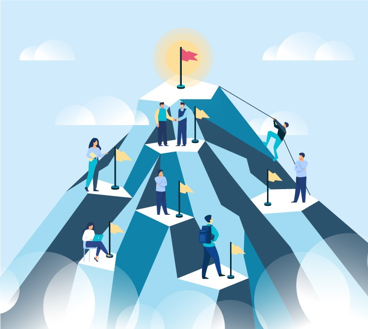

_Why do we need Alkemio if we already have Teams / Slack / Google Workspace / Whatsapp etc?_

This is one of the key questions we get when introducing Alkemio. And it is natural as productivity / communication tools dominate our current digital environments and lives.
 
So why Alkemio? The key is **alignment**: _“where” do we want to go_?. 

 

Alignment is critical for collaboration of any sort. Especially as collaboration crosses organizational boundaries. _And the issues facing our society, large and small, cannot be solved by people or organizations working alone_.

The above tools are all great for interacting and producing - but they do not put the change central. And having a clear shared understanding of the change is critical. To use a quote from the [podcast](https://www.humanetech.com/podcast/a-problem-well-stated-is-half-solved?utm_source=hs_email&utm_medium=email&_hsenc=p2ANqtz-_c9Hd7OQ5drXkKTEoKVrPK7TykDk3vZfe4DCg-bnYFF46UQzIjnZwhXDKovMMebjTC2ogn) we recommended a while back:

*"A problem well-stated is a problem half-solved"*
 
Perhaps the most widely known example is the United Nations Sustainable Development Goals (SDGs). They set a clear direction, and paint a picture of what success looks like. Are they fully detailed out? No. But that is not the point: they set a direction, which organizations and citizens can then align with. What if we could have “SDG-like” alignment in any situation? At any scale?

Alkemio is putting the Challenge central. It is a simple change, but **fundamental**. Lets understand where we want to go. And manage that. Systematically. Together.

Of course any digital solution is only an enabler. It can help manage the information / data. But it is the **people** involved that make progress happen. Our belief is that if we can align on where we are going then our collective progress becomes much more effective. Working together with the destination in mind. With more of society able and motivated to contribute.