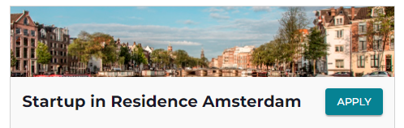
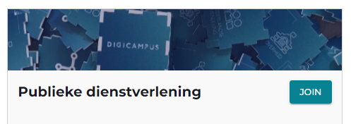
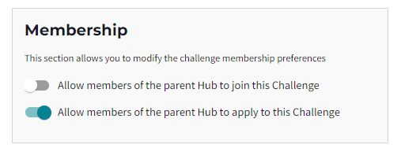

Each Challenge has a Community of Users and Organizations that work together to make progress. And just as there is a diversity in Challenges, there also needs to be a diversity in how the Communities around those Challenges operate. And this starts with how a User becomes a **member** a Community...  

Every two weeks Alkemio releases new and improved functionalities on the platform based on the feedback of all involved stakeholders. An important topic in the past month has been Community membership, and in particular to provide more flexibility with regards to how *Community membership* happens!

### What do we mean by Community membership?
The goal of our Alkemio platform is to make it easier for Contributors, including both Individual Users as well as Organizations, to work together on shared goals. Around each Hub, Challenge, or Opportunity, we can therefore find Communities (sets of Contributors).

Becoming a member of a Community implies agreeing to the rules of that Community. Such Users have to explicitly join a Community: either to Apply, Join and agree to terms etc. 

As a member of a Community, you are allowed to carry out certain actions e.g. start an Aspect, create a Whiteboard etc. You are also able to turn on notifications for certain events in that Community e.g. receive Community Updates etc.

### Why would you as a Contributor join a Community?
Each User will have their own rational, but some example rationals could be:
* To be *updated* and inspired by developments in that community
* To *contribute* to the goals of the community and make your interest visible
* To *connect* and interact with other users in that community

Or simply because of curiosity and wanting to understand more!

### How can you as a Contributor join a Community?
Alkemio aims to make it much easier for Users to connect and contribute to the topics they care about. Previously, joining a Community required a formal application that needed to be approved by admins of that Community. In some situations that makes sense. But for other Communities this was too heavy: it would be preferable to let anyone who agrees to the rules of that Community **directly join**!

As *Hub* level administrators now have the following options: 
* **Anyone can *apply* to be a member**: This is what we originally had

* **Anyone can *join* as a member directly**: New! This means that any platform User can join once they accept the Community rules

* **Anyone from the Host Organization on a Hub can *join as a member***: This is primarily aimed at private Hubs, whereby Users associated with the Host Organization can join.

At the *Challenge* level administrators now also have similar options available:
* **Any Hub member can apply to become a member**: This is what we originally had
* **Any Hub member can join as a member directly**: New! This means that any Hub member can join once they accept the Community rules

Furthermore, we are working on the possibility for Community admins to **invite** Users to join a Community. 

### To conclude
Engaging the Community remains key for making progress on each Challenge. Thinking about what would make you want to contribute or what you would need to enter the Community is therefore essential. 

Any thoughts on this? Please [contact us](https://www.alkemio.org/feedback/)!

