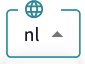
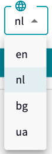
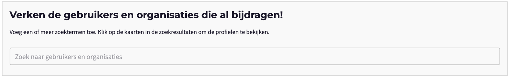
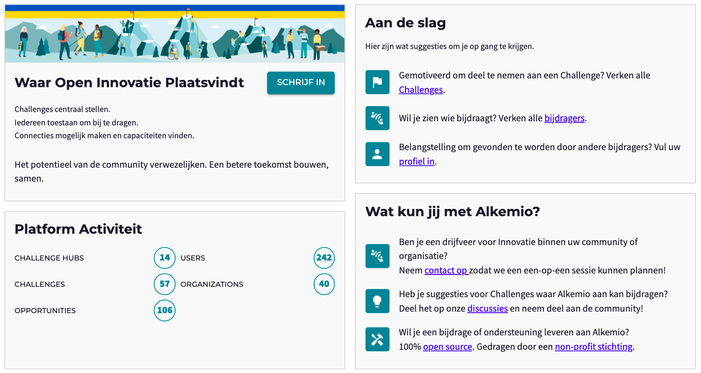
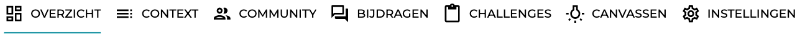

*Note that the screenshots/images in this post may not represent the current reality as our platform's features are changing and improving constantly.*

# 
Alkemio is being built **with** the Community as well as **for** the Community! That has been one of the key messages from the start. Each Individual User as well as Organization can submit their feedback, for example through [GitHub](https://github.com/alkem-io/alkemio/discussions) - gathering the **wisdom of the Community** as we together develop the platform. 

In the last months, we have seen many different ways of co-creation that improved our platform. A nice example is our recent addition of **multi-language support**. 

 

Each translation involved help from our Community. For example, the Bulgarian translation was done by the wife of one of our key development team members and the Ukranian translation by a former Contributor.

With key partners in the Dutch public sector, a Dutch translation was also a key addition.

 After we made a first pass, we received some valuable feedback from **UWV and their community** as they further worked with the platform, creating a list with suggestions to improve the Dutch translation. The suggestions were provided in a manner that they could be easily incorporated into the bi-weekly release. Now, all our other Dutch community members can benefit from their contribution. 

Examples are that we use 'je' instead of 'u', improved the various call to actions for a new User as well as our value propositions  an appealing description of the value of Alkemio. 

Note that we did choose to keep our **key terminology** in English, such as *Challenges*, *Opportunities*, and *Communities*. 

Many thanks to UWV for their on-going contributions and feedback!

Interested in this translation (or the Bulgarian or Ukranian)? Please visit our [Hub](https://alkem.io/)!

Any thoughts on this? Please [contact us](https://alkemio.foundation/feedback/)! 

