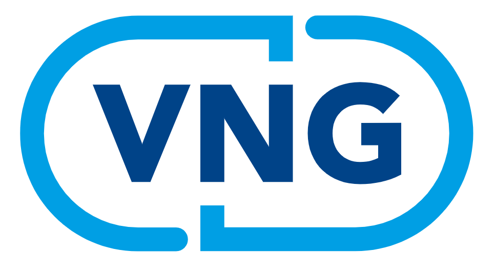
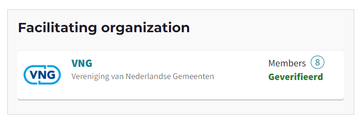
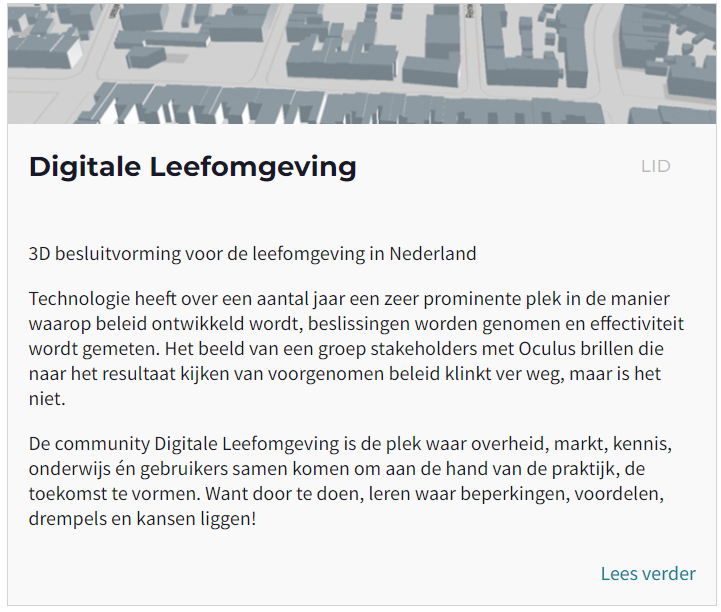
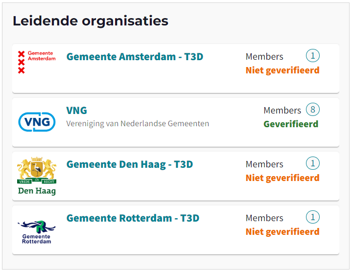
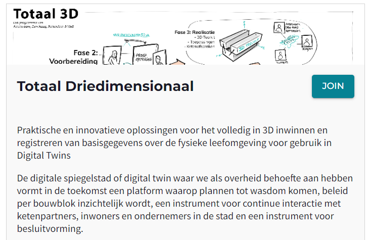

* Note that visuals of the platform may be outdated due to continuous improvements.

# Mijn boodschap aan de innovatie community? We hadden Alkemio al eerder moeten inzetten!

Nog meer goed nieuws! Onlangs heeft VNG zich aangesloten bij Alkemio als **Innovation Partner**. 

Zij zetten Alkemio in voor hun programma *Totaal Driedimensionaal (T3D)*. Wij gingen hierover in gesprek met **Gerlof De Haan**, Projectleider Geo-informatie en 3D en Programmaleider van het spoor Samenhang, Verbreding en Borging binnen T3D. 

T3D is een samenwerkingsverband tussen VNG en de drie grote gemeenten (Den Haag, Rotterdam, Amsterdam). Er is voor de gemeenten, en breder de overheid, nog een stap te maken van 2D, oftewel platte kaarten, naar 3D weergave. Dit programma werkt aan oplossingsrichtingen en standaarden voor het inwinnen, registreren en gebruiken van driedimensionale geografische gegevens. 

### Hoe zijn jullie daarbij in contact gekomen met Alkemio? 

"Binnen dit programma zoeken we naar een structurele oplossing om deze 3D-keten te verbeteren. 

> Er is behoefte aan een omgeving waarin resultaten gedeeld en besproken kunnen worden met iedereen die betrokken is of betrokken wil worden. 

Toen wij binnen VNG anderen zochten die met digitalisering van de fysieke leefomgeving bezig zijn, kwamen we snel in contact met de Digital Twin Community. Via dit programma, met o.a. Alkemio’s launching partner Digicampus, werd de link met Alkemio gelegd en ging het balletje rollen…" 

### Zo werden jullie onlangs ook onze partner. Wat was daar jullie voornaamste reden voor? 

"Het belangrijkste doel van T3D is de samenwerking tussen gemeenten faciliteren en stimuleren op het gebied van de 3D keten. Het platform kan hierbij een verbindende rol spelen. 

> Als partner kunnen we meedenken met de verschillende functionaliteiten van het 	platform die ons hierbij zullen helpen. 

Om te beginnen met inzicht en overzicht. Naar mijn mening laten we eerst zien wat er al is en waar we nog mee bezig zijn. Door dit inzichtelijk te maken willen we de community activeren en prikkelen om bij te dragen. Op het platform kan men kennis en ervaring delen zodat de oplossingen beter worden, voor iedereen."

### Wat zijn op dit moment daarbij de grootste innovatie uitdagingen? 

"Hoewel de overheid steeds vaker 3D informatie gebruikt rondom vraagstukken als de energietransitie, klimaatadaptatie, omgevingswet en mobiliteit, zijn onze informatieprocessen voornamelijk ingericht op inwinnen en registreren van 2D informatie. We willen samen zoeken naar een efficiënte en duurzame manier van 3D werken in de keten. 

Daarbij is het van belang dat het praktisch bruikbaar is, nieuwe inwintechnieken en 3D databronnen worden benut, en we verder digitaliseren. Hier willen we vanuit een integrale benadering naartoe werken, door alle partijen te betrekken. 

> We zijn ons ervan bewust dat we nog niet alle antwoorden hebben en het hele vraagstuk kunnen oplossen. Maar wat we wel weten, is dat we verschillende oplossingsrichtingen kunnen identificeren die echt een toevoeging zijn voor de toekomstige werkwijze van andere gemeenten. 

Daar kunnen we op Alkemio mee aan de slag!" 

### Hierbij willen jullie zowel de gemeenten als organisaties op landelijk niveau betrekken. Zou je ons daar meer over kunnen vertellen? 

"Ten eerste is ons programma door en voor de gemeenten. Hoewel vernieuwingen vaak landelijk ontstaan naar aanleiding van een beslissing bij het ministerie, gaan we nu voor een bottom-up aanpak vanuit de gemeenten. We kijken naar de processen en problematiek in de praktijk. 

Daarbij is het van belang om te weten hoe we standaarden voor duurzaam en efficient  kunnen invoeren. Zo zetten we Alkemio met name in om resultaten uit onze toolbox te delen. Anderen kunnen zien wat er door wie is bedacht en nagaan of dat voor hen ook bruikbaar is. 

> Daarnaast zoeken we naar input voor het opschalingsontwerp dat beschrijft hoe deze gereedschappen door andere gemeenten ingezet kunnen worden. Om in de volgende fase op te schalen, willen we hen nu de mogelijkheid geven om aan te geven wat voor hen van belang is. 

Ten tweede, hoewel we primair werken voor de gemeenten is de samenhang met landelijke ontwikkelingen ook van belang. Wij willen graag dat ons ontwerp past binnen landelijke beleidskaders én tegelijkertijd een bijdrage kan leveren aan de bruikbaarheid van die landelijke aanpak. Betrokken partijen zijn o.a. landelijke partijen, andere overheidsorganisaties die met geo-informatie werken, of partijen die met ons samenwerken aan het bijhouden van landelijke basisregistraties. 

> Door deze omgeving te betrekken en te verbinden op het platform, hopen we input te krijgen over de mogelijke werking op landelijk niveau. Al deze partijen kunnen bouwstenen aanleveren die bijdragen aan of verbeteren wat wij doen." 

### Hoe belangrijk is transparantie daarbij? 

"Transparantie zit in ons programma en de proefopstelling waarmee we werken. We vinden het belangrijk om naar de buitenwereld duidelijk te maken waar we mee bezig zijn, maar ook waar we nog niet aan toekomen. 

> Op het platform zoeken we naar de juiste manier om aan te tonen wat onderzocht is, wat de resultaten daarvan zijn, en welke verdere stappen nodig zijn. Zo kunnen we de juiste partijen vinden die ons verder helpen. 

Het mooie van deze informatie delen is dat mensen input kunnen geven over waar nog niet aan gedacht is of hoe het anders kan. Op deze manier hopen we mensen te triggeren hun kennis te delen. Dat kan de samenwerking alleen maar ten goede komen." 

### Last but not least, wat is jouw bericht naar de bredere innovatie community? 

"Hoewel we in de afgelopen fasen van het programma al ver zijn gekomen met het onderzoeken en uitwerken van de oplossingsrichtingen, waren de verschillende functionaliteiten van het platform ook in die fasen al goed van pas gekomen. Nu zetten we Alkemio voornamelijk in voor de laatste fase; het delen van onze resultaten en feedback en input verzamelen. 

> Het eerste waar ik daarom aan denk bij deze vraag is dat we een platform als Alkemio eerder hadden kunnen in zetten. 

Ten tweede, een belangrijk vraagstuk waar iedere partij met een challenge mee worstelt, is hoe je de community actief houdt. Je wilt dat de energie uit de samenwerking komt en niet alleen uit degene die het initiatief heeft genomen. Een eenduidig antwoord op die vraag is er volgens mij niet, maar één ding is wel zeker: we moeten elkaar helpen in deze zoektocht. 

> We moeten met elkaar delen hoe we het aanpakken, wat wel werkt en wat niet. Hierbij is transparantie en je kwetsbaar opstellen essentieel. Wees niet bang om in deze veilige omgeving te delen welke bouwstenen je al hebt en naar welke je nog zoekt. Ook al zijn de ideeën nog niet af. 

Alleen dan krijg je input over mogelijke vervolgstappen en werk je echt samen. Juist op die momenten moet je mensen prikkelen om bij te dragen, in plaats van wachten tot het momentum voorbij is. 

Ook als partner van Alkemio zien we deze laagdrempelige manier van samenwerking terug. Er zijn regelmatig brainstormsessies over nieuwe functionaliteiten. Hier kunnen we zien waaraan gewerkt wordt, input geven en deze input ook terugzien. Zo testen we snel wat wel en niet werkt. En werkt het niet? Dan leren we van het proces en komen we gaandeweg op nieuwe ideeën. Alleen zo zetten we stappen vooruit." 

*En dat kunnen we niet genoeg benadrukken. Alkemio is niet alleen een platform voor iedereen maar ook door iedereen. Wij zijn erg blij dat we dagelijks samen met VNG en andere partners de functionaliteiten blijven vernieuwen en verbeteren. Bekijk de Hub van VNG en anderen op ons platform. Voor verdere vragen over hoe VNG Alkemio inzet, kun je contact opnemen met Gerlof de Haan (gerlof.dehaan@vng.nl) of namens de Digital Twin Community Wouter Heijnen, (wouter.heijnen@vng.nl).*

 
