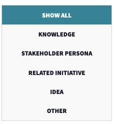
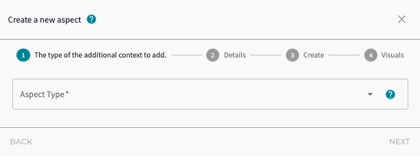
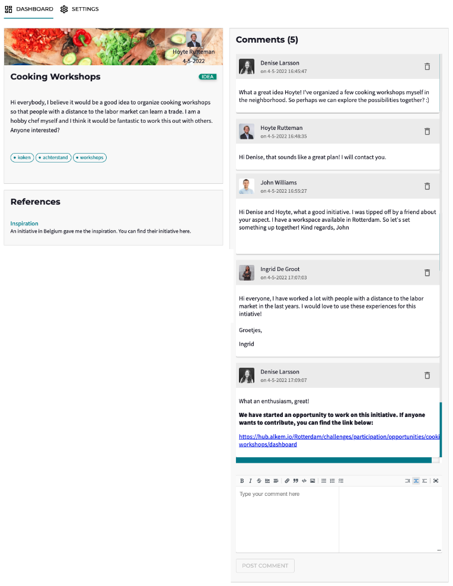
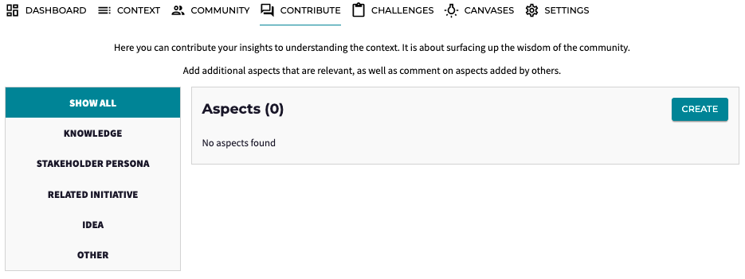
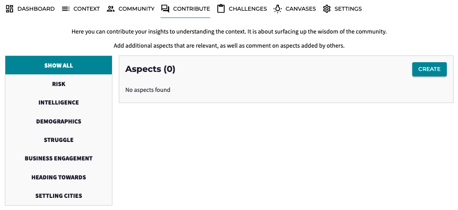

* Note that visuals of the platform may be outdated due to continuous improvements.

# Product: Wisdom of the Community

_How to enable everyone to share their insights? Gather input from a diverse set of perspectives?_

In any community there is a wealth of knowledge, insights and connections available - and too often this richness is not fully surfaced. Any user has interests, knowledge and network from their private or professional life that go far beyond their formal role. 

For example, you may have helped gather information about initiatives to help *Ukranian refugees*? Or you are concerned about the *climate crisis* and have read a lot about this in your free time? Or you are passionate about *social initiatives* in your local community and are deeply connected there? 

The more diverse the Community, the richer the set of potential knowledge. The question is then is twofold: 
* As a user, _how can I contribute to these topics in an easy way?_
* As a community manager, _how can I gather the wisdom of the Community around a particular Challenge?_

Alkemio can support you in both situations. By working together to surface up the rich collective wisdom of the Community, we can learn from each other and work together in an effective way.

### So how can you contribute? 

Sharing your insights is easy! As a Member of a Community you can contribute to topics you care about. These insights are called **Aspects** on Alkemio. Within each Hub, Challenge, or Opportunity, you can find Aspects under the **Contribute Tab**.

You can choose a type, title and give a brief description to explain why your Aspect is relevant. You can add *tags* to improve the search ability based on for example location, topic, or industry. Lastly, you can refine the Aspect with *references* and *visuals*. 

After raising an Aspect, the Community can see who *created* it, *respond* to it and in that way start a *discussion* around it. For example, you can find others with knowledge and resources related to your idea and start an Opportunity:

### What are the various examples of Aspects? 

You can think of many different examples of knowledge to be shared. Alkemio currently provides the following default Aspect types: *Knowledge*, *Stakeholder Persona*, *Related Initiative* and *Idea*. 

However Hub Admins are also able to customise the set of Aspect Types that are used. 

### How can you gather the wisdom of your Community?

It is also possible that you as a Community Admin want to **personalize** your set of Aspects related to your Challenge or Hub. We have seen various categories while working with our partners in the humanitarian as well as the Dutch public sector. 

For example, Stop The Traffik using Alkemio to build a Hub around the Ukranian Refugee crisis. They are looking for the Community to share related *risks*, specific *tools*, *demographics*, or the *countries and cities to watch*.

In this way, Challenge leads can make progress on their Challenge based on Community input. And Users can share their valuable insights. 

So connect, collaborate and contribute! The more people join Alkemio, the more impact we can make. Together. 
