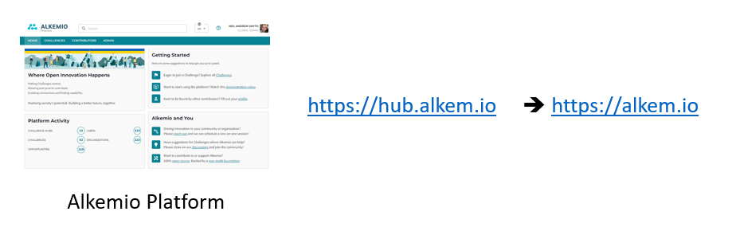
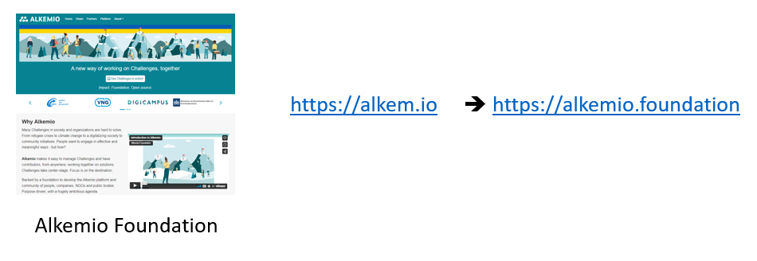

# Landing on the Alkemio platform 

Since the launch, almost 1 year ago, the **Alkemio platform** has been available on: https://hub.alkem.io.

And the information about the **Alkemio Foundation** has been available on: https://alkem.io

To reiterate the relationship: **Alkemio is the platform**. It helps you make progress on challenges, together. It is backed by the **Alkemio Foundation** to guarantee it's **purpose**. 

However, as our community and usage has grown, we have seen that you probably just want to get going with working on challenges! The Alkemio Foundation is important, but the platform is where users want to go and get work done.  

And we noticed that a lot of users were first going to the main URL (https://alkem.io) and then clicking from there over to the platform...

**What is changing?**

Every barrier we can take away to getting more people working better together on challenges is worth it - even if only an extra click or typing in a few less characters!

So, we decided to have **the Alkemio platform available at the primary URL**: [https://alkem.io](https://alkem.io) 

The website with information about the Alkemio Foundation, covering the purpose and organisation behind Alkemio, then needs to have a new URL. We are now available at https://alkemio.foundation.

**Questions?**

* _Will existing URLs still work?_ Yes! The previous location, https://hub.alkem.io, will still be available and redirect to the new location. So bookmarks / links will still work as before. 
* _Does this impact my usage of the platform?_ This should be a transparent change, all existing functionality should work as before. 

Please feel free to comments on this change - and as always any other suggestions!