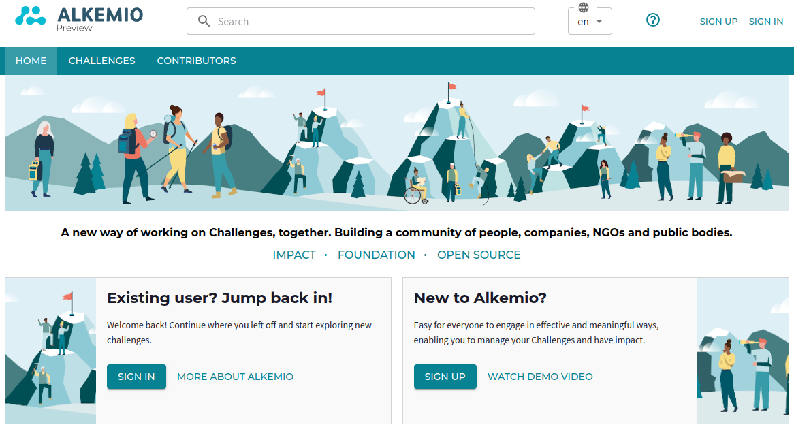
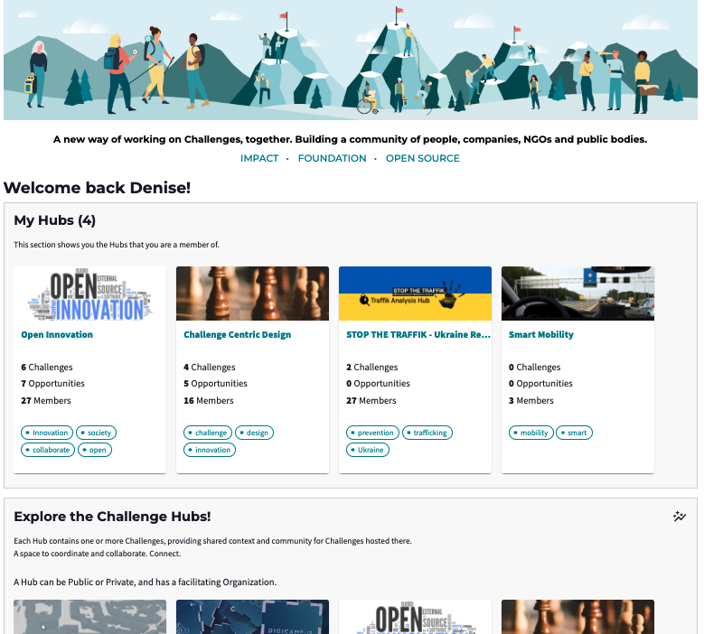
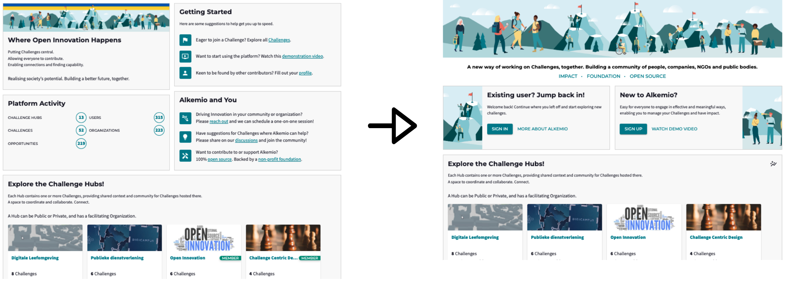
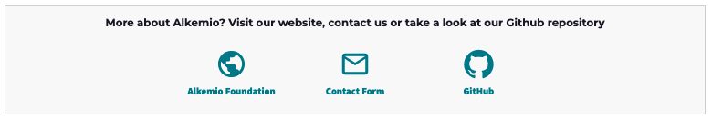
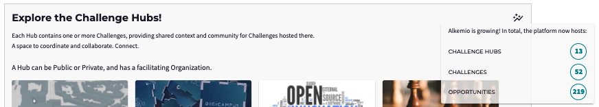

* Note that visuals of the platform may be outdated due to continuous improvements.

# Product update: Home page refresh

*Active user engagement*. This is key focus for the platform. How to make it easier to contribute? How to stimulate users to actively participate and share knowledge? How can we make it easy for them to jump right back into the topics they care about? 

The release on JUne 29th brings a **refreshed home page**. Bringing users directly to the content you care about! 

## Home page for users that are logged 

When you are logged in, you want to immediately see the content that is **relevant** for you. These are the Hubs that you are a member of!

In the future, your 'my home page' may include many additional functionalities such as an activity feed, or recommendations specific to you about relevant content. But with this first refresh, we have taken the first step.

## Home page for users who are not logged in 
For users that are not logged in, there is now stronger guidance to help with their next steps:
* **Existing users** can sign in or find out more about the **organization and vision** behind Alkemio. 
* **New users** can watch the **demo video** with an explanation and sign up.

## Alkemio & You, Metrics 
Finally, in replacing the content previously at the top of the page with the new user interface described above, there were some existing content that needed to go elsewhere: 
* **About Alkemio**: There is now a footer bar with ways to **connect** with us, find out more about [Alkemio Foundation](https://alkemio.org) and visit our github repository :

* **Metrics**: These have been incorporated within the relevant sections. As visualized below, you can find the amount of Hubs, Challlenges, and Opportunities via the icon in Explore the Challenge Hubs: 

The number of involved Users and Organizations are displayed in the Contributors section. 

## Summary
With this first home page refresh, we hope to make it easier for you to find relevant information and contribute to topics you care about! 

As always, happy to hear your feedback and ideas for the further improvement of the (my) home page!
