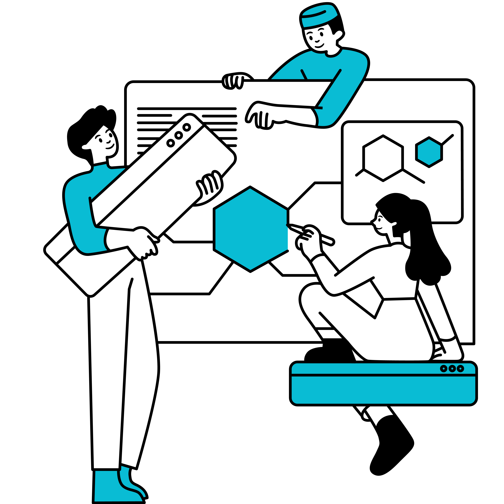

# Building Alkemio together

This has been one of the key messages since we started Alkemio. The code is 100% open source, and a public good.

Contributions can be in many forms:

* **Feedback**: on the product roadmap and features
* **Development**: directly via coding effort or feedback that can be directly added in
* **Financial**: supporting the core team
* **Communication**: raising the visibility and awareness of Alkemio
* **Usage**: growing the community so that network effects accelerate
* **Connecting**: making links to relevant parties
…

It can be on-going, or ad-hoc. It can be small or large. It could be as part of the core team or the community. Maybe you want to write an article? Or make an introduction? Or have an idea where Alkemio could add value? Or need to see a particular feature developed and your organization is able to do it? Or provide financial support to get an extension made?

A nice recent example is the [blog post](https://www.alkemio.org/post/2022-04-translation-uwv/) in this newsletter: UWV is currently using the platform internally, for which Dutch language support is important. The UWV Innovation Team gave feedback to improve the initial NL translation, so that everyone who wishes to work with Alkemio in Dutch (so public sector community members like Digicampus, VNG, Ministerie BZK, Belastingdienst) benefits.

And for those enjoying Whiteboards (whiteboards with best practices), it is worth sharing that the initial path finding work in that space was done by a developer assigned by Digicampus. Building on that capability, Digicampus also recently made available on the platform [one of their innovation whiteboards](https://alkem.io/digicampus/canvases?utm_source=hs_email&utm_medium=email&_hsenc=p2ANqtz-_7Rb5RD9q5PDdPgxtFkg_BB2zpi1cKxJbyX948CudbUFIP1N83tqb_n7wlyhMQ25ipfiAd).

It is a classic open source story: *everyone can contribute so that everyone can benefit.*

It does require **a different mindset**. Most organizations are used to buying “finished” products or services. Think of Miro, Teams etc. These platforms all have massive development teams, and they typically have the core goal of return on investment for those lucky enough to have stakes in the companies behind them. Interests are not aligned. Ensuring interests are transparent and aligned is critical for a platform aiming to help collaboration, as coverered in [a previous newsletter](http://alkem-25488729.hs-sites-eu1.com/newsletter/2021/december?utm_source=hs_email&utm_medium=email&_hsenc=p2ANqtz-_7Rb5RD9q5PDdPgxtFkg_BB2zpi1cKxJbyX948CudbUFIP1N83tqb_n7wlyhMQ25ipfiAd).

It does require **choosing to engage**. Of course you can just “wait” and let others develop the platform until it is “done”. That is a choice. But it does mean that the benefits for our society take longer to achieve. The more we can work together on Alkemio, the more we all benefit.

It does require **trust**. In the vision. In the team. In the community. We are hugely appreciative to all those that have already engaged. Accelerating our collective effectiveness in working together. Where everyone can contribute to topics they care about. Across organizational boundaries.

It does require **daring to take the lead**. There is simply more risk in supporting a platform that is not “done”. Actually it will never be “done”: there will always be extensions and ideas that are needed to face new social, environmental or technology challenges in the future.

The bigger the community, the bigger our benefits. *And you get to shape its development.*
