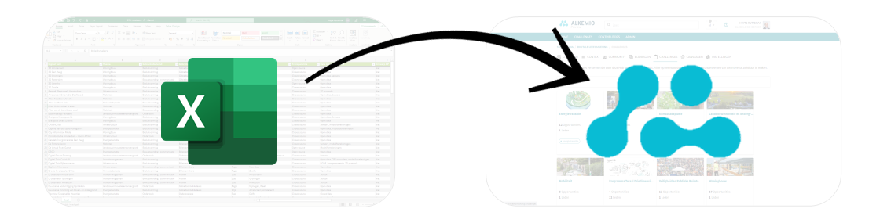
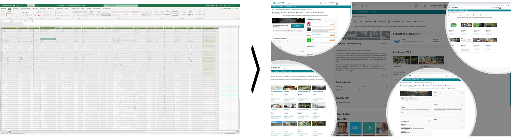
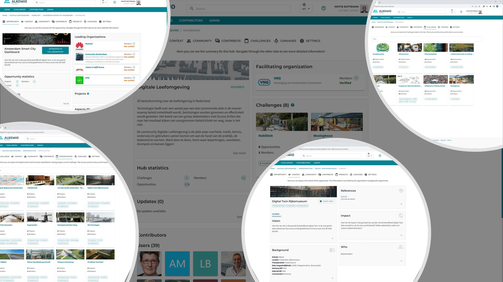

**Note that visuals of the platform may be outdated due to continuous improvements.*
~**Note that visuals of the platform may be outdated due to continuous improvements.*~

*You are managing a project, consisting of many stakeholders and types of information. The first thing you do is structure all data in a spreadsheet, as this is the easiest way of processing the data. But.. what now?*

Sounds familiar, right? This is something Alkemio regularly sees: innovation efforts being managed by spreadsheets. This can be so much more effective, and also less work for you! 

[VNG](https://vng.nl), the Association of Dutch Municipalities, also encountered this in their program *'Digitale Leefomgeving'*, which focuses on creating *digital twins* in the Netherlands. Alkemio helped VNG to transform this information from a simple aggregation of data in a spreadsheet to manageable information that can actually be **worked on**, together with **all relevant stakeholders**. In this interview, [Wouter Heijnen](https://nl.linkedin.com/in/wtrhnn) - one of the driving forces of the program - shares his insights on their progress.

### Why did you start using Alkemio for the Digitale Leefomgeving? 

"The government uses their own websites for communication and knowledge sharing for their projects and programs. They assist in sharing knowledge, gathering new insights and developing new technologies. 

Many of these projects are quite succesful and valuable. However, **one of their biggest downsides is: they end**. The ending of a projects means the shared knowledge is killed, it falls back to its source. Most importantly, it is no longer available for the broad community to learn from, a great loss. Using an independent platform like Alkemio, designed to help working together across organizational boundaries, can certainly help with this!"

The 'Digitale Leefomgeving' program includes 104 different projects all around the Netherlands. Excel is a good tool to get an initial overview on the projects, but it is very limited when it comes down to actually collaborating on these projects and showing others your progress. Alkemio offers the tools to **work** on these projects and **exchange lessons learned**. This is not only important for the current projects, but also for similar programmes that will take place in the future.

### How will Alkemio be used by the Digitale Leefomgeving community?

"We are working in the complex environment of a public organization, with data suppliers as well as education & research. On a strategic level, we are all working on the same subject, but on a practical level, we're not. The first goal of the hub is to **create an overview** on what is done by whom: a total of 104 projects are therefore visible in the Alkemio hub, almost straight from our Excel sheet. This content gives the platform some level of maturity and body. In order to kick-start collaboration, we need this background information." 

The next step is to **address the topics** of shared interest to work on. The projects have been divided in categories, such as infrastructure, energy transition and mobility. All projects share some basic definitions, and a project lifecycle can be established together with all approximately 200 organizations that are involved in these 104 projects. At category- or project-level, these definitions and lifecycles can be further specified. A good alignment between all projects will facilitate an easier knowledge-exchange between the projects.

### So who will be managing all these different projects?

"Our goal is to have a **self-supporting community**, without central management from VNG, Waterschapshuis or Interprovinciaal Overleg (IPO). This is a big challenge: when everybody is responsible, nobody is. It will require a transformation process. Initially, I will be the central gatekeeper and promotor and gradually transfer the tasks to members of the community. In the end it will be a test. If the value of being part of the community is high enough, people will take their responsibility. If not, then the value isn’t worth the effort."

### Who will benefit from working on Alkemio? 

"The community members are from the triple helix: education, government and market. Together we are facing huge challenges in which we believe technology can be part of the solution. On the short term, we will all benefit on a business/personal level. That benefit is an **enabler for communal benefits**."

### Where do you see the platform economy in 5 years?

"I hope that the platform economy is no longer used as a tool to lock out gatekeepers of public values or rules of operation. We have seen platforms breaking open traditional markets, with good intentions initially, but in the end they focus on market dominance and shareholder value. In many cases, they are using public space and public funded facilities to make their profit. I hope this will change and I have faith it will happen"

Alkemio believes that a platform for collaboration across organizational boundaries should have **public values central**. Interactions should benefit public values, rather than commercial or other interests. In the case of Alkemio this is achieved by having Alkemio backed by a foundation to guarantee its purpose. You can read more about the rational for being a foundation in [this blogpost](https://alkemio.foundation/post/2022-01-why-foundation/).

 ### When is the 'Digitale Leefomgeving' program on Alkemio succesful?

"The moment it is self sustaining."

Do you want to take a look at the Digitale Leefomgeving hub? [Check it out here](https://alkem.io/digileefomgeving/dashboard)!

--- 

