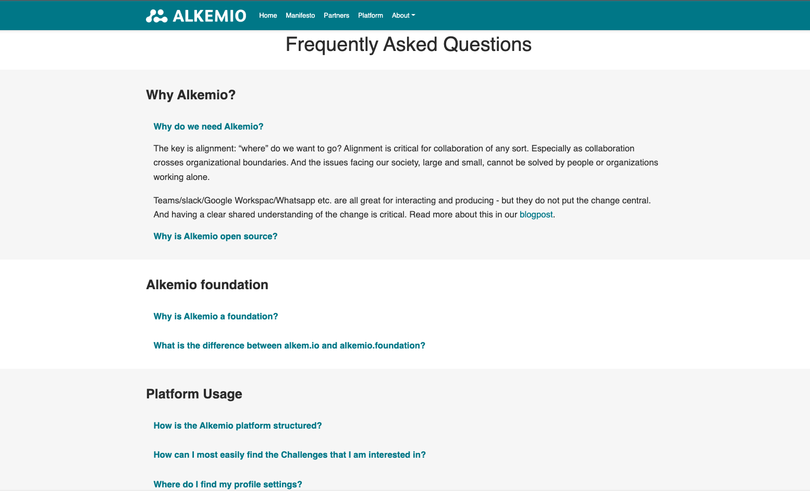
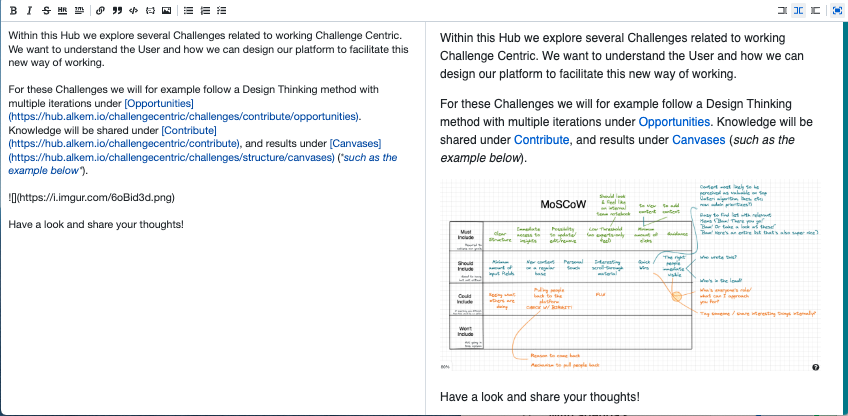

*The Alkemio platform is growing! With the expansion of our users, guidance becomes more and more important. That is why we have made the first step towards building our **knowledge base**!*

This knowledge base will overtime include a FAQ, how-to guides, tips and tricks for using the platform, relevant articles, etc. 

### Frequently Asked Questions
The good news is, we have put up our first version of the **Frequently Asked Questions** that you can access via [alkemio.foundation/faq/](https://www.alkemio.foundation/faq/) and the help icon on [alkem.io](https://alkem.io). The FAQ currently includes several questions related to the use of our platform, Alkemio in general, and the foundation behind Alkemio. Please have a look and share your suggestions!

### Tips and Tricks with Markdown
With help from our partners, we learn about how Alkemio can be used on a daily basis. To give you an example of some tips and tricks for the platform, we will dive a bit deeper into the **Markdown** functionality. 

Markdown is an easy way to add **formatting elements** to text documents. On the Alkemio platform, Markdown fields are for example used for *Updates*, *Context* of your Hub/Challenge/Opportunity, or Aspect *descriptions*. As visualized below, it can be used in many ways. 

For example, you can insert *links* in your Hub Context to relevant Opportunities, important Aspects, or active Canvases. Also, *videos and images* can be embedded to make your text more visually appealing. 

The possibilities are endless, and you can find them online via for example the [Guides provided by Markdown](https://www.markdownguide.org/). Have a look and play around with it on our platform! 
