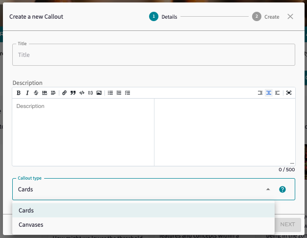
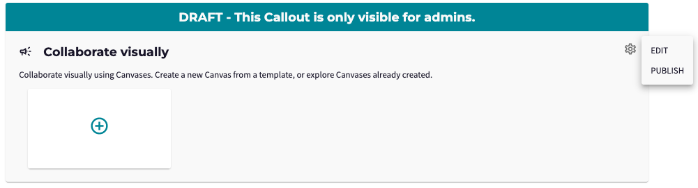
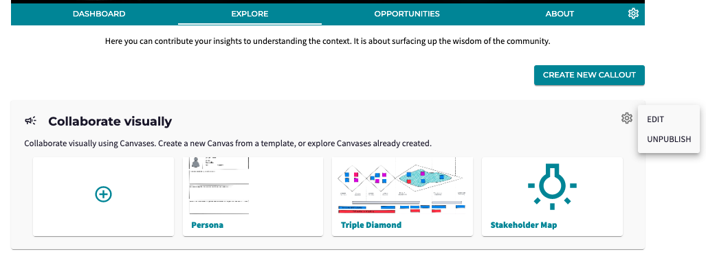

* Note that visuals of the platform may be outdated due to continuous improvements.

*What are the topics that your community is most interested in? Who are the potential stakeholders that play a role in this Challenge? What are the risks related to this Opportunity? What are other initiatives that this community can learn from?*

These are all questions that you may encounter while working on your Challenges. As a Lead you want to stimulate your community to <b>engage</b> and as a member you want to know <b>where</b> you can contribute, what are the important issues in that particular fase. 

Previously, your Community was able to share their knowledge via Aspects or Whiteboards. But this approach did not allow for providing <b>context</b> to the request, nor to have <b>multiple requests</b>. With the addition of Callouts, admins can now frame multiple requests to the Community on different topics. 

### <b>Creating a Callout</b>
Creating a Callout is simple! Admins will see a "Create Callout" button on <b>Explore</b> tab, which presents them with a form where you can add engaging title and provide further description. This is framing the Callout: *what it is that you are asking from the Community*. The final choice is deciding how the Community can contributue: by putting up their card (with knowledge/persona's/related initiatives) or a Whiteboard (as a visualization). 

A Callout is typically created as a <b>draft</b>, as shown below. Draft Callouts are only  visible to Admins.

After publishing, the Callout will be visible to the Community. An Admin can later choose to <b>unpublish</b> the Callout again. The settings icon on the right also allows you to <b>edit</b> the Callout. 

### <b>Engaging the Community</b>
As mentioned earlier, the Community can answer these questions by submitting a Card or a Whiteboard. Deciding what type of Callout is most appropriate depends on the questions. 
- <b>Cards</b>, (previously Aspects) are a way to submit your knowledge, such as ideas, related initiatives, or relevant stakeholders, and provide an additional description, references and visuals. Also, others can comment on the knowledge provided with the Card.
- <b>Whiteboards</b> can be used to allow people to visualize their persona's, stakeholder mapping, business models, etc.

### <b>A glimpse of the future</b>

The next release will already include a third type: <b>Discussions</b>! 

The <i>Discussions Callout</i> type allows members a low threshold way to engage by providing a simple text answer. Examples can be a Callout for new members to introduce themselves in the Hub, or share topics that they would like to include in the next webinar, or propose additional Challenges.

But there is so much more potential for these Callouts that we want to explore with you in the coming months. For example:
- <b>Additional Callout types</b>: for example to let the members <i>vote</i>, or in <i>task list</i> with jobs to be done
- <b>Enriching the Callout concept</b>: for example <i>closing</i> your Callout for further answers, <i>timeline</i> for the Callout (when it is open, when it is closed etc), <i>summarizing</i> the results, or <i>connecting</i> your Callouts to different Innovation Flow fases.

As always we would love to hear your examples of how Callouts can be used and are looking forward to seeing them in action on the platform!
