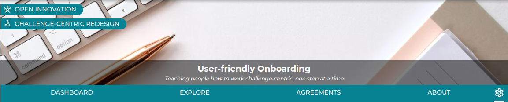
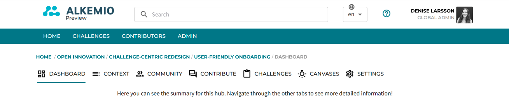
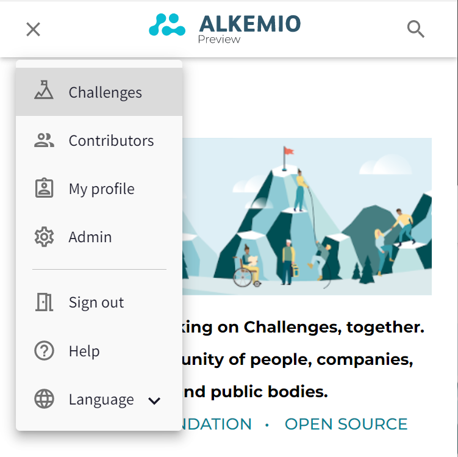

<i>We believe that our platform can enable individuals and organizations to solve Challenges, together. But we do understand that it is again a new platform, with new functionalities and an unknown interface. The simplification of our menu structures has therefore been an important focal point the last weeks.</i>

### Platform menu
The key elements of our platform menu can now be found as icons on the <a href="https://alkem.io/"> top right: </a> <b>Challenges</b>, <b>Contributors</b>, your <b>Profile</b> and - if applicable - your <b>Admin</b> settings. This is where you can explore all the Challenges on the platform as well as the individuals and organizations contributing to those Challenges.  

New menu:

Old menu:

As you can see, a whole "menu line" has been removed!

### Release Notification
Also, when new releases are deployed, users will now see a <b>Release Notification banner</b> to inform them that the release has happened as well as where they can find additional information about what has changed:

### Hub, Challenge and Opportunity

When you dive into your Hub, Challenge or Opportunity, you may have several questions. Where am I? Where do I start? What can I do? The tabs offered now are much more oriented on giving the user a <b>direction</b> on where to start or to go

New menu:

Old menu:

As you can see, the new menu is a big simplification!  

First of all, the new layout places the <i>banner, title, and tagline</i> centered across the page. Making it immediately clear where you are and what the purpose of this Hub / Challenge / Opportunity is. The labels on the top left have replaced the endless breadcrumbs that we previously had, making it much easier to navigate between the different 'levels'.

Furthermore, based on the feedback of partners and platform users, we reduced the tabs to a <b>set of four</b>, making it more explicit where you should go for what. 

#### Dashboard
Where am I? What are all the things that I can do or see here? The Dashboard combines this information and has mostly remained the same. It is the starting point and highlights the <i>summary</i> of the Hub/ Challenge / Opportunity. It includes the Updates as well as previews of the Community, latest activity, and the Challenges or Opportunities. 

#### Explore
Where can I help? Where can I start working on this Challenge? The Explore tab becomes the place where all the <i>action</i> is happening, where the wisdom of the community is gathered! This knowledge was previously shared via the Canvases or Aspects pages, but are now available at one place and structured via Callouts. To read more about this new functionality, please see our [recent blogpost](https://www.alkemio.foundation/post/2022-09-callouts/).

Within the Hub, this section is mostly focusing on gathering the right people and identifying Challengs to work on. Explore within the Challenges is more related to gathering insights about the Challenge and identifying possible Opportunities. Lastly, for Opportunities it is important to gather resources to make it happen, as well as showcasing the results!

#### Challenges and Opportunities
The Challenges and Opportunities tabs have remained the same. This allows you to <i>dive a level deeper</i> into the context of the Hub or Challenge.

#### About
What was the reason for creating this Hub / Challenge / Opportunity? What is the vision? Which individuals and organizations are already involved? All these questions to help you <i>understand</i> can be answered via the About tab. This now contains all information from the former Context and Community Tabs. 

#### Admin
Finally, the <i>administration</i> is now done in the context of the Hub, Challenge or Opportunity. This can be reached via the cogwheel icon on the right. It is also possible to directly navigate back to different areas of a Hub / Challenge / Opportunity from within the settings.

### Mobile Menu 
These updates are all taken into consideration for our refreshed mobile menu as well.

We continue to look for ways to support our users and we welcome all the feedback and input!   
