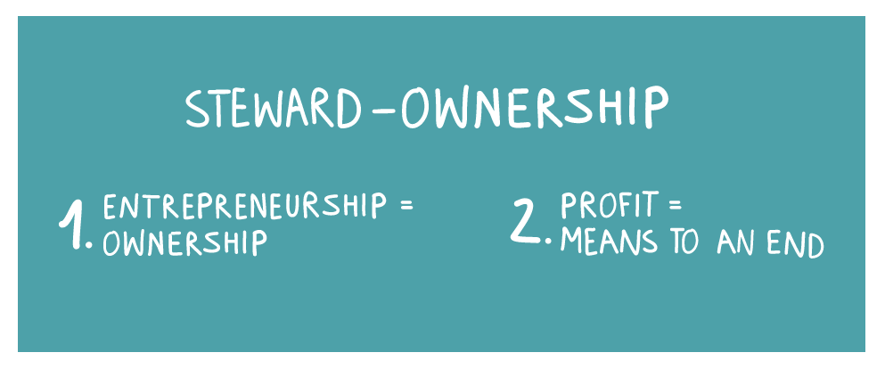

**At lot of engagement to enable change**

Our calender is full of very cool events to discuss, meet and know more about how communities are currently working on challenges. All part of our purpose driven mission to enable people to work challenge centric, on an open-source platform with public values central.

**Purpose before profits, public values central**

Imagine a company structure where your independence and purpose are guaranteed. Around for a long time, think Patagonia, Bosch and Zeiss. Now in the 2020s more stakeholders are looking for companies with a clear and guaranteed purpose. In the Netherlands good examples are [TBI and Moonback](https://wearestewards.nl/bedrijven/). What's needed are more businesses like Patagonia that model a viable ethical business and make meaningful commitments in line with their purpose.

For Alkemio, it is about ensuring public values remain central. Established as a foundation in 2020, we are now ready for the next step towards Steward Ownership. Setting up steward ownership and growing the community will guarantee that Alkemio remains purpose driven and all stakeholders can work together with this clear vision written up in our manifesto > https://www.alkemio.foundation/manifesto/. 

With profits serving purpose there is a growing steward ownership community in NL, Europe and globally - recognising that there are many types of value and it is not all about shareholder returns. We invite all who support this mission to join the [Alkemio community](https://alkem.io/). We have joined or will join these events, working with these communities to see what is needed to realize change, together!

**Events**

27 & 28 September 2022 • Malaga (Spain)
 
**[Empodera Live](https://lnkd.in/eGCWGkgA) - Denise Larsson - Open and Secure Collaborative Communities**
 

6 October 2022 • Amersfoort 
 
**[Eigendom Anders Festival](https://eigendomanders.nl/) - Neil Smyth - Steward Ownership**

18 October 2022 • Ghent (Belgium)
 
**[Discover New Encounter](https://lnkd.in/eMuBfr2Z) - Denise Larsson & Neil Smyth - Societal and digital transformation**

1 November 2022 • World Forum • The Hague
 
**[Gov Tech Summit](https://www.govtechsummit.eu/agenda) - Neil Smyth - More founders, less barriers: is procurement the single biggest blocker to innovation**
 
**[Gov Tech Summit](https://lnkd.in/e8Qwqqmh) - Team - Expo**

November 2022 • Hybrid (In Dutch)
 
**INNOvember** 
 
2 November - **Neil Smyth - [Proactieve Dienstverlening](https://lnkd.in/eja5VKB3)**
 
17 November - **Team - [Networkborrel](https://lnkd.in/eKmMmjWJ)**
 
25 November - **Neil Smyth - [Communities als innovatieve werkwijze binnen de rijksoverheid](https://lnkd.in/eaeRanWn)**
 

15 November • Fokker Terminal • The Hague
 
**[ImpactFest](https://lnkd.in/ePquRz4r) - Neil Smyth - How to succeed in working on Challenges, together**
 
**[ImpactFest](https://www.govtechsummit.eu/partners) - Team - Creating the Future of Impact**
