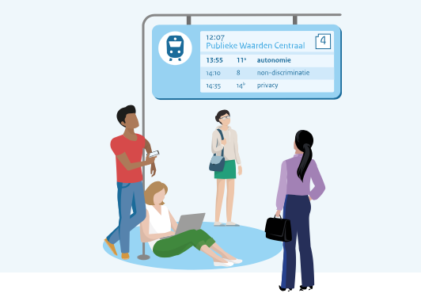
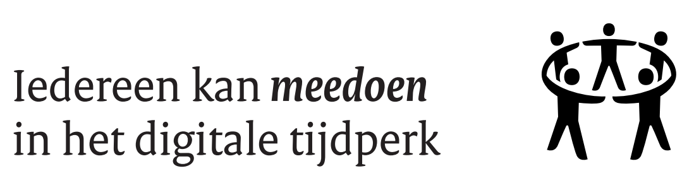

It's widespread 'NEWS' in the Netherlands and Europe: _Participation_, _trust_, and _control_ in the digital society. Partly because it has to be done - the European regulations have been tightened up - and on the other hand, it shows how demand is increasing. 

It is no surprise that younger users are more likely to turn to the internet for almost **all information gathering**. Looking for a handyman or work, and communicating with others; TaskRabbit, WhatsApp, FaceTime, and Skype make it easy to communicate instantly across the globe. 
Despite having a tough year ahead, the future in terms of the growing online workforce is that 69% of those aged 18-24 use the internet to source their gigs*. Whether from a platform, a job agency, or some online marketplace, digital platforms are becoming preferred sources.

These user markets provide opportunities. Platforms provide the innovations necessary for public institutions and private organizations to _serve their goals_ and constituencies more effectively, _increase participation and citizen engagement_, and _enhance stakeholder experience_. As a platform with public values central, we know there is much for companies and institutions to consider becoming future-ready. We are highlighting this news of the public sector movement in the Netherlands to open the discussion and insights into how your organization can use digital and open-source collaboration to jump-start success. 

### We love tech. But not how it is often used. 

Big and small businesses play a big role in the public domain. This implies the urgency for governments to explore and secure their role in the platform economy. On Alkemio we are creating focus and we showcase the opportunities for public institutions and private organizations. We do not want digital tools and data to be used to exploit people. They should benefit society. Working together in one online space on common goals, putting the shared value central, rather than the organization, will reveal the infinite potential of collaboration. We believe this is the key to success. 

### How Public Platforms can enable collaboration and transparency for users with *[Province of South-Holland](https://www.zuid-holland.nl/onderwerpen/digitaal-zuid-holland/ethiek-digitalisering/)*

An expedition that started in the spring explored the possibilities of the province of South-Holland, as a connector in the platform economy. During an open symposium, the results of the six months of explorations were launched in an expedition report. It was handed over from the acting provincial secretary Jan van Ginkel to the deputy Willy de Zoete. The results show that there is a need to enable the user and the community around public challenges. Platforms are steering and maintaining the rules of engagement and they can lower transaction costs.  

### Across all boundaries?! The [European Digital Markets Act (DMA)](https://competition-policy.ec.europa.eu/dma_en) is published. 

In the Netherlands, Alexandra van Huffelen presented the 'digitale werkagenda' which enables tech companies to collaborate to achieve the goals of the DMA. And online platforms and search engines failing to comply with the DMA can be fined up to 6% of their worldwide turnover. Enabling digital transparency is an important step and at the core of Alkemio's beliefs: **A platform should be: open for all for everyone to contribute; independent and solid to make progress together, and work across all boundaries.**

Key measures in the DMA include the following:

* **Online platforms**. Swift removal of illegal content online, including products, and services: a clearer “notice and action” procedure where users will be empowered to report illegal content online and online platforms will have to act quickly;
More responsible online marketplaces: strengthening checks to prove that the information provided by traders is reliable (“Know Your Business Customer” principle);
 
* **Transparency for users**. New transparency obligations for platforms will allow users to be better informed about how content is recommended to them (recommender systems) and to choose at least one option not based on profiling.
Online advertising: users will have better control over how their personal data are used. Targeted advertising is banned when it comes to sensitive data (e.g. based on sexual orientation, religion, or ethnicity);
Protection of minors: platforms accessible to minors will have to take specific measures to protect them, including by fully banning targeted advertising.
Dark patterns: online platforms and marketplaces will be prohibited from manipulating users’ choices.
 
* **Harmful content and disinformation**. Very large online platforms (more than 45m monthly users) to mitigate systemic risks and be subject to independent audits each year. Special measures in times of crisis: during a public security or health emergency, the Commission may require very large platforms to limit any urgent threats on its platforms for up to three months.

Putting public values central is at the core of Alkemio. You can read our manifesto and we encourage anyone who supports this manifesto to join the Alkemio community and feel free to comment 🔽

https://www.alkemio.org/manifesto/

*non-employed contractors

