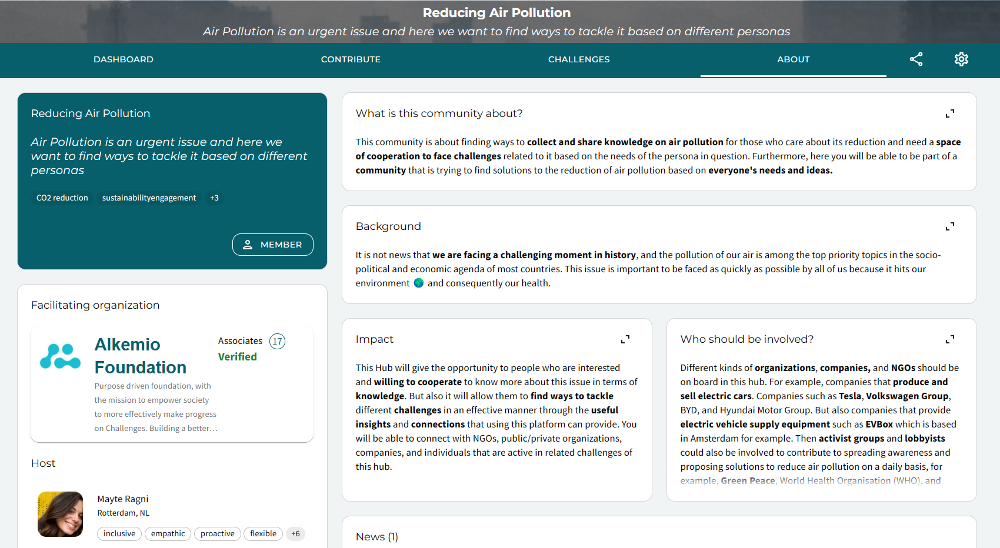

* Note that visuals of the platform may be outdated due to continuous improvements.

### Discover the meaning behind our platform's terminology!
*Welcome! This blog will spread some light on the meaning of Alkemio's core concepts visualized in the image above. It is key to understand these concepts before starting your journey on our platform.*

Let's start with the **red flag** on top of the mountain. This flag represents the Challenge, the central focus on our challenge-centric platform. 

Then we have a set of **yellow flags** spread around different levels of the mountain. Those flags represent the Opportunities, the next steps that we can identify and take towards the red flag on top. 

All the **people** around the mountain represent the *community* of individuals, organizations and resources that will help you on this journey. Cooperation along the **journey** is the key to success. The connected community, Challenges and Opportunities can all be found in a Space (the mountain).

All clear so far? Now let's get into more detail by explaining the key concepts with our example Space...

#### What’s a Challenge?
A Challenge, in this context, represents the change you want to achieve with a group of people. Together you want to reach that flag on top of the mountain. It has to be the central focus point in each community to **solve these issues more effectively together** with the right people and tools. The community can for example discuss what are the biggest obstacles to solve this issue, who are already working on it, or what are interesting articles on this topic.

Below you can see two examples of possible Challenges related to the topic of reducing Air Pollution: *Awareness* and *Work environment*. Why? It is logical to think that a first barrier, when talking about topics such as reducing air pollution, is that many people may not be aware of the urgency of the topic. Often, people do not know what the consequences are and what can be done to improve the reduction of CO2 emissions. That is why it is important to draw attention on awarness. And the "work environment" challenge is a concrete example of a context in which the topic of air pollution can be faced and overcome under certain aspects of people's daily life.

#### What's a Space?
A Space is another word to represent a community of people that are driven by the same interests. This **ecosystem** includes all existing individuals or organizations currently working on a (group of) Challenge(s). Together they can effectively communicate and improve their understanding of who else should involved, why and what kind of contributions/values they need.

In this example Space, the community is interested in *Reducing air pollution* on different levels and in different contexts. The creation of a Space can help different people to connect and share ideas, knowledge and useful insights to efficiently get to the solution of the Challenges. The functionalities available in the Space will allow parties that were not connected but have the same end goal, to work across organizational boundaries.

#### What's an Opportunity?
An Opportunity represents a possible **way to solve a challenge**, or a step in the right direction. There can be different Opportunities to the same Challenge based on the needs and resources of the people working around a certain issue. 

A possible Opportunity related to creating awareness can be *Educating individuals on pollution*. Important discussions within this Opportunity can for example be about the resources needed to develop/fund this Opportunity or the lessons to learn from others applying this solution.

 

Alkemio aims to be a place where multiple parties with different ways of working and different networks can come together to reach common goals. They can brainstorm, share ideas, share connections and create visualizations of concepts with the right tools. All available in this one platform.

Pretty cool right?! :) We hope that this blog post has clarified how Alkemio works, why do we use certain terminology and what is our goal!

#### However this is not all of it!
Theree is more to come of course! Our platform is in constant development and improvements are made based on the input from the existing communities. Further explanations will be given along the development process of Alkemio and its functionalities. 

So stay tuned.. See you in the next blog post!

*note: this post has been updated to ensure consistency with the latest terminology.*