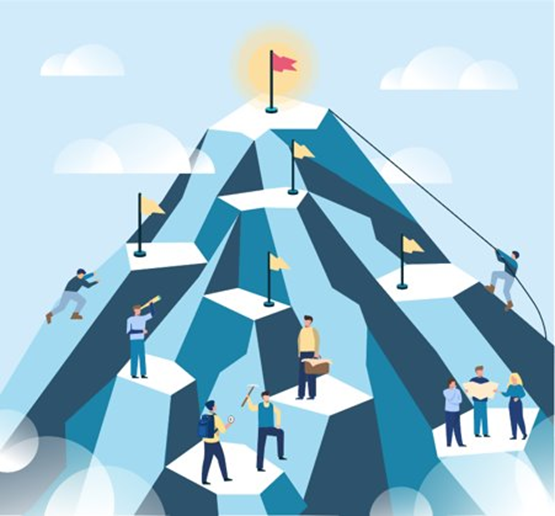
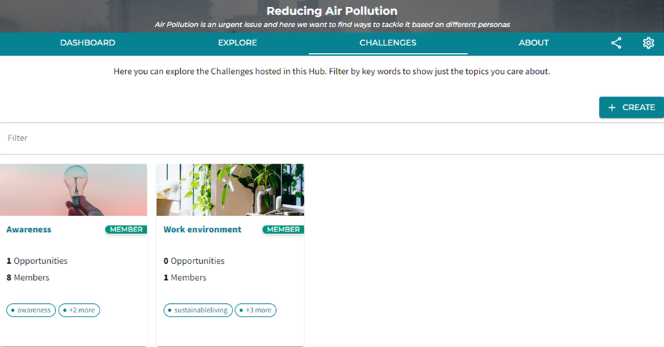
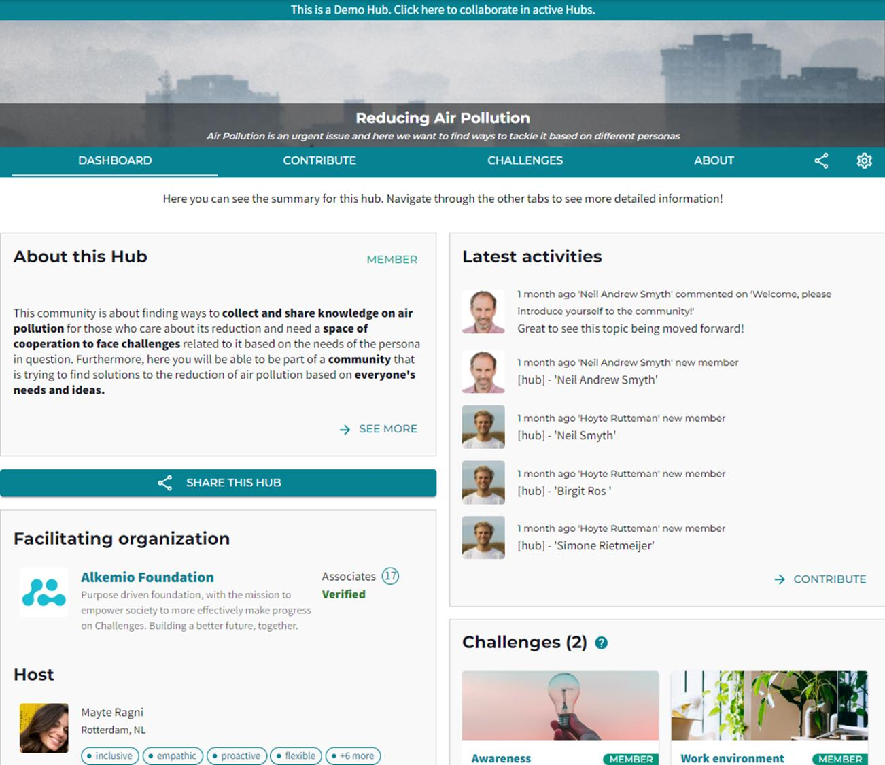
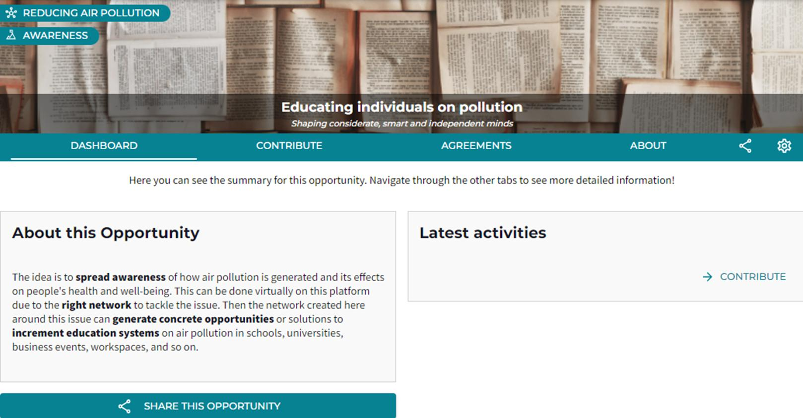

## Discover the meaning behind our platform's terminology!

### Welcome! This blog will spread some light on the meaning of Alkemio's core concepts.

The image above is a visualization of our platform's structure and concepts. Let's start with the **red flag** on top of the mountain! This flag represents the Challenge which is put central since we are a platform that works challenge-centric. 

Then we have a set of **yellow flags** spread around different levels of the mountain. Those flags represent the Opportunities, the next steps that we can take towards the red flag on top. They illustrate the possible solutions that we can identify to tackle and solve the central Challenge. 

All the **people** around the mountain represent the **community** of individuals, organizations and resources that will help you on this journey. Cooperation along the **journey** is the key to success. Therefore, the mountain portrays the Hub which is the community created around the challenge.

### All clear so far? Now let's get into more detail...
*The key concepts will now be explained further with screenshots taken from our demo example Hub.*

***What’s a Challenge?***

A Challenge, in this context, represents the end goal of many people. This is why we put the Challenges central within our Hubs or communities. Thanks to the communities around certain challenges, these can be **solved more effectively together** with the right people and tools.

The image above represents a screenshot of two examples of possible challenges related to the Hub interested in "reducing air pollution". The challenges concern the awarness of the issue itself, and how this issue can develop within the work space for example. 
You may ask yourself: 
##### Why have these two challenges been picked in this context?

It is logical to think that a first barrier, when talking about topics such as reducing air pollution, is that many people may not be aware of the urgency of the topic. Often, people do not know what the consequences are and what can be done to improve the reduction of CO2 emissions. That is why it is important to draw attention on awarness. And the "work environment" challenge is a concrete example of a context in which the topic of air pollution can be faced and overcome under certain aspects of people's daily life. 

***What's a Hub?***

A Hub is another word to represent a community of people that are driven by the same interests. The whole hub concept can be translated into an ecosystem. The **ecosystem** is composed by all the members interested in a certain challenge, and having them all group together in one hub helps the communication process and the understanding of who is involved, why and what kind of contributions/values are people adding to the community. 

In this example hub the community is interested in finding ways to recude air pollution on different levels and in different contexts. The creation of a hub can help different people to connect and share with others ideas, knowledge and useful insights to efficently get to the solution of the Challenge.

Here above, the example Hub is shown. This represents a space where a community can come together to work on a specific topic with different communication tools all in one platform. This will gurantee efficiency and effectivness and cross the borders between diffet parties that are not used to working together but that have the same end goal.

***What's an Opportunity?***

An opportunity represents possible **ways to solve a challenge**. There can be different opportunities to the same challenge based on the needs and resources of the people working around a certain issue. The community is the resource and potential solution to the challenge. The only thing needed is to work out every step of the process with the right people, that have the same interests and that can work in the right space all together.

In the above screenshot, there is the visualization of one of the opportunities within the "reducing air pollution" hub related to the challenge of "awarness". This is to show, how the interface looks like, and to give a sense of the many possible solutions to be found depending on the challenge and the community around it. 

Alkemio aims to be the space where boundaries between different stakholders can be crossed. A place where multiple parties with different ways of working and different netweorks can come together to reach common goals. Here different stakholders can bainstrom, share ideas, share connections and create visualizaions of conecepts with the right tools which are all available in this one platform.

#### **Pretty cool right?! :)**

We hope that this blog post has clarified how Alkemio works, why do we use certain terminology and what is our goal!

#### **However this is not all of it!**
Theree is more to come of course! Our platform is in constant mutation and development. Further explanations will be given along the development process of Alkemio and its functionalities. 
##### *Little foretaste...*
The interface of the platfrom is currently been updated so you should be expecting to see visual developments and changes as well as more content and further guidance! ;)

#### **STAY TUNED EVERYONE...**
See you in the next blog post!
