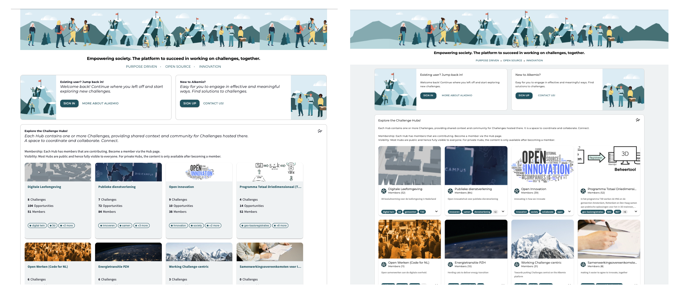
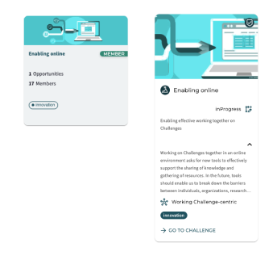
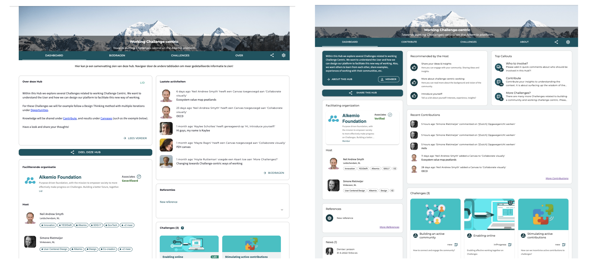
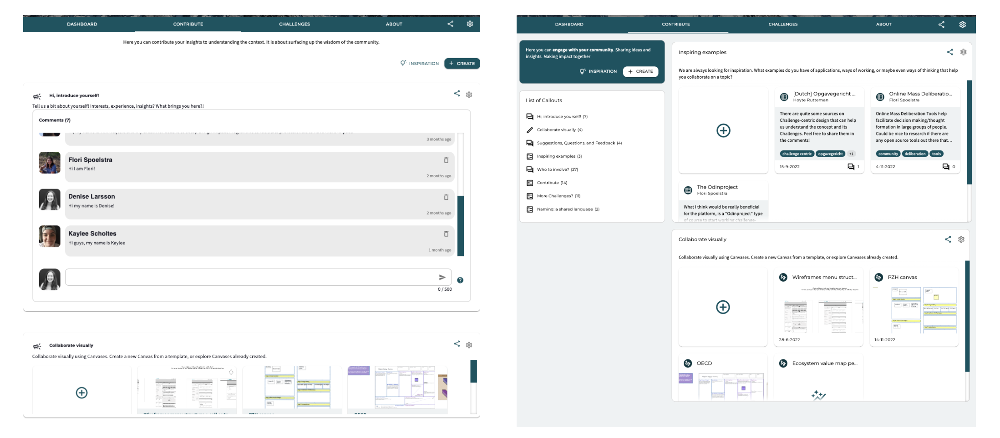
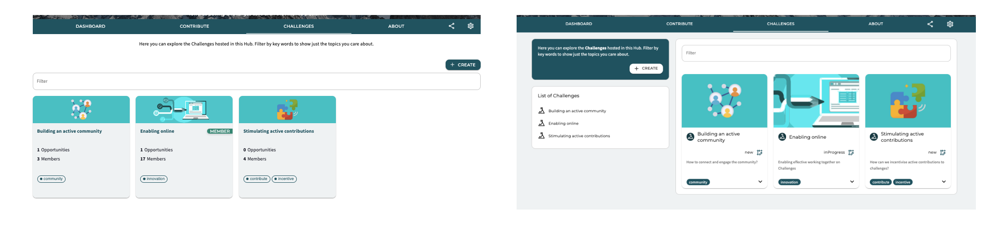
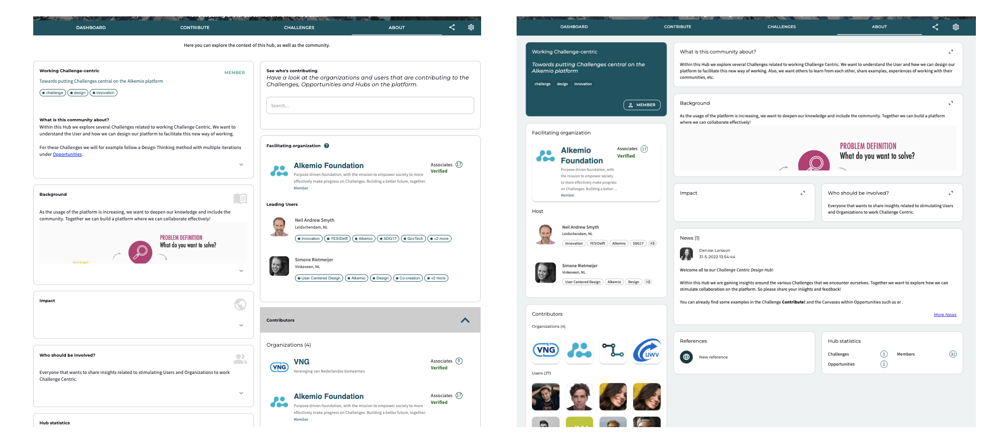

* Note that visuals of the platform may be outdated due to continuous improvements.

*After adding a lot of new functionalities, it was time to have a look at the user interface of our platform. This month, we have been preparing a completely new interface for you. Since it has quite a different look and feel, we wrote this blogpost to talk you through it.*

### Global changes
First of all, you will immediately see some global changes across the platform. This includes styling updates with regards to o.a. colors, spacing, and textstyles. Improvements resulting in a more **modern look and feel** and according the **accessibility standards**.

Also, you can see the new design of the **cards**. When a new user enters the platform, they want to see the topic/vision of each community. In that way they can more easily join the ones of their interest. To guide the user, the cards now includes more context instead of metrics. The cards are *expandable* for more content and show a preview of the *tagline*, part of the *vision*, the *innovation flow* state, and the *community/challenge* they are a part of.

### Journey pages
The key focus for this interface refresh has been the journey pages. The switch to a **1:2 layout** on this pages allows for a better display of the content. Below you will see the update for each tab within the Alkemio communities. 

#### Dashboard page
The [dashboard page](https://alkem.io/challengecentric/dashboard) should present a *summary* of what happens in this community and should *guide* the user to the most relevant content. As a lead of the community, you want to be able to customize this. The new lay-out highlights three key functionalities to help you with this. The left block is familiar, namely part of the **vision** of this community so the user knows where they have landed. 

However, we have added two new features. In the middle, we have added **recommendations by the Host**. These are three links that the community lead can add to guide their members to the most relevant content (within or outside of the community). You can think of a recent report that they must read, a link to sign up for one of the community events, a document with guidance on how the community uses Alkemio, etc. 

And finally, the last block shows you the **Top 3 Callouts**. These are the Callouts on the Contribute page where the most interactions happens, meaning the most contributions. The user can then immediately see what knowledge is required or what is being discussed in the community. 

#### Contribute page
This is where you can collaborate, share knowledge and insights, receive feedback. Therefore it is key that you are quickly able to navigate to the callouts that you can contribute to. 

As the number of callouts is growing, navigating them effectively on the contribute page becomes important. Therefore, we have added a [**list with all callouts**](https://alkem.io/challengecentric/contribute). Clicking on one of these callouts will directly navigate you to the callout. Note that there is also a refresh of the **cards** and **whiteboards**, again focussing on visualizing the content directly.

#### Challenges page
Similar to the contribute page, the number of Challenges can grow quickly as your community starts to expand. Therefore, the [**list with all Challenges**](https://alkem.io/challengecentric/challenges) helps you to navigate to the Challenge(s) you are most interested in. Also, the redesigned cards provide more context to trigger members to the Challenges they want to contribute to.

#### About page
While [this page](https://alkem.io/challengecentric/about) doesn't have much added functionality, the lay-out improvements are clearly visible. The 1:2 lay-out allows for a better distinction between the **community** information on the left and the **context** on the right. Also, the expand button opens a dialog where you can read through the entire context.

Hopefully these updates will improve your ability to make progress on your Challenges. Interested in trying out the changes? Go directly to [Alkemio](https://alkem.io)!

Do you want to receive updates about new functionalities directly? sign up for our [Release notifications email](https://alkemio.org/releases). And as always, happy to hear feedback or other suggestions!

