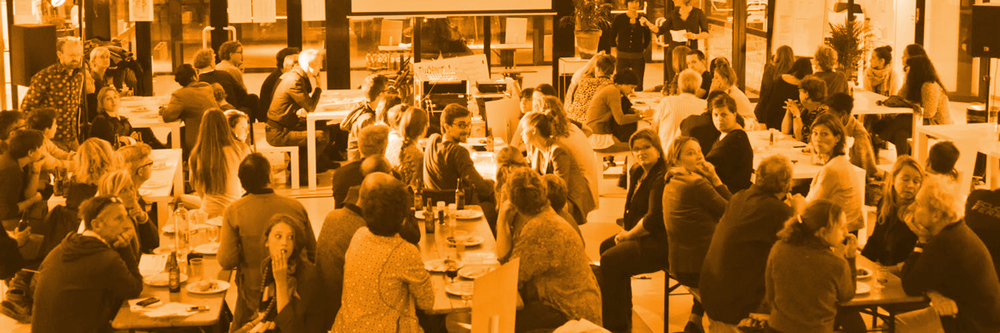
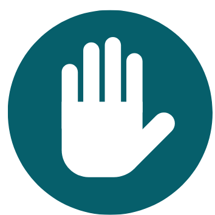

### Explore 
Building a community and keeping it active is a challenging task. When turning conversations into contributions that matter, it is essential to not only **build** communities but also to **guide** and help them along the process. You want to make sure they keep engaging and growing as a community while they work towards a shared interest. 

The Alkemio team thought it was time to organize a **community gathering with our new and existing communities** on the platform. While focusing on solving real community problems by having all your tools in one place, their ideas and thoughts evolved into something better: a list of drivers and blockers. We will be hosting **more workshops** to regularly connect the various communities around Alkemio, dive deeper into specific topics and share experiences from activities on and outside the platform.

### Community journey
It was an interesting afternoon where we brainstormed about the possible ways to grow and activate communities. Even though all communities are very different, we share similar drivers and blockers in our journeys. New users or professional innovators could be hesitant in sharing their believes out in the open. The energy and support from the champions in the communities are key to making progress.

During the workshop, we have captured the **drivers, blockers, and suggestions for activities** that were mentioned in the [Building an Active Community Challenge](https://alkem.io/challengecentric/challenges/buildingthecommuni-426/contribute) on Alkemio.  A few examples:

#### Drivers to come to the community
* Members are often looking for knowledge instead of providing knowledge
* They want to feel seen, heard, and helped
* They contribute when there is a clear task for them
* They want a space to experiment
* They want to see other success stories 

#### Blockers are related to 
* Vulnerability
* Time pressure
* No open culture
* No control

#### Activities to start engaging the online and offline community
* Find your key champions first in the community
* Start by focusing on a specific challenge or topic, end to end
* Organize meetings in person before exposing them to the difficulty of a new platform. That allows members to get to know one another and to build relationships over time that wouldn’t be possible without the community
* Sharing success stories & real people in videos/other content, empowering established members to host or facilitate smaller group experiences within the community  

### Focus on the energy!
The energy and support from the champions in the communities are key to make progress. We have captured the drivers, blockers and suggestions for activities that were mentioned in a [Building Active Communities Challenge](https://alkem.io/challengecentric/challenges/buildingthecommuni-426/dashboard) on Alkemio. 

* If you have new insights, experiences, ideas or suggestions, you can [add your contribution](https://alkem.io/challengecentric/challenges/buildingthecommuni-426/contribute) to the Callouts or [create a new Callout](https://alkem.io/challengecentric/challenges/buildingthecommuni-426/contribute) 
* The whiteboard used in the session can be found [here](https://app.excalidraw.com/l/4BCnkZqaP0t/ae3PR6EExy) and we also shared our workshop template [here](https://alkem.io/challengecentric/challenges/buildingthecommuni-426/contribute/callouts/ideasforcommunity-9340/canvases/understandingyourc-329)
* To give you more inspiration about community building activities and resources, we have added some knowledge and ideas in the [Opportunity on learning from high quality guidance](https://alkem.io/challengecentric/challenges/buildingthecommuni-426/opportunities/howtofindhigh-qua-3421/contribute) to guide you on this journey.

### Upcoming community event
We believe it can be very valuable to connect the various communities around Alkemio on a regular basis to dive deeper into specific topics and share experiences from activities on and outside the platform. For example, getting together around the topic of community building, community engagement, framing challenges, understanding the ecosystem... We would love to hear your stories and brainstorm ideas with community builders. We value all perspectives, we are all building very different communities with different challenges and needs. **Save the date for the afternoon of [Tuesday 11 April 2023](https://share-eu1.hsforms.com/1zby6H9bOQ3S6A3h8NTGORAf6b89)!**
