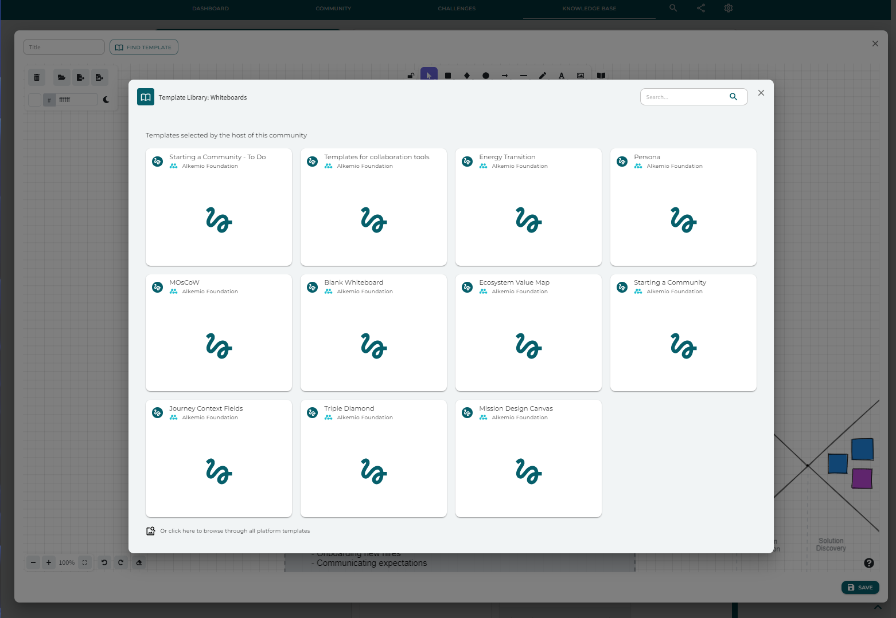
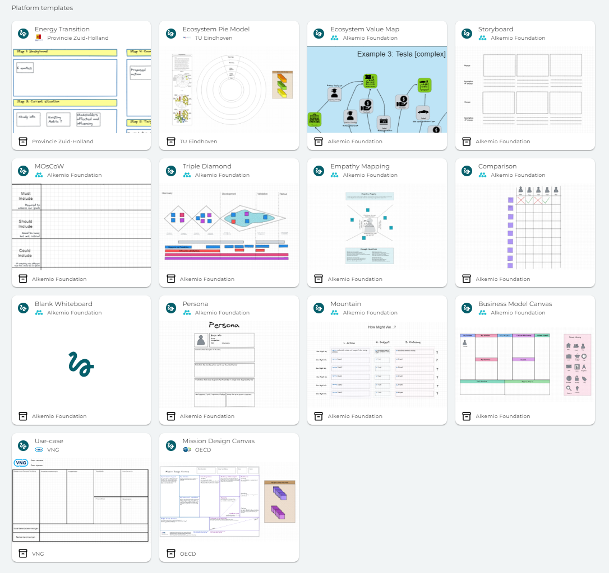

### Our way of contributing to innovation through an innovation library!

Innovation is not always easy and at Alkemio we want to make it easier for everyone to innovate effectively. 

The Innovation Library on Alkemio makes it easier to share best practices for effective innovation. An innovation library is a collection of best practices such as useful templates that offer guidance and structure to his/her users. Enabling everyone to know which steps to take to know how to make the changes society needs. Our innovation library is growing daily, with new templates from multiple parties that can share knowledge and expertise.

### Using Whiteboard templates on the platform
As a user, I want to make use of best practice whiteboard templates to support my innovation or community building efforts. Whiteboards allow you to capture thoughs and give them a visual which will make it easier to start concretly working on a project with different people involved. 
As a provider of templates, I want them to be available for and widely used by all platform users. Now everyone can access the templates anywhere in the platfrom, and this makes it easier to share and make use of everyone's knowledge.

When you open a new whiteboard, you can now choose from the templates selected by the host as well as browsing through all platform templates! This is one step closer to making all knowledge around innovation or community building more directly available for you to use and share!

### Adding Whiteboard templates to the platform 
The platform also has multiple 'innovation packs' of templates provided by organizations, knowledge institutes etc...

### Innovation templates to share with the wider community?
If you have any useful templates, you can add or make them widely available for the whole community.

