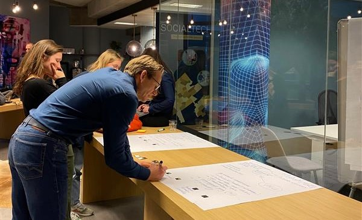

The platform continuously welcomes new communities that want to make a change. However, we are also very lucky with our partners that have followed and contributed to the Alkemio journey for a longer time... One of these examples is VNG, currently working on Alkemio in four different use cases! We discussed the VNG renewal with Gerlof de Haan (['Totaal Driedimensionaal' Space](https://alkem.io/t3d/dashboard)) and newly joined Mirko de Boer (['Digitale Leefomgeving' Space](https://alkem.io/digileefomgeving/dashboard)).

Looking back at some **important lessons** from the last year, how did you grow the community? What is your tip for others opening a new Space on Alkemio?
Gerlof: *"The most important lesson I've learned is to take every opportunity. To show what's being shared in this Space on Alkemio, how to find it and how to get involved. You can't do that often enough. I now have an instruction video and I notice that it has an effect. The number of users familiar with the Totaal Driedimensionaal Space are slowly increasing. Potential active participants must come from that group. So, the larger the group, the greater the chance.* 

With this growing number of participants, what is the **vision in the coming year** for the T3D Space on Alkemio? Who will be active, what will the activities be, or what is the key goal?
Gerlof "*Currently, the active users are mainly municipalities and other organizations outside the T3D programme. They now mainly use the platform to learn about the results of the programme. Now that the program has been completed, I want to continue to encourage cooperation and knowledge sharing on this subject on this platform, at least within the municipal domain.*"

And Mirko, you recently joined the project around 'Digitale Leefomgeving' to start growing and activating the communities around 'Digitale Leefomgeving'. Can you introduce yourself to the community?
Mirko: *"Hi everyone! My name is Mirko and I have recently started at VNG. I am enthusiastic to get to know everyone and start working with the communities. I will be busy the next months with creating and supporting the communities around three Digital Twin use cases. Hope to see you soon!*

A final question for Gerlof. What do you need to further **grow your community** or what do you want to **ask the Alkemio community**?
"*Key participants are the municipalities themselves. In addition, it would help me / us to share insights and knowledge around real life examples of community collaboration on Alkemio (around other topics). Successful approaches and what we can learn from them.*"

And he is right... we can learn so much from each other. So let's continue to share our experiences! Have a look at our [Forum](https://alkem.io/forum) and start interacting with other users of the platform.

Thank you Gerlof and Mirko! 