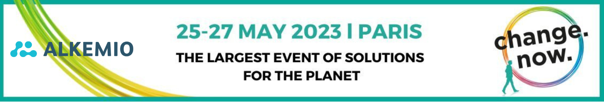

Alkemio was chosen, among the best, to participate and pitch our **positive impact solutions** during the three-day summit [ChangeNow 2023](https://www.changenow.world/join_changenow_2023/) in Paris. The Summit brings together the most innovative solutions and impactful changemakers from diverse backgrounds tackling our planet's biggest challenges, to take action, together. Our goal? To be inspired by these changemakers and see how we can support and learn from each other.

The ChangeNow Summit theme of this year, **'DAYS OF ACTION, HOPE, AND HUMANITY'**, couldn't be more in line with Alkemio's core beliefs. With communities, sustainable impact and innovation at its heart, Alkemio as a [platform for change](alkem.io) allows communities to find, learn from and work with each other to achieve effective results. Action, Hope and Humanity translated in one.

## Accelerate the Ecosystem 
The Summit enables entrepreneurs to present their solutions within various thematic areas that range from Inclusion and Education to Fashion and Corporate Responsibility. Alkemio will be showcasing its solution as part of the **'Accelerate the Ecosystem track'**. This is at the core of our platform, enabling *systemic connectivity between communities for change to allow them to scale*. The platform allows you to see what individuals and organizations are driving societal Challenges and makes it easy to connect and start making impact. When we are able to understand the ecosystem, we can accelerate change and make impact!

Alkemio will also **pitch** for a jury of investors, ecosystem leaders, corporates and media. During this pitch, we will demonstrate how to enable collaboration across all boundaries with citizens, governments, civil society and corporates. Making sure to be purpose driven, neutral, open source and steward owned to benefit society. 

## SDG 17 - Partnerships for the goals
The effect of the Sustainable Development Goal 17 - Partnerships for the Goals - always remains hard to quantify. However, as it is an enabler for other SDGs, the impact is huge. A digital platform to bring us together is also hard to quantify; how to put a value on trust? We believe each community will have its own benefits. Each connection between communities will have its own benefits. And trust and inclusiveness in society has its own benefits.

We are very honored and excited to show how a horizontal platform can make all communities for change more effective, while also allowing them to find, connect and learn from each other. We are building the Alkemio platform together with our community, and we are so happy to meet more like-minded people that can join us on this journey. 

Are you attending the event or do you know others that are participating? Let's connect! And stay tuned, as we will be sharing with you all the exciting moments during the Summit and after...  