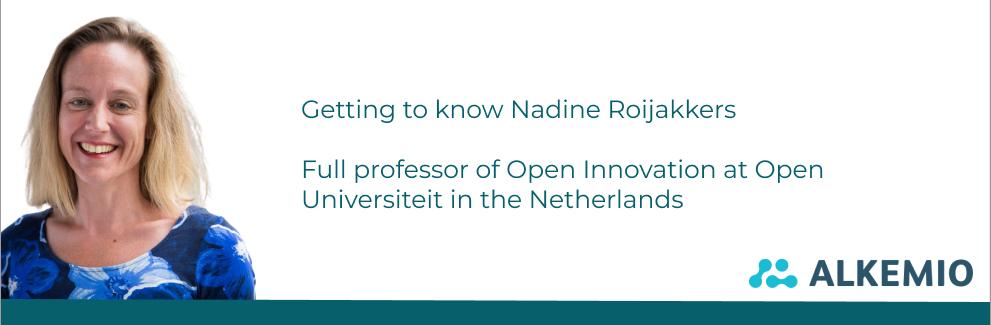

Nadine Roijakkers joined the Alkemio Board of Advisors in April 2023. Alkemio is delighted to have her contributing! In this blog post we will introduce you to Nadine as we discuss how our paths crossed, what our shared drivers are and her vision on the role of Alkemio and other stakeholders in this ecosystem.

## About Nadine

Nadine is a full professor of Open Innovation at Open Universiteit in the Netherlands.

Innovation and cooperation have always been at the heart of Nadine’s work. After graduating within strategic management on the topic of governance of cooperation, she spent time as a consultant, before going back to explore more what makes open innovation work in her research. So importantly covering both research and its usage in projects.

She has a long history of research and thought leadership in **open innovation**, including for the European Commission and Eindhoven University of Technology. Her current research topics include **Ecosystem Governance** as well as **Ecosystem Analytics**, both topics that are highly relevant to the mission of Alkemio.

## About Open Universiteit

Nadine is working for the **Open Universiteit**, a university with a broad range of interactive online education.

As Nadine describes it:

*“As the course materials are designed for students to effectively study at a location/time of their own choosing, the interactive sessions with professors are mostly focused on exchanging thoughts and discovering new ideas. This is what makes the sessions much more valuable to our students".*

There are six faculties serving almost 17000 students in the Netherlands and Flanders (Belgium), which are responsible for its academic education and scientific research. The aim is to continuously offer new and improved teaching methods and research possibilities. The students often participate in these courses as part of an additional program at a later stage or to switch careers.

*“What attracts me to working for Open Universiteit is the type of students that we work with. They are very driven as they often do this study at a later age with a family or career on the side. They bring a lot of knowledge and experience to the table. This is very valuable for the conversations and discussions in class. Besides their insights, they also bring interesting connections and with that access to data for research.”*

## Aligned drivers and frustrations

It won’t be a surprise that with Nadine’s background and the mission of Alkemio that there is a big overlap in our values. That is why we already came in contact with Nadine back in 2021. Together we shared ideas and brainstormed about the potential of the platform.

As shared by Alkemio CEO Neil Smyth:

*“It was very clear from our first contact that there was a click. A focus on what is needed for effective collaboration, how to do this pragmatically while also ensuring best practices are applied. Alkemio had to focus more on the core platform capabilities during 2022, but as we turn our attention to integrating stronger research ties within Alkemio it was great to be able to pick up contact with Nadine again!”*

And as Nadine recalls it:

*“And at a later stage, our paths crossed again via a mutual connection. It was evident how our drivers and frustrations were still aligned. In my research I also see the energy being not optimally spent by people due to inefficient collaborations. There is so much duplication and dependency on finding the right person at the right time. Like how our paths crossed!”*

Besides her knowledge and insights, the possibility to work with Nadine’s students also offers great chances for deeper collaboration. These students have a background in data analytics and are focused on understanding ecosystems. Combined with Alkemio being able to surface the actual collaboration graph (who is contributing to what topic), it means some highly promising research topics can be explored together. For example, what are the patterns in these multi-stakeholder collaborations? What are the factors to bring success and impactful change to these ecosystems? This allows them to better understand the complexity and Alkemio to better facilitate it.

*"What really interests me is how do the people that are meant to find each other, easily find each other. Instead of based on serendipity, more structural. The right connections and knowledge at the right place and the right time. Instead of finding these connections in the traditional, hierarchical organizations, maybe the new future is solely self-employed people with expertise circulating around these themes…”*

The outcomes of this research and the models also provide insights for the innovation library. The models and identified factors for strong and sustainable ecosystems can provide very valuable insights.

## Ecosystem analytics and governance

This research into ecosystems is one of the common areas with Alkemio. How do we ensure that we build sustainable ecosystems that can tackle today’s challenges and stay vibrant in the long run? Especially the big transitions such as energy transition and circular economy require collaboration and alignment between a lot of parties for extended periods of time.

*“I saw the shift from dual collaborations, alliances, to multi-stakeholder collaborations and ecosystems. With the way that technology is developing and the societal challenges we face, you have to work with multiple parties. As a company, you must make sure that you spread your tentacles everywhere, that you are in as many conversations as possible, while also developing your knowledge and skills internally, to be able to absorb and implement this knowledge in your services and products."*

And it is not only finding the right stakeholders, but also keeping all eyes on the same direction.

*“You need to be patient and keep the long-term goal in mind, also when conflicts arise. Intrinsic motivation is key, and we need to find the factors contributing to this, besides the obvious money element. Our goal is to provide a model, a Lego box with building blocks if you want to call it that, that have proven to be success factors in an ecosystem. This box consists of a set of essential building blocks and building blocks that might be important for specific sectors or goals. The aim of providing this model is to avoid re-inventing the wheel repeatedly when it comes to building successful and sustainable ecosystems.”*

## Roles and responsibilities in the ecosystem

When diving into the governance of this ecosystem: what are the roles and responsibilities for each stakeholder? These agreements around such collaborations are new and stakeholders with different backgrounds are all expected to contribute with their resources, with the outcomes benefiting society.

*“The government plays an important part by facilitating the transition with policy and law, which they often still struggle with. They must balance their position and accountability to the citizens, with a flexible and pro-active attitude towards new technologies and collaborations. They have to be the party focusing on the bigger picture, as that is not something the private sector will easily do. You can see this for example in the sustainable building sector.”*

Besides governance, trust and control are also key elements. As an online platform we see how it is often a barrier when you must work in an online environment with people you don’t always know that well. How do you stimulate people to contribute openly and be vulnerable? And what role can Alkemio play in this ecosystem?

*“Trust and control are also important elements in my research. It plays a big role in all these types of collaboration and a lot of sectors are not very comfortable with this new way of working. However, this is a mindset that must change and that we can help each other with. I think an important role for Alkemio will be to show trustworthiness. Other platforms are more commercially driven, and it is important to show that you uphold public values. And secondly, an important role can be to facilitate the overview. Who is working on what? What are the big themes currently? And if someone wants to contribute, they know in the future that they can come to the platform and quickly navigate through the challenges to see where they can contribute. And maybe even the prediction element we touched upon before. Already being able to see where the interest lies and where we should now act or focus on to ensure we are well-prepared at a later stage. That would also for other parties, including the government, be an important source of information.”*

Thank you, Nadine! A lot of interesting insights that will help us improve the platform but also together think of how can we do better. How we can build a way of working where all perspectives are included and where we make the most of the available people and resources.
