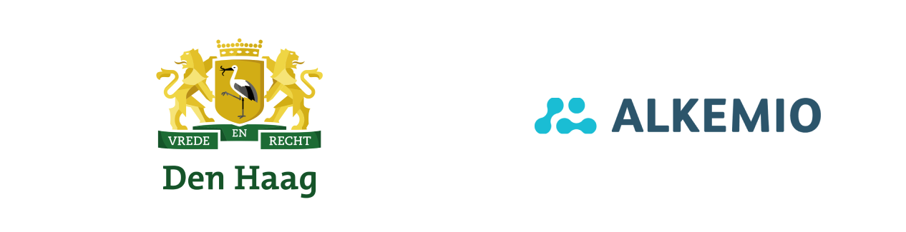

We are thrilled to announce that **The Hague City** has joined as an Alkemio Partner! This partnership will enable us to collaborate with the city government on multiple pilots aimed at creating a positive impact on society and promoting sustainable development.

### Finding new ways of working together

>*"We live in a time of accelerating change, with many transitions happening at the same time. These transitions need all of society to contribute, and we need to find new ways of working together. Alkemio's vision of putting the change to be achieved central and building the community around it is one that The Hague is looking forward to piloting,"* says Branko van Loon, Senior Programme Manager from The Hague.

### The Hague: a global hub for trust, peace, and collaborative change

*"The Hague has a unique profile on the world stage: the city of peace and justice. Trust is key for any situation where parties work together for change, and The Hague's profile means it is a natural location for Alkemio to have its headquarters. Alkemio is very excited about starting to actively work together with The Hague - helping us all to come together as we work through the transitions facing us,"* says Neil Smyth, co-founder and CEO of Alkemio.

### Putting Public Values at the core

Alkemio is committed to creating a positive impact on society by putting public values central. This also matches The Hague's role as Impact City. *"Working together requires trust, in each other but also in the digital platforms being used. Our society is increasingly digital, so it is refreshing to see a digital platform that is focused on public values and realizing societal impact,"* says Coos Santing, Impact City @ The Hague.

### Driving positive change

*"We are thrilled to have the opportunity to work with The Hague city to achieve these goals. The city government brings a wealth of knowledge and expertise to the table, and we believe that this partnership will enable us to make a real difference,"* adds Neil Smyth.

We look forward to sharing more details with you as we embark on this exciting new journey. Stay tuned for updates on the projects and initiatives we will be working on with The Hague City!

Thank you for your continued support and trust in Alkemio.
