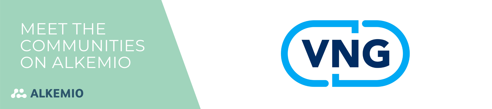
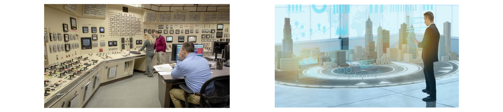

**Liever in het Nederlands? Scroll naar beneden.**

It is time to introduce you to another very interesting community, as well as long-term partner since the early days of Alkemio! In our latest blog series "Meet the Communities on Alkemio", we highlight the incredible communities that call our platform home. We believe in the power of collaboration and the impact of collective efforts, and what better way to celebrate this than by showcasing the amazing work being done by our diverse community members! 

The Digital Twin Community was built on Alkemio in mid 2022. There is an active community behind this Space, run by VNG but in cooperation with several other Governmental organizations. Let's begin with a brief explanation about the concept Digital Twin and how it can play an important role for societies. 

## Digital Twin 
One thing certain about the future, each day more and more technology and data is produced and available. It is also certain that our societies will be steered based on data. BUT more data doesn’t automatically give us better ways to deal with social issues or with solutions. And that’s where the Digital Twin comes in! 

There is a new way of analysing data by visualizing it in a 3D environment.  

> *“This approach makes data more insightful and accessible, not only for governments, but also residents. In an ideal picture, you could run simulations like a sims city game or engage in real time with different policy choices.”*

This technology makes policy and data accessible. Helping to support dialogue between municipalities and residents, but also to monitor policy. Another major advantage is the possibility of linking different issues, such as green space and health, or housing and nitrogen. 

As Wouter Heijnen, Innovation Advisor at VNG describes it: 

> *"Reports are not read, excel is not understood, therefore the Digital Twin"*

As the Digital Twin Community teaches us in their Alkemio Space, 3D information is not new - it has been used for years in various sectors. Therefore, it is not the technology that we need to understand, it is learning to use it and ensuring sustainable implementation of the technology that we are focusing on. 

The NL Digital Twin community believes that together, we can create a breakthrough in the field of 3D information and the extent to which municipalities and broader government are able to incorporate three-dimensional information that is already available into their registries and then use it for the tasks and challenges they face. 

The Digital Twin Community aims to allow communities to gather around shared challenges, as for example, housing in combination with mobility scenarios and climate themes (heat stress, nitrogen, flood models). To different environmental questions such as energy, security or circularity, to societal challenges and the impact of technology in our society.  

###### The transition from complex - hard to visualise datasets - to a 3D visualisation that is accessible and understandable. 

## Connecting municipalities, government organizations, market parties and knowledge institutes 

The Digital Twin Community is here to connect people, everyone is welcome! It has been active for several years in different forms. The group meets about once a month to exchange knowledge in the form of a digital demo, to strengthen cooperation from there. A huge range of municipalities (From Amsterdam to Assen), government organizations (ministries, provinces and more), market parties and knowledge institutes are represented in the Community. All are in their own way related to Digital Twins. 

> *“This is precisely the added value of the Community. We are all facing the same challenge, whether it concerns energy transition, housing or a healthy living environment, these issues are bigger than individual organisations or municipalities. We try to do things together instead of reinventing the wheel.”*

## Leading by example, an open and transparent Community 

Alkemio serves three important purposes for the Digital Twin Community: knowledge sharing, build collaboration in Challenges, and transparency. Their Community has a variety of Challenges that they already started working in.

> *“On Alkemio we work with Challenges that are focused on tasks, some examples are monitoring air quality, the rollout of a national Digital Twin and targeted nature work. Because Alkemio gives us the opportunity to organize the Challenges based on content, we can work with concrete shared tasks through the Challenges, which is also open to everyone to collaborate. This brings partners from the entire field together.”* 

However, not only their Challenges and ways of working are accessible for all, the future vision of the Community and Challenges to be worked on is also discussed in a transparent manner. They have a specific sub-Communities dedicated to the development of the main Community. 

> *“With this working method we also try to promote transparency; we have a Challenge specifically aimed at ‘community development’, here we work with an active leading group of different organizations on the longer term of the community. This is also an open group, and everyone is welcome to take a look, or contribute.”*

It is great to see how the various communities discover new ways to use the platform each day! 

## From knowledge sharing to active collaboration 

Even though there is already much value in connecting the communities, the real impact can be accelerated when these online communities start working together.  

> *“Long term, we want a platform like Alkemio to be a place where real work comes together. It is a challenge to make the switch from sharing knowledge of one’s own work, to active collaborating. VNG has always been a leader of the community but the ultimate goal is for VNG to become a participant like any other organization, and tasks are planned and executed together in shared ownership.”*

## A call from the Digital Twin community …

> *“We are an open Community, so everyone is welcome to follow the discussions, think along and work together with us! Become a member of our Space: [Digileefomgeving](https://alkem.io/digileefomgeving/dashboard). Also feel free to contact leads and let's schedule something to get to know each other!”*

# Maak kennis met de Digital Twin-community! 

Het is tijd om jullie voor te stellen aan een andere interessante community, maar ook belangrijke partner sinds de start van Alkemio. In onze nieuwste blogreeks "Meet the Communities on Alkemio", stellen we je voor aan de diverse communities met wie wij iedere dag samenwerken. Samenwerking en co-creatie staan centraal op ons platform. Door deze verhalen te vertellen hopen wij jullie te inspireren en te verbinden! 

De Digital Twin Community startte in de loop van 2022 op Alkemio. Het is een actieve community, die wordt geleid door de VNG maar in samenwerking met verschillende andere overheidsinstanties. Laten we beginnen met een korte uitleg over het concept Digital Twin en hoe het een belangrijke rol kan spelen in onze samenleving.  

## Digital Twin  
Eén ding is zeker over de toekomst: iedere dag wordt er meer en meer data geproduceerd en beschikbaar gemaakt. Het is ook zeker dat onze samenleving gestuurd zal worden op basis van data. Het is niet vanzelfsprekend dat meer data ons automatisch een betere manier biedt om te werken aan sociale problemen of het vinden van oplossingen. Dat is waar de Digital Twin een uitkomst biedt!  

De Digital Twin is een nieuwe manier om gegevens te analyseren door ze te visualiseren in een 3D-omgeving.   

> *"Deze aanpak maakt gegevens inzichtelijker en toegankelijker, niet alleen voor overheden, maar ook voor inwoners. In een ideaalbeeld zou je simulaties kunnen uitvoeren zoals in een Sims City spel realtime aan de slag gaan met verschillende beleidskeuzes."*

Deze technologie maakt complex beleid en data toegankelijk en inzichtelijk. Het kan ondersteuning bieden voor de dialoog tussen gemeenten en bewoners, maar ook voor het monitoren van beleid. Een ander groot voordeel is de mogelijkheid om verschillende onderwerpen aan elkaar te koppelen, zoals groenvoorziening en gezondheid, of woningbouw en stikstof.  

Zoals Wouter Heijnen, adviseur innovatie bij de VNG het omschrijft:  

> *"Rapporten worden niet gelezen, Excel wordt niet begrepen, daarom de Digital Twin."* 

Zoals de Digital Twin Community ons leert in hun Alkemio Space, is 3D-informatie niet nieuw - het wordt al jaren gebruikt in verschillende sectoren. Daarom is het niet de technologie die we moeten begrijpen, maar hoe we de technologie gebruiken en zorgen voor een duurzame implementatie van de technologie.  

De NL Digital Twin Community gelooft dat we samen een doorbraak kunnen creëren. Zowel op het gebied van 3D-informatie alsook de mate waarin gemeenten en de bredere overheid in staat zijn om driedimensionale informatie, die al beschikbaar is, te gebruiken voor de taken en uitdagingen waar ze voor staan.  

De Digital Twin Community wil overheden en het hele veld samenbrengen rond gedeelde uitdagingen, zoals bijvoorbeeld woningbouw in combinatie met mobiliteitsscenario's en klimaatthema's (bijvoorbeeld: hittestress, stikstof of overstromingsmodellen). Van verschillende milieuvraagstukken zoals energie, veiligheid of circulariteit, tot maatschappelijke uitdagingen en de impact van technologie in onze samenleving.

###### De verandering van complexe - moeilijk visualiseerbare datasets - naar een 3D visualisatie die toegankelijk en begrijpelijk is. 

## Verbinden van gemeenten, overheidsorganisaties, marktpartijen en kennisinstellingen  
De Digital Twin Community is er om mensen te verbinden, iedereen is welkom! Het is al een aantal jaren actief in verschillende vormen. De groep komt ongeveer één keer per maand bij elkaar om kennis uit te wisselen in de vorm van een digitale demo, om van daaruit de samenwerking te versterken. Een enorm scala aan gemeenten (van Amsterdam tot Assen), overheidsorganisaties (ministeries, provincies en meer), marktpartijen en kennisinstellingen zijn vertegenwoordigd in de Community. Allemaal hebben ze op hun eigen manier te maken met Digital Twins.  

> *"Dat is precies de meerwaarde van de Community. We staan allemaal voor dezelfde uitdaging, of het nu gaat om energietransitie, woningbouw of de gezonde leefomgeving, deze vraagstukken zijn groter dan individuele organisaties of gemeenten. We proberen dingen samen te doen in plaats van het wiel opnieuw uit te vinden."*

## Leading by example, een open en transparante community 
Alkemio dient drie belangrijke doelen voor de Digital Twin Community: kennis delen, samenwerking opbouwen in Challenges en transparantie. Hun Community is al met verschillende Challenges aan de slag gegaan.  

> *"Op Alkemio werken we met Challenges die gericht zijn op taken, enkele voorbeelden zijn het monitoren van luchtkwaliteit, de uitrol van een nationale Digital Twin en gebiedsgerichte ontwikkeling landelijk gebied. Omdat Alkemio ons de mogelijkheid geeft om de Challenges op basis van inhoud te organiseren, kunnen we via de Challenges werken met concrete gezamenlijke opgaven, waar ook iedereen aan mee kan werken. Dit brengt partners uit het hele veld samen."*

Niet alleen de Challenges en manier van werken zijn toegankelijk voor iedereen, maar ook aan de verdere ontwikkeling van de Community en de Challenges wordt op een transparante gewerkt. Hier is ook een Community voor opgericht. 

> *"Met deze werkwijze proberen we ook transparantie te bevorderen; we hebben een Challenge die specifiek gericht is op 'community ontwikkeling’. Hier werken we met een actieve kopgroep van verschillende organisaties aan de langere termijn van de community. Dit is ook een open groep, en iedereen is welkom om een kijkje te nemen, of een bijdrage te leveren."*

Het is geweldig om te zien hoe de verschillende communities elke dag nieuwe manieren ontdekken om het platform te gebruiken!

## Van kennis delen naar actief samenwerken 
Hoewel er al veel waarde zit in het verbinden van de communities, kan de echte impact worden versneld wanneer deze online communities gaan samenwerken.   

> *"Op lange termijn willen we dat een platform als Alkemio een plek is waar het echte werk samenkomt. Het is een uitdaging om de overstap te maken van het delen van kennis over het eigen werk, naar actief samenwerken. VNG is altijd een trekker van de community geweest, maar het uiteindelijke doel is dat VNG een deelnemer wordt zoals elke andere organisatie, en dat taken samen worden gepland en uitgevoerd in gedeeld eigenaarschap."*  

## Een oproep van de Digital Twin gemeenschap ...  

> *“We zijn een open Community, dus iedereen is welkom om de discussies te volgen, mee te denken en mee te werken! Word lid van onze Space: [Digileefomgeving](https://alkem.io/digileefomgeving/dashboard). Neem ook gerust contact op met de leads en laten we iets afspreken om elkaar te leren kennen!”*
