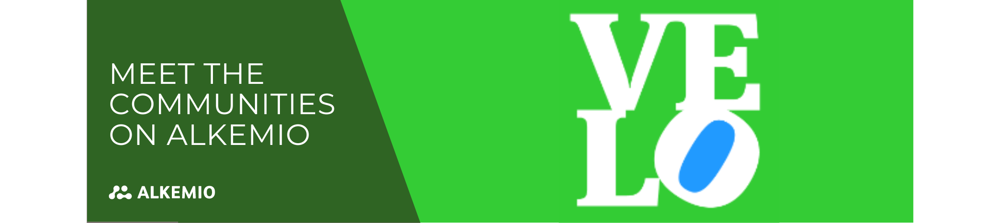

Welcome to our exciting new blog series, "Meet the Communities on Alkemio", where we embark on a journey to spotlight the incredible communities that call our platform home. We believe in the power of collaboration and the impact of collective efforts, and what better way to celebrate this than by showcasing the amazing work being done by our diverse community members! Today, we are thrilled to kick off this series by introducing you to the inspiring community of the **VeloLAB**. 

[VeloLAB](https://velolab.de/) is a project funded by the German Federal Ministry of Digital and Transport and the German cycling industry and managed by the Berlin based agency **Velokonzept**. Velokonzept offers strategic consultancy, network, and capacity building as well as innovative formats, such as hackathons, fairs, conferences. The mission is clear: to make cycling and walking a way of life for everyone. Regardless of the bicycle you ride or the path your feet take, Velokonzept serves as the ultimate interface for the German market: promoting and normalizing cycling like never before. 

## Driving Sustainable Materials in Cycling
VeloLAB is a dedicated platform with a clear mission to bring companies within the cycling sector together that share a common interest in innovation in sustainability, infrastructural design and service, and communication. With this purpose central, they aim to bring industry experts together to discuss critical topics such as recyclability, circular practices, and advancements in manufacturing.  

Connecting the cycling industry, city administration, and science is key to overcome problems that are too big for one stakeholder to solve by themselves. Therefore, the VeloLAB project aims to use Alkemio as a space for communities to collaborate on initiatives related to sustainable materials and circular economy.  

> *“Our vision extends beyond mere collaboration; we seek to drive sustainable and circular practices throughout the cycling industry.”*

## Bringing Relevant Stakeholders Together & fostering new communities 
By leveraging VeloLAB’s network, Alkemio brings the possibility and tools to connect stakeholders from various sectors within the cycling industry. This integration will facilitate conversations and collaborations to create a united front to address sustainability challenges.  

> *"We are targeting the whole cycling industry, trying to make it more sustainable and circular in its ways to do business. We want to engage stakeholders from insight and outside the bubble on the platform: manufacturers, CRS managers, repair shops, distributors, material scientists, and policymakers. To initiate a comprehensive transformation that redefines conventional business approaches.”*

With VeloLAB’s expertise in hosting conferences and events, Alkemio serves as a knowledge base and digital twin of offline contacts. This synergy will encourage the formation of new communities, allowing users to connect, share ideas, and work together on projects that align with their shared values and missions.  

## Why Alkemio?  
As the vision and possibilities of Alkemio become more widely known, it is great to see how connections are made. In the case of the German VeloLAB this introduction was made by Ruben Kranendonk from [ShiftCyclingCulture](https://www.shiftcyclingculture.com/). This is a global not-for-profit movement, based in the Netherlands, that aims to accelerate the shift to responsible production and use in the cycling industry through various activities.  

> *“This showcases the collaborations and community thinking within the cycling sector. And with the simple and straightforward interface of Alkemio, it was exactly what we were looking for to get our platform online.”*

## The most important functionality of the platform? The Challenges! 
For VeloLAB the emphasis revolves around fostering knowledge exchange and facilitating collaborative transitions. Therefore, the Challenges on the platform are most important. Each community can form sub-communities around a specific challenge within their topic. The Challenge flows allow the community to better understand the context, define what a solution should entail, and evaluate possible opportunities to make progress. 

> *“A diversity within the Challenge is important for our case. People to share contributions and others to get inspired to contribute themselves. To be more precise: we want experts in specific fields to get to know each other. For example, are you also working on recyclable aluminium but in a different country? Let's work together and share expertise!”*

Bringing people with similar problems together is essential for VeloLAB to provide an overview on the different products and projects out there. And when we discussed the future of VeloLAB with them, it is clear that they are ambitious! 

> *“We have big plans! While the main focus until now is on sustainable materials, the platform is one part of our Initiative for Sustainable Materials in the cycling sector. We want to enlarge the number of members as well as contributions. Also, we want to include other important parts of the Initiative and our VeloLAB activities. This means concretely: we want to incorporate information on funding opportunities and enable companies to apply for funding collaboratively.”*

It is great to see how they are dedicated to make a difference in the cycling industry. Hopefully Alkemio can provide the place to foster this innovation, knowledge sharing, and cooperative growth within the cycling industry. 

## Lastly, for VeloLAB collaboration means ....   
> *“Working together on problems what are too big for one individual (company / government/ person) to overcome. We want to establish the bicycle as an equal mode of transport through enabling exchange between the cycling industry, politics, municipalities and civil society”* 

So, are you interested in collaborating with VeloLAB? Are you immersed in the realm of circularity or recyclability, albeit in a different geographical context? Are you also dedicated to make the cycling industry more sustainable and widely used? Have a look at [their Space](https://alkem.io/velolab/dashboard) on Alkemio and join forces!  

 

 
