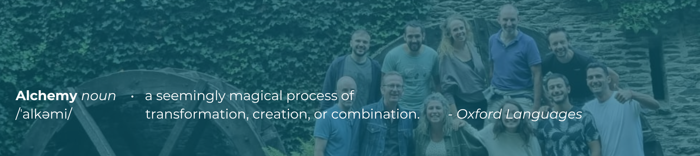

It's an exciting time for our team as we recently embarked on an unforgettable offsite event, a week dedicated to contemplating the future of Alkemio. The theme of our outing was all about scaling up, and we're thrilled to share with you some of the insights and discussions that unfolded during this occasion. 

## Envisioning the Future

One of the central pillars of our offsite was taking a step back, allowing ourselves the time and space to envision what Alkemio might look like in the next 3 to 5 years. We recognise that staying ahead of the curve and innovating is key to our growth, so we delved deep into discussions about our vision for the future. 

Among the fascinating topics that were explored, we talked about the different implementation of the Alkemio platform in multiple areas, such as the private market but also in public bodies, such as, but not only, schools and universities. Additionally, there was a spirited conversation about the possible implementation of AI within our company, in an ethical way. Please note that this is still strictly TBD, but it's good to think about the potential ways AI could enhance our offerings and improve the experience for our users. Other visions and ideas were shared, for which we have many more future announcements - we’ll get back to you on these! 

## Harnessing the Power of Our Platform

As our UX Designer Simone aptly put it, "we really used the platform, challenges, and innovation flow to guide this offsite," and it truly paid off. We found that by leveraging the tools and processes we've developed, we were able to seamlessly navigate discussions and make the most out of our time together. The beauty of it all is that we can easily revisit what we did and shared, thanks to our well-organised platform, capturing every idea and insight in one place. 

## Looking Forward

So, where do we go from here? That's the question that's been lingering in our minds since we returned from our offsite. We're eager to embark on the next phase of Alkemio's journey, building upon the insights and inspirations gathered during this week. 

As we ponder the future, we invite you, our community, to join us in this journey. Your support, ideas, and feedback have always been a cornerstone of our growth, and we couldn't be more grateful for your continued involvement. 

The road ahead is filled with possibilities, and together, we'll shape Alkemio's future in a way that reflects our shared vision and values. Stay tuned for more updates, as we'll be sharing our progress and insights with you along the way. Are you curious about how you could use Alkemio for your team workshops and events? Don’t hesitate to get in touch with us! 

Thank you for being a part of the Alkemio community, and here's to an exciting future filled with growth, innovation, and success! 

P.S. We'd love to hear your thoughts on where you see Alkemio in the next few years. Share your ideas and visions with us in the [Building Alkemio Space](https://alkem.io/building-alkemio/dashboard) or through [Linkedin](https://www.linkedin.com/company/alkemio-foundation/).