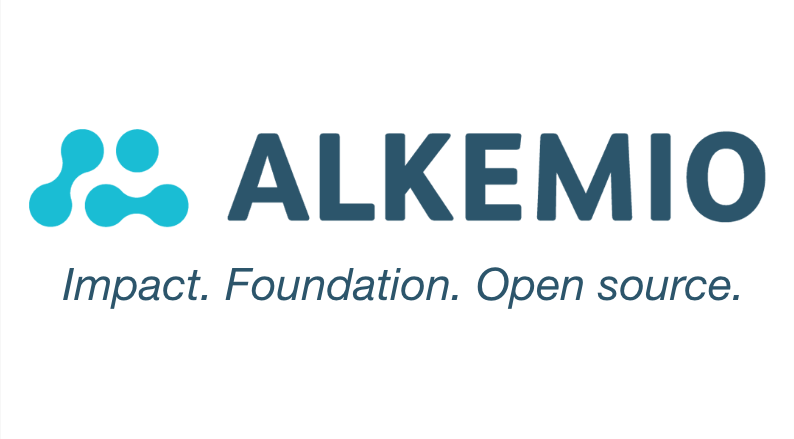

## The Inception of Alkemio: A Foundation for Change

[Alkemio](https://alkemio.org) was established as a foundation in 2020 with a mission to help society work together more effectively. The primary product is a [digital platform](https://alkem.io/landing) to make it much easier to effectively work together for change – but the mission is broader.

It quickly became clear that the potential impact from Alkemio is immense, implying that there could be a lot of value generated by the platform in the future. For Alkemio it was critical to fully anchor the purpose before the platform takes off – while also being able to raise the capital needed for investment without compromising the purpose. And to find a way to attract + retain top talent.

## Embracing Steward-Ownership: A Journey Towards Purpose

Enter Steward-Ownership (“SO”), with the key concepts immediately resonating with the Alkemio team. We started the process of switching to SO in Q3 2022. The partners of Alkemio and the organizations driving the growth of the SO community were involved in the journey, giving us a rich set of feedback. It took a lot of effort and energy (and money!), but we are very proud that this process completed in Q3 2023. And with the SO setup in place we could proceed with the first external capital raise in late Q3 2023.

On reflection, I have wondered why SO immediately resonated so strongly with Alkemio. And the insight that explained this was surprisingly simple: it is also a way for stakeholders in society to work together more effectively on shared challenges! So not a digital platform like Alkemio, but a legal platform. To create companies that can focus on all stakeholders, with alignment of efforts, risks and rewards and working together towards a shared purpose. The whole concept of SO is in line with what Alkemio was set up to achieve.

## Challenging the Norm: The Road Less Traveled by Purpose Ventures

But the road to SO has been far from easy or quick. The analogy I like to use is that for VC backed startups there is a 10 lane highway, with service stations and plenty of fuel, but for purpose ventures there is at the moment only a small side path through the woods. We are hugely grateful to the great guides and inspiration from those that have already followed this path as it is simply not the standard one.

One experience to share from our journey is that there was continually the pressure of “why not just use the typical VC backed startup route” – out of fear of not being able to attract investors, out of fear of being different, out of the sheer scale of habits that have been built up in our “startup ecosystems” and how easy it is to follow the path of “business as usual”. But having kept the focus on putting the purpose central in a legally binding way, the end result is one that is surprisingly simple and positions Alkemio well for the long-term – although it is definitely different!

Alkemio is a strong champion of Steward-Ownership. Given our principles of transparency and public values, we have shared all of the [materials](https://www.alkemio.org/structure/) used on our journey. So that others can benefit from the work we have done, making their path easier. And that we can hopefully inspire more entrepreneurs to put purpose first!
