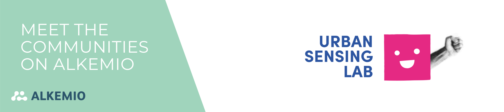

Welcome to the third edition of our blog series, "Meet the Communities making impact on our Platform." Today, we introduce you to the [Urban Sensing Lab](https://www.meetup.com/urban-sensing-lab/), initiated by [GovTech NL](https://www.govtechnl.nl/). The GovTech NL Hub is organized by The Hague Tech and WorldStartup, with support from Gemeente Den Haag, Provincie Zuid-Holland, YES!Delft, PLNT Leiden, Digicampus, Isuna, Antea Group Nederland, Centric, The Impacters and others. 
 
## Why a Community Approach Matters 

The Urban Sensing Lab, a multi-partner program, was born from the need to connect citizens with their urban environment, allowing them to express their challenges and contribute to making their city - in this case, The Hague - a better place to live. This program was designed to bridge the gap between technology, data, and community empowerment, given the existing need of the Municipality of The Hague and the Province of South Holland to find a way to make it happen. The initiative consists of 8 meetups from September until November.

> “By measuring, citizens gain knowledge and raise awareness about the measurement subject. The data collected through the collaboration offers a start for public discussion and social involvement. Additionally, the initiative can lead to behavioral change and maybe policy change. Together we want to collaborate and create a sustainable mindset and strengthen community empowerment.”.

## Towards a Sustainable, Inclusive, and Efficient City 

> “Including citizens brings multiple benefits into play as they form the basis of our society. By including them in discussion making, we can create a sustainable future together.”.

The Urban Sensing Lab is not just another program; it's a catalyst for positive change. By actively involving citizens in technology-driven collaborations, this lab aims to make a lasting impact on The Hague and beyond. By harnessing the power of data, innovation, and collective effort, it seeks to address urban challenges, enhance the quality of life, and pave the way for a better world for generations to come. Including citizens in the decision-making process is crucial, as they are the foundation of our society. Their insights and perspectives are invaluable in shaping a sustainable future.

## From Ideation to Solution with Whiteboards

To facilitate collaboration and idea sharing, the platform incorporates various tools, including the use of digital whiteboards. These whiteboards serve as visual aids, simplifying complex concepts and ideas, and are instrumental in moving from ideation to practical solutions. As the Urban Sensing Lab Team put it:

> “The idea of making [the whiteboard] available for everyone helps us accomplish a better collaboration between the government and its citizens. Through conversations, we gather the input and help that everyone can generate to create a solution.”.

One of the standout features of the Alkemio platform is indeed its accessibility to everyone. This inclusivity promotes seamless collaboration between the government and citizens, gathering input and ideas to drive innovative resolutions. The "Wishes, Contributions, and Expectations" whiteboard is a testament to the power of citizen voices and their ability to contribute to the community. Beyond in-person meet-ups, these whiteboards continue to fuel discussions and collaboration online.

## Working Together on Shared Challenges within the Community

A key feature of the platform is the ability for citizens to submit their challenges related to the urban environment. This process encourages active community participation and provides insights into informed decision-making. Challenges are documented on the platform and are open for others to join in finding solutions. 
 
The Urban Sensing Lab leverages the collective intelligence and motivation of its users, turning challenges into opportunities for positive change in urban landscapes. The Urban Sensing Lab Team explains:

> “We collect the proposed challenges raised by our participants and post them on the platform together with highlighted documents of the meetup itself.  The exercises from the meetup are also on the platform allowing the participant to revisit the material and continue. The challenges are open to the public and serve as a platform for people to collaborate freely, deciding together how they want to use it.”.

## The Innovation Process

The Urban Sensing Lab follows a structured innovation process, which includes phases such as Launch, Inspiration, Measurement Plan, Ideation & Concept, Design & Development, Prototyping, and Wrap-up. This process, along with the content in each of the phases, ensures that citizen-driven challenges are addressed comprehensively and collaboratively.

## Next Steps

Looking ahead, the Urban Sensing Lab has ambitious plans. The goal is to expand its scope and impact, making smart city development more inclusive and accessible to residents. The lab aims to empower them by providing opportunities to understand and participate in the development of smart city solutions. 
The Urban Sensing Lab is a shining example of how communities can drive positive change through technology, collaboration, and citizen involvement. It's not just about creating smarter cities; it's about creating cities that work better for everyone.

> “Therefore, our aim is on the one hand to give residents more say in smart city development and, on the other hand, to offer them an opportunity in the use of smart city technology”

as remarked by The Urban Sensing Lab Team. The future is brighter when citizens have a voice and a role in shaping it.  
 
 