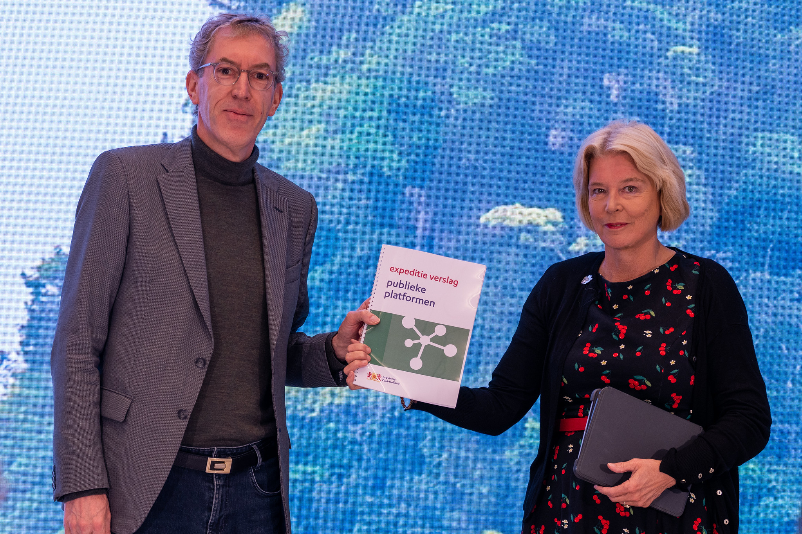

<i>Unfortunately for Alkemio, Jan left Province South Holland at the end of 2024, and decided that it was also then no longer appropriate to be on Alkemio's Board of Advisors. His willingness to support our mission, even for a limited time, is much appreciated.</i>
 

We are delighted and proud to announce that <b>[Jan van Ginkel](https://www.linkedin.com/in/janvanginkel1965/)</b> has joined the Board of Advisors of Alkemio! 

Jan has held many important positions in the public sector in the Netherlands and cares deeply about building a better society for all. 

As for Jan's rational for advising Alkemio: 
  
<i>"There are now countless platforms that create social added value. The unique thing about Alkemio is that this digital platform does full justice to all conceivable democratic and moral principles. 
  
I think that is very special, even though it really shouldn't be special at all. 
  
Alkemio therefore deserves a strong position with governments, between governments and in collaboration with residents, companies and social organizations. 

I would like to contribute to this in an advisory role."</i>
 

### About Jan

Jan is currently the Group Director and Deputy Provincial Secretary at the Province of South Holland. 

He <b>[contributes widely to societally worthwhile](https://www.linkedin.com/in/janvanginkel1965/)</b> topics. From the <b>[Province of South Holland](https://pzh.nl)</b> he has supported a wider understanding of the role that <b>[Public Platforms](https://www.zuid-holland.nl/onderwerpen/digitaal-zuid-holland/vervolg-expeditie-publieke-platformen/)</b> can and should play in society. 

That <b>[expedition](https://kennis.zuid-holland.nl/evenementen/toekomst-van-publieke-platformen/)</b> made it abundently clear that there was deep alignment. It is inspiring to see the recognition and leadership from Province of South Holland on the need for digital platforms to enable collective action - with public interests guaranteed.  

Thank you Jan for your support 🙏 Very much looking forward to working with you 🤝
