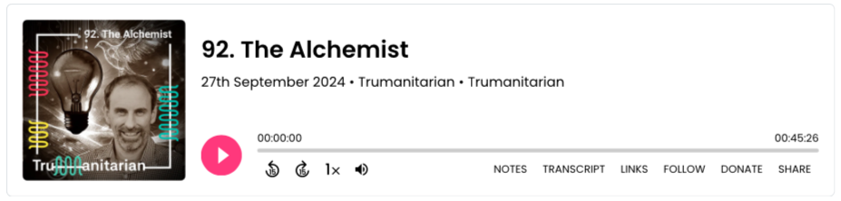

“Imagine building a house, but you don’t own the pipes, nor the foundations, and others can decide who communicates with who.”

This is how our CEO, Neil Smyth, explains what is happening in society due to the pervasiveness of profit-maximizing digital platforms.

Neil was recently invited to discuss this issue and Alkemio’s mission to offer an alternative on Episode 92 of the Trumanitarian podcast, hosted by Lars Peter Nissen. In this blog post, we highlight some of the key themes.

### The Problem with the Digital Status Quo

Neil addresses a critical issue in today’s digital landscape: profit-driven platforms control the very infrastructure of our online spaces. With the analogy of building a house but not owning the foundations, Neil illustrates that this isn't a hypothetical future; it’s our present reality. This phenomenon, often referred to as "techno-feudalism," is already here.

### Introducing Alkemio: Collective Action Reimagined

Alkemio was designed to enable collective action, providing safe digital spaces for collaborative work, backed by an organization dedicated to societal benefit.

A significant milestone for Alkemio was its adoption of Steward Ownership. This commitment assures that Alkemio’s purpose remains central: the venture cannot be sold, and profit serves purpose. This diverges starkly from the prevailing model of digital platforms, where shareholder profits often take precedence over societal interests.

Additionally, Alkemio’s Open Source commitment guarantees a transparent exit option for users. While Alkemio hopes to sustain its vision through a commercially hosted service, the open-source promise means users can leave if necessary.

The vision is for Alkemio to be a seed for a larger collaboration, creating a digital foundation with public interests at the core.

### The Challenges of Scaling a Mission-Driven Platform

Among the many themes discussed, Lars Peter asked Neil what’s needed to scale a platform like Alkemio. Competing with established tech giants means breaking free from their playbook.

Neil believes that only by offering a different narrative and fundamentally different product can a new digital foundation for society be realized. Attempting to compete within the shareholder-driven model simply won’t work.

However, scaling Alkemio still requires capital, though the model ensures this capital doesn’t bring voting rights or control. This safeguards the mission, while offering investors reasonable returns.

Over time, the network effect of many communities engaging in collective action will drive the paradigm shift needed to embed this vision into society.

### Rethinking Our Digital Tools

One of the most compelling takeaways from the conversation is Neil’s challenge to listeners: reconsider the digital tools you use every day. Are they serving your interests, or are you serving theirs? And as AI becomes more integrated, have you thought about its effects on your autonomy?

Neil encourages us to imagine a digital ecosystem where collaboration is free from profit-driven pressures.

### Listen to the Full Episode

To dive deeper into this conversation, tune into Episode 92 of the Trumanitarian podcast. [Listen to it here!](https://trumanitarian.org/episodes/92-alkemio/)
