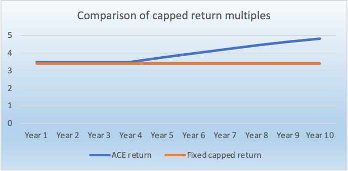

 

Steward-ownership is a perfect match for purpose-driven companies. We recognised this immediately when we came across the model in 2022. 
It legally ensures that the purpose of an organisation will always remain the top priority and aligns all stakeholders towards it. 
For a public interest tech company such as Alkemio, aligning our ownership and governance model with the values of our target customers in the public sector can create a unique competitive advantage. 
Alkemio completed the transition to steward-ownership in early 2023. 
In that journey, we worked closely with [We Are Stewards](https://wearestewards.nl/) and [DePrioriteit](https://deprioriteit.nl/), who have been instrumental in expanding awareness of and supporting companies moving to steward-ownership in the Netherlands.

Steward-ownership is well tested for established companies such as Patagonia, Bosch, Zeiss, Novo Nordisk, and Maersk. 
For purpose-driven early-stage startups, it is, however, still quite new, which means it is not familiar to the investor market, even to many impact investors.

As part of aligning all stakeholders towards the purpose, a feature of steward-ownership is the capping of economic returns for all parties, including investors.[^1] 
Alongside the lack of familiarity, this makes it very hard to raise money from venture capital funds, the dominant supplier of capital to startups. 

This blog post focuses on a twist Alkemio has implemented to the capped return feature. 
We also highlight the cost-effective and scalable structure Alkemio has used to bring in investors.

### Time value of money

Startups take time to develop and be successful. 
For purpose-driven startups, it is especially important to build the business carefully towards achieving the purpose, as opposed to the growth maximisation approach often seen in venture capital-backed startups.

From an investor’s perspective, however, the timing of cash flows is a key driver of their returns. 

When implementing steward-ownership at Alkemio, we struggled to balance investors' cash flow preferences with the concept of a “fixed capped economic return”. 
For example, a 3.5x return over 5 years gives a much higher IRR than 3.5x over 10 years. 

There is always a time value to money.

Further, if the capped economic return is a fixed amount, there isn’t an incentive for the company to quickly repay investors, raising further concerns as to the timing of economic returns and IRR. 

The solution we came up with is the appreciating capped economic (“ACE”) return, with the cap growing over time. 

This is how it works: 

-	The initial capped return multiple for a certificate is set at a certain level, such as 3.5x 
-	This means an investment of €1,000 is initially entitled to dividends of up to €3,500
-	From year 4 onwards, the outstanding amount of such dividend rights will appreciate
-	The rate of appreciation in this example is 7%, based on an Euribor index rate plus 4%
-	This appreciation rate is applied to the outstanding entitlement amount, which starts at €3,500, and (i) decreases based on dividends received to date and (ii) increases based on appreciation in previous years. Therefore, the effective rate of appreciation on the actual €1,000 investment amount is likely much higher than 7%

In this example, the return multiple for investors grows from the initial 3.5x to 4.8x for an exit at year 10. 
The IRR increases to 19%, compared to 15% if the capped economic return had been fixed at 3.5x. 
Further, the company is incentivised to pay dividends. These features make it a more attractive offering for investors. 

The ACE return has been favourably received by angel investors in Alkemio. 
Further details are shared on our [website](https://www.alkemio.org/investors/), which we hope can make it easier for other steward-owned companies to raise capital and together grow the investor base for purpose-driven startups.

### Simple and scalable 

To provide a digital platform offering value to users and a huge impact on society, scalability is important for Alkemio. 
Having a structure that enables quickly and cost-effectively raising funds from investors is a big part of this. 

To facilitate quick fundraising, Alkemio chose to work with economic certificates. 
Each certificate represents a right to future dividends, with the amount capped as detailed above. 
The certificates do not carry voting rights, which enables the separation of economic rights from voting control. 
This separation is another key feature of steward-ownership, with voting control being held by the stewards who are bound to make decisions towards achieving the purpose.

In the Netherlands, companies can issue economic certificates using a [STAK structure](https://business.gov.nl/running-your-business/legal-forms-and-governance/trust-office-foundation-stak/). 
The process is quick, with low transaction costs at issuance and for secondary trading of certificates. 
It also brings simplicity for all parties, as this one mechanism can be used to reward investors, founders, employees and other contributors.

A core advantage of economic certificates with capped economic rights and no voting rights is that there aren’t lengthy discussions about company valuation and voting percentages when raising funds or hiring talent. 
Once you have evaluated market conditions and decided on the capped return level for an issuance, you can issue new certificates. 
Compared to often lengthy and expensive negotiations for venture capital-backed companies, this makes it simpler to raise additional capital and  hire talent as you scale your business. 
So, the founders at steward-owned startups can devote their time and energy to the most important thing: building a sustainable and profitable business to achieve the purpose. 

These features also enable you to build up a very broad network of people contributing capital and time towards the purpose. 
Alkemio’s structure is highlighted in [a case study by Purpose](https://purpose-economy.org/content/uploads/purpose-alkemio-casestudyen-31032024.pdf), who has also been a valuable partner in our journey. 

### Growing the market for purpose-driven startups

There isn’t a well-trodden path for steward-owned startups, including when it comes to raising capital. 
Many startups come across things in their journeys that can help make it easier for other founders. 
Through this blog post and resources on our [website](https://www.alkemio.org/investors/), we are sharing key learnings from Alkemio’s journey: 

- A solution for considering the time value of money with capped economic returns. Recognizing the needs of investors in this way can help grow the pool of capital available to steward-owned startups
- The use of a simple, cost-effective mechanism for rewarding contributors of capital and time. This makes it easier to build a broader set of contributors and frees up management resources towards the pursuit of the purpose

[^1]: Economic returns are capped so that all stakeholders (including investors, founders and employees) are aligned towards the purpose while having the potential for attractive economic returns. 
With extra profits to be used/donated towards achieving the purpose, such that the biggest winner of the company’s success is the purpose. 
Note that social returns for investors are not capped.