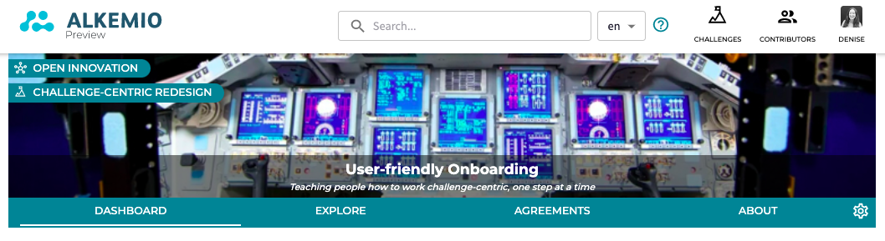
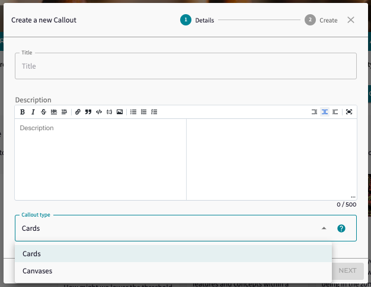
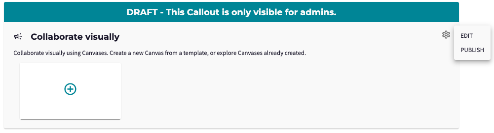
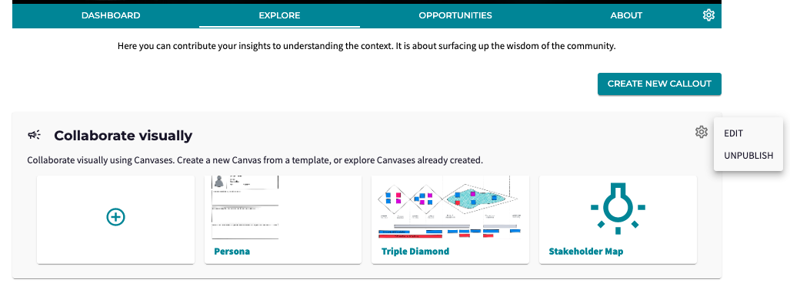

*What are the topics that your community is most interested in? Who are the potential stakeholders that play a role in this Challenge? What are the risks related to this Opportunity? What are other initiatives that this community can learn from?*

These are all questions that you may encounter while working on your Challenges. As a Lead you want to stimulate your community to <b>engage</b> and as a member you want to know <b>where</b> you can contribute, what are the important issues in that particular fase. 

Previously, your Community was able to share their knowledge via Aspects or Canvases. But this approach did not allow for providing <b>context</b> to the request, nor to have <b>multiple requests</b>. With the addition of Callouts, admins can now frame multiple requests to the Community on different topics. 

### <b>Creating a Callout</b>
First of all, it is a simple procedure! Admins can create a Callout on the <b>Explore</b> page by chosing an engaging title and providing further description about what is needed to make progress. Also, they make a decision whether the Community can answer by putting up their card (with knowledge/persona's/related initiatives) or a Canvas (as a visualization). 

All Callouts will be published in <b>draft</b> as the example below. These draft Callouts will only be visible to the admins.

After publishing, the Callout will be visible to the Community. An Admin can later choose to <b>unpublish</b> the Callout again. The settings icon on the right also allows you to <b>edit</b> the Callout. 

### <b>Engaging the Community</b>
As mentioned earlier, the Community can answer these questions by submitting a Card or a Canvas. Deciding what type of Callout is most appropriate depends on the questions. 
- <b>Cards</b>, (previously Aspects) are a way to submit your knowledge, such as ideas, related initiatives, or relevant stakeholders, and provide an additional description, references and visuals. Also, others can comment on the knowledge provided with the Card.
- <b>Canvases</b> can be used to allow people to visualize their persona's, stakeholder mapping, business models, etc.

Lastly, the next release will include a third type: <b>Discussions</b>. This Callout type allows members to answer with a simple answer. Examples can be a Callout for new members to introduce themselves in the Hub, or name topics that they would like to include in the next webinar, or proposed additional Challenges.

### <b>A glimpse of the future</b>
But there is so much more potential for these Callouts that we want to explore with you in the coming months. For example:
- Additional <b>types</b> such as the earlier mentioned discussions, the option to let the members <i>vote</i>, or in a <i>task list</i> with jobs to be done
- But also more <b>functionality</b> updates such as <i>closing</i> your Callout for further answers, <i>summarizing</i> the results, or <i>connecting</i> your Callouts to different Innovation Flow fases.

As always we would love to hear your examples of how Callouts can be used and are looking forward to seeing them in action on the platform!