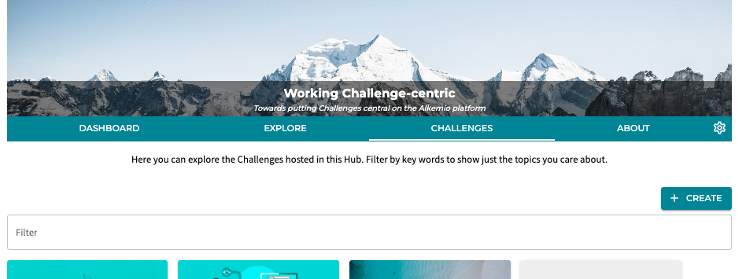
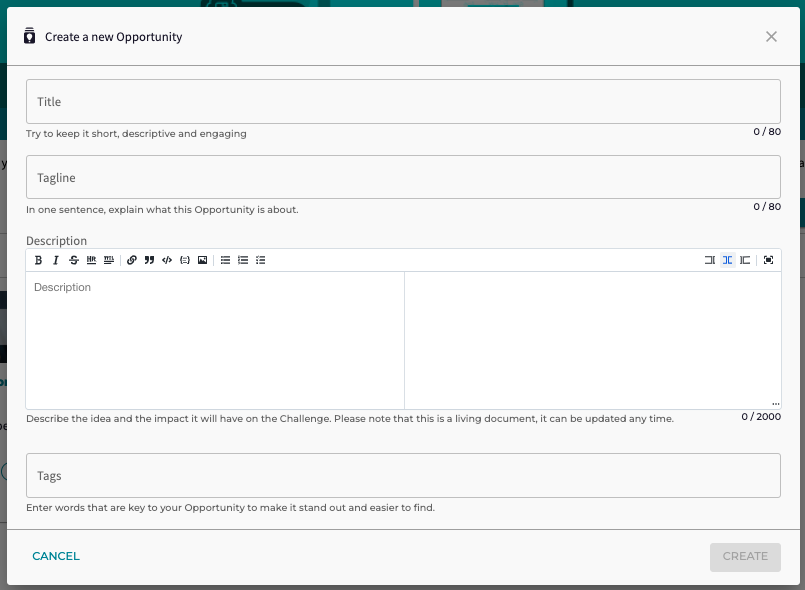
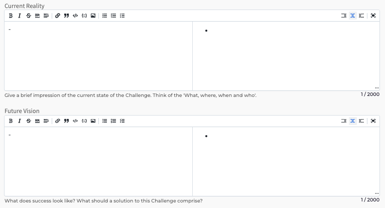
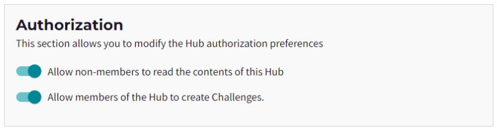
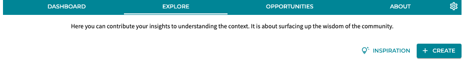
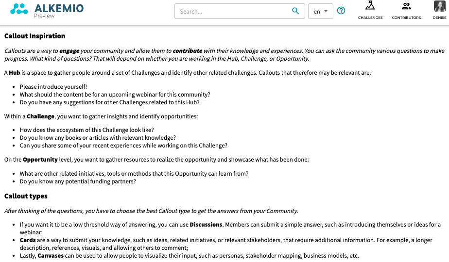
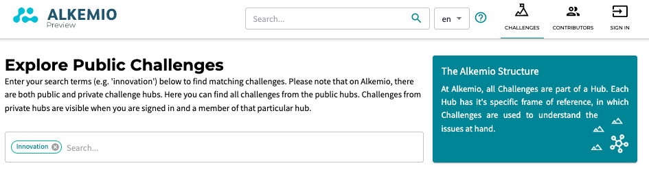

---
# An instance of the Blank widget.
# Documentation: https://wowchemy.com/docs/page-builder/
widget: blank

# This file represents a page section.
headless: true

# Order that this section appears on the page.
weight: 1

# Section title
title: Alkemio Release Notifications

# Section subtitle
subtitle: 

# Section design
design:
  # Use a 1-column layout
  columns: "1"
  spacing:
    # Customize the section spacing. Order is top, right, bottom, left.
    padding: ['30px', '0px', '0px', '0px']
  # Use a dark navy background with light text.
  #background:
  #  color: 'navy'
  #  text_color_light: true
---
Alkemio makes updates to the production platform approximately every two weeks. Below you can find the latest release note as well as links to previous notes.

<b>Release 2022-09-28</b>

<i>This release focuses on simplifying the **creation and updating** of Challenges and Opportunities - important for a Challenge centric platform :) To help users in how the platform can be used there is also now *inspiration* for Callouts, and a refreshed *Challenges page* to help new users find relevant Challenges!

Interested in trying out the changes? Go directly to [Alkemio](https://alkem.io/?utm_source=hs_email&utm_medium=email&utm_content=64703278&_hsenc=p2ANqtz-9Giqo8QcZnf1CWdBLUSBKzmp4iMt-wvwbXM0qYcnNA30kdtBPsKqaaj3shSIvFGGfK-BM2cl2xAbSLj-JRK7VDK9TgcQ)!</i>

#### Simplified Challenge & Opportunity creation flow

As a Challenge or Opportunity lead, you want a low-threshold way of creating a new one.

The option to create a new Challenge is **now directly available** on the Challenges tab for users with that permission. Similarly for the option to create a new Opportunity under the Opportunities tab.

In addition, we have **simplified the creation process**, asking only for essential information and giving the user more guidance. The goal is to have you up and running in no time! 

#### Guidance for describing Hub / Challenge / Opportunity

When I am creating a Hub, Challenge or Opportunity, I want to be guided through a set of questions that help me frame it correctly.

Previously, all the context fields were **similar** (Background, Vision, Impact, Who). To help you frame the journey, we have further specified all the questions and added guidance to each of these fields. Especially key for users that are new to working Challenge Centric!

#### Allowing members to create Challenges

As an admin I want to be able to allow Hub members to create Challenges. 

Hub Admins have a **new preference to allow Hub Members to create Challenges**

#### Innovation flow management

As an admin I want to be able to manage the Innovation Flow used in the Challenge / Opportunity. 

Related to the simplifying of the creation of Challenges and Opportunities, the management of Innovation Flows has also been refreshed. There is **new Innovation Flow tab** for admins to interact with and update the state of the Innovation Flow:

For the sharp eyed, you will notice that there is also now the option to **change the current Innovation Flow definition**. This is something we advise you to do in consultation with us. So for now, if you wish to use a custom Innovation Flow, please take up contact with us so that we can help you.

#### Callout inspiration

As an admin, I want to create Callouts to engage my Community and gather important insights, knowledge, and experiences.

But if you are just starting, it may be difficult. What is a Callout exactly? How do I use it in a Hub, Challenge, or an Opportunity? And what are the differences between discussions, cards, and canvases?

The Callout page now includes an **inspiration button**, that will direct you to our inspiration page. Over time we will also include inspiration for other functionalities or concepts. 

Working on your Challenge? Please have a look at this [inspiration page](https://alkem.io/inspiration/callouts?utm_source=hs_email&utm_medium=email&utm_content=64703278&_hsenc=p2ANqtz-9Giqo8QcZnf1CWdBLUSBKzmp4iMt-wvwbXM0qYcnNA30kdtBPsKqaaj3shSIvFGGfK-BM2cl2xAbSLj-JRK7VDK9TgcQ), directly apply them, and start engaging the community!

#### Challenges page refresh
As a not logged in user, I want to see what is happening on this platform. What are the Challenges that people work on? What is the structure?

The previous [Challenges page](https://alkem.io/challenges) was just an empty page and didn't give much guidance. That is why we have added an **explanatory box** on the top right, and display all the public Challenges. In that way, users can start exploring immediately. 

So quite a focus on Challenges this release, improving what is really the heart of the platform. 

As always please share your feedback and comments. Enjoy!
