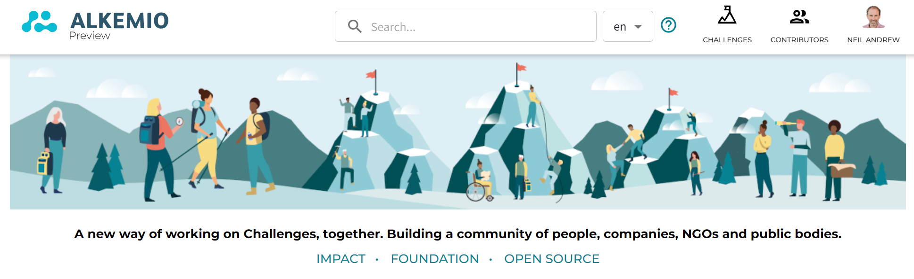
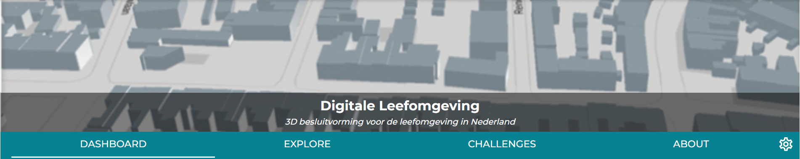
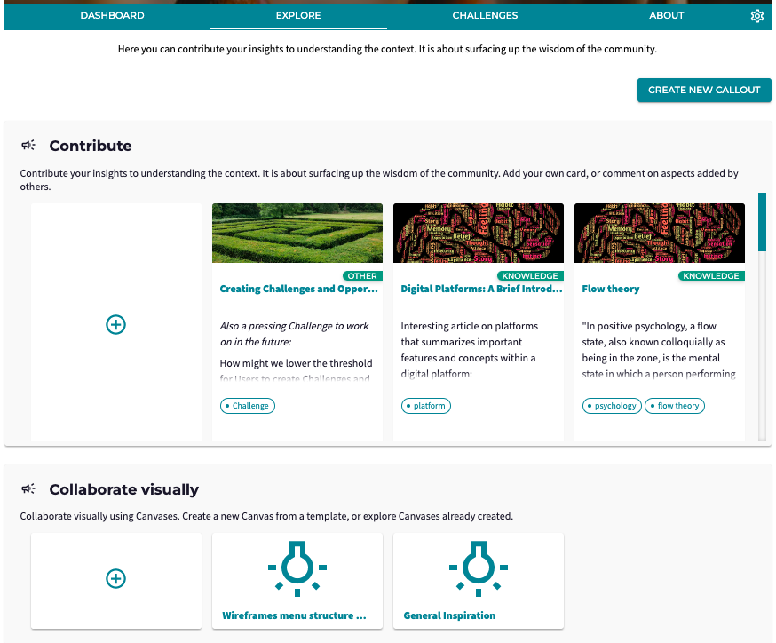
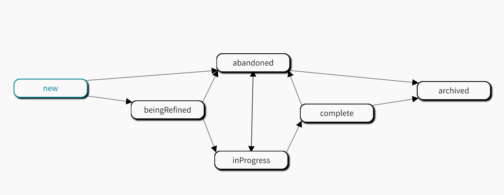
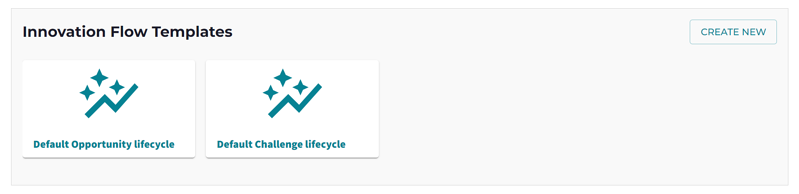
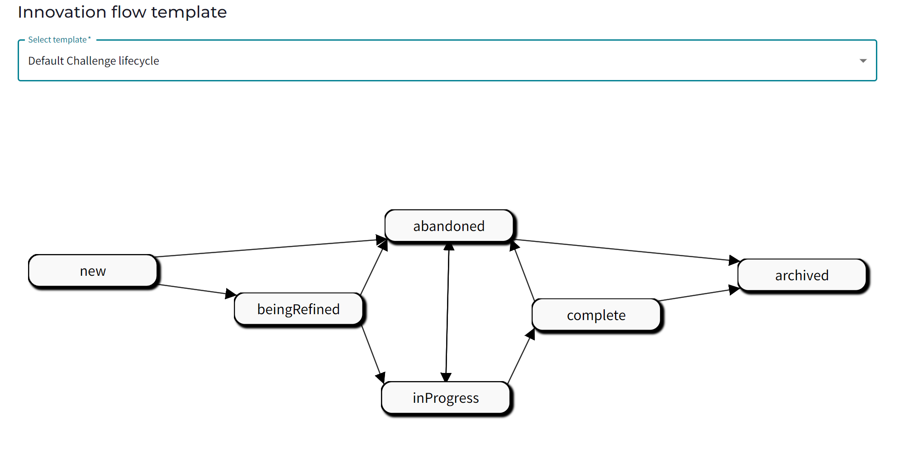
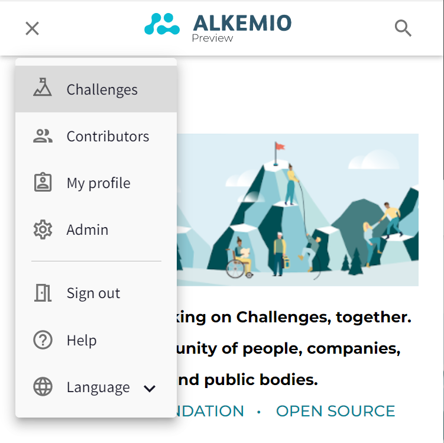
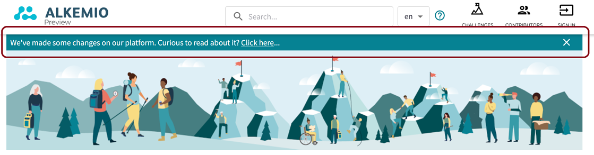

---
# An instance of the Blank widget.
# Documentation: https://wowchemy.com/docs/page-builder/
widget: blank

# This file represents a page section.
headless: true

# Order that this section appears on the page.
weight: 1

# Section title
title: Alkemio Release Notifications

# Section subtitle
subtitle: 

# Section design
design:
  # Use a 1-column layout
  columns: "1"
  spacing:
    # Customize the section spacing. Order is top, right, bottom, left.
    padding: ['30px', '0px', '0px', '0px']
  # Use a dark navy background with light text.
  #background:
  #  color: 'navy'
  #  text_color_light: true
---
Alkemio makes updates to the production platform approximately every two weeks. Below you can find the latest release note as well as links to previous notes.

<b>Release 2022-8-26</b>

<i>A major release, bringing a simplified user experience and new functionalities! These changes include:</i>

<b>Platform navigation</b>
The platform menu has been removed, and the key links for Challenges and Contributors are now icons on the top menu bar: 

<b>Hub / Challenge / Opportunity Navigation</b>
The overall layout has changed, now placing the Hub title central, with the tagline underneath it. The banner images 
are are now centered too.  

<b>Hub / Challenge / Opportunity Tabs</b>
The set of tabs are reduced from six to four:
    - The **Dashboard** tab has mostly remained the same, including a summary of the content.
    - The **Explore** tab becomes the place where all the wisdom of the community is gathered, either through 
Canavases or Aspects. On Hub, Challenge and Opportunity level, the leads can now ask their community to submit 
their Canvas or Aspect with a 'Callout'. 
    - The **Challenges** and **Opportunities** tabs have remained the same.
    - The **About** tab now contains all information from the former Context and Community tabs.
    - The **Admin section** can be reached through the cogwheel icon.

<b>Callouts</b>
**Callouts** are a key new concept introduced with this release. A Callout is for engaging the community! 

Previously, your Community was able to share their knowledge via Aspects or Canvases. But this approach did not allow for providing context to the request to the Community, nor to have multiple requests to the Community.

With the addition of Callouts, admins can frame multiple requests to the Community on different topics. The Community can answer by submitting a Card (previously known as Aspects) or Canvas.

The Explore tab becomes the central page where the interaction with the Community happens. 

<b>Innovation Flows</b>
'Innovation Flows' are another new core platform concept! They encapsulate the set of phases that a Challenge or Opportunity goes through as it progresses.

The platform also now supports '**Innovation Flow Templates**'. These are best practice Innovation Flows that can be used throughout the Hub. They are available via the Templates tab on the settings for a Hub.

*The creation of new Innovation Flow Templates is one that for now should be done with our assistance, but we would love to work with you to get your best practices available to your Community!*

The Innovation Flow Templates are then available to admins when creating a new Challenge or Opportunity:

Innovation Flows, and the related Innovation Flow Templates, are core platform functionality that has been there since the first version of Alkemio - so it is great to start exposing this to our Community. We would love to hear your feedback on this!!

<b>Mobile menu</b>
The navigation on mobiles has also been fully refreshed:

<b>Release notifications</b>
And finally, when new releases are deployed, users will now see a Release Notification banner to inform them both that the release has happened as well as where they can find additional information about what has changed:
